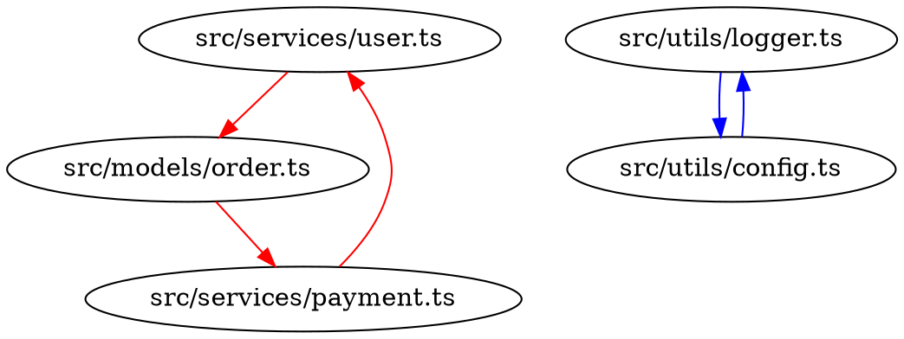

# Circular Dependency Detection

**Status:** Proposed
**Goal:** Detect and report import cycles across the entire codebase

---

## Problem Statement

Circular dependencies (import cycles) are a universal pain point in software development:

- **Build failures:** Many build systems (Go, Rust) reject circular imports outright
- **Runtime errors:** JavaScript/TypeScript circular imports cause undefined exports
- **Architecture smell:** Cycles indicate poor module boundaries
- **Refactoring blocker:** Can't reorganize code without breaking cycles first

**Manual detection is impractical:**
- Grows exponentially with codebase size (100 files = 10,000 potential cycles)
- Requires tracing imports across many files
- Easy to miss transitive cycles (A → B → C → A)

## Solution Overview

Build a whole-program dependency graph and use **Tarjan's algorithm** to find strongly connected components (SCCs). Any SCC with >1 node is a circular dependency.

**Output:**
```
Found 3 circular dependencies:

Cycle 1 (3 modules):
  src/services/user.ts
  → src/models/order.ts
  → src/services/payment.ts
  → src/services/user.ts

Cycle 2 (2 modules):
  src/utils/logger.ts
  → src/utils/config.ts
  → src/utils/logger.ts

Cycle 3 (5 modules):
  crates/cb-core/src/lib.rs
  → crates/cb-types/src/errors.rs
  → crates/cb-protocol/src/types.rs
  → crates/cb-services/src/file_service.rs
  → crates/cb-core/src/project.rs
  → crates/cb-core/src/lib.rs
```

## Implementation

**Prerequisite:** Reuse the shared dependency graph infrastructure from the Analysis Platform proposal once available; initial versions can operate on per-directory scans for smaller codebases.

### 1. Dependency Graph Construction

**Input:** All source files in the project
**Process:** Extract import/use/require statements
**Output:** Directed graph where nodes = modules, edges = imports (runtime-only)

**Example (TypeScript):**
```typescript
// src/services/user.ts
import { Order } from '../models/order';  // Edge: user.ts → order.ts
import { log } from '../utils/logger';    // Edge: user.ts → logger.ts
```

**Leverages existing infrastructure:**
- Use language plugins to parse import statements
- Filter out type-only or compile-time-only relationships (e.g., `import type`, Rust `pub use`, Python guarded imports)
- Rely on the upcoming analysis platform graphs when available; fall back to on-demand extraction for smaller scopes
- Reuse AST parsing from `cb-ast`
- Build graph using `petgraph` crate

### 2. Cycle Detection (Tarjan's Algorithm)

**Algorithm:** Find strongly connected components (SCCs) in directed graph.

**Key properties:**
- **O(V + E) time complexity** (linear in nodes + edges)
- **Single pass** through the graph
- **Space efficient** (O(V) memory)

**Pseudocode:**
```rust
pub fn find_cycles(graph: &DependencyGraph) -> Vec<Vec<NodeId>> {
    let mut cycles = Vec::new();
    let mut index = 0;
    let mut stack = Vec::new();
    let mut indices = HashMap::new();
    let mut lowlinks = HashMap::new();
    let mut on_stack = HashSet::new();

    for node in graph.nodes() {
        if !indices.contains_key(&node) {
            strongconnect(node, &mut index, &mut stack, &mut indices,
                         &mut lowlinks, &mut on_stack, &mut cycles, graph);
        }
    }

    // Filter out SCCs with only 1 node (not cycles)
    cycles.into_iter().filter(|scc| scc.len() > 1).collect()
}
```

**Implementation:** Use `petgraph::algo::tarjan_scc`

### 3. Cycle Reporting

**For each cycle, report:**
- All modules involved
- Import chain showing the cycle
- File locations of import statements
- Whether each edge is runtime-relevant (skip flagged type-only edges in output)
- Suggested fixes (if possible)

**Output Format (JSON for MCP):**
```json
{
  "cycles": [
    {
      "id": 1,
      "modules": [
        "src/services/user.ts",
        "src/models/order.ts",
        "src/services/payment.ts"
      ],
      "import_chain": [
        {
          "from": "src/services/user.ts",
          "to": "src/models/order.ts",
          "location": { "line": 3, "column": 0 },
          "symbols": ["Order"]
        },
        {
          "from": "src/models/order.ts",
          "to": "src/services/payment.ts",
          "location": { "line": 5, "column": 0 },
          "symbols": ["processPayment"]
        },
        {
          "from": "src/services/payment.ts",
          "to": "src/services/user.ts",
          "location": { "line": 2, "column": 0 },
          "symbols": ["getUserById"]
        }
      ],
      "severity": "error"
    }
  ],
  "summary": {
    "total_cycles": 3,
    "total_modules_in_cycles": 10,
    "largest_cycle_size": 5
  }
}
```

### 4. AI-Assisted Fix Suggestions

**When integrated with MCP tools, AI assistant can:**

1. **Identify the weakest link:**
   - Which import is least essential?
   - Which can be moved to a separate module?

2. **Suggest refactoring:**
   - Extract shared types to a new module
   - Use dependency injection to break cycle
   - Introduce an interface to decouple modules

3. **Generate code:**
   - Create new module with shared types
   - Update import statements
   - Refactor to use dependency injection

**Example conversation:**
```
User: "Fix the circular dependency in src/services/"
Assistant: [calls analyze_circular_deps MCP tool]
"I found a cycle: user.ts → order.ts → payment.ts → user.ts

The cycle exists because:
- user.ts needs Order type from order.ts
- order.ts calls processPayment from payment.ts
- payment.ts calls getUserById from user.ts

Suggested fix: Extract shared types to src/types/order-types.ts
This breaks the cycle by removing user.ts → order.ts edge.

Shall I create the new module and update the imports?"
```

## Language Support

### Rust
- Parse `use` statements from AST
- Separate re-exports (`pub use`) from runtime dependencies
- Track both module-level and crate-level dependencies

### TypeScript/JavaScript
- Parse `import` and `require()` statements while ignoring `import type`
- Handle ES6 imports, CommonJS, AMD
- Track dynamic imports (`import()`)

### Go
- Parse `import` statements
- Go compiler already rejects cycles, but detection helps refactoring

### Python
- Parse `import` and `from ... import` statements
- Handle relative imports (`from . import foo`) and conditional imports guarded by runtime checks (skip when clearly environment-specific)
- Track package-level cycles

## MCP Tool Definition

```json
{
  "name": "analyze_circular_dependencies",
  "description": "Detect circular dependencies (import cycles) in the codebase",
  "inputSchema": {
    "type": "object",
    "properties": {
      "scope": {
        "type": "string",
        "enum": ["workspace", "directory", "module"],
        "description": "Scope of analysis"
      },
      "path": {
        "type": "string",
        "description": "Path to analyze (for directory/module scope)"
      },
      "fail_on_cycles": {
        "type": "boolean",
        "default": false,
        "description": "Return error if cycles found (for CI/CD)"
      },
      "max_cycle_size": {
        "type": "integer",
        "description": "Only report cycles with N or more modules"
      }
    }
  }
}
```

**Example usage:**
```json
{
  "method": "tools/call",
  "params": {
    "name": "analyze_circular_dependencies",
    "arguments": {
      "scope": "workspace",
      "fail_on_cycles": false
    }
  }
}
```

## CLI Command

```bash
# Detect cycles in entire workspace
codebuddy analyze cycles

# Detect cycles in specific directory
codebuddy analyze cycles --path src/services

# Fail if cycles found (for CI/CD)
codebuddy analyze cycles --fail-on-cycles

# Only report large cycles
codebuddy analyze cycles --min-size 3

# Output as JSON
codebuddy analyze cycles --format json

# Visualize graph (requires Graphviz)
codebuddy analyze cycles --visualize --output cycles.png
```

## CI/CD Integration

### GitHub Actions

```yaml
name: Check Circular Dependencies

on: [push, pull_request]

jobs:
  analyze:
    runs-on: ubuntu-latest
    steps:
      - uses: actions/checkout@v3

      - name: Install Codebuddy
        run: cargo install codebuddy

      - name: Detect Circular Dependencies
        run: codebuddy analyze cycles --fail-on-cycles
```

### Pre-commit Hook

```bash
#!/bin/bash
# .git/hooks/pre-commit

echo "Checking for circular dependencies..."
if ! codebuddy analyze cycles --fail-on-cycles --quiet; then
    echo "❌ Circular dependencies detected. Commit aborted."
    echo "Run 'codebuddy analyze cycles' to see details."
    exit 1
fi
```

## Performance

### Benchmark Targets

| Codebase Size | Modules | Edges | Build Time | Memory |
|---------------|---------|-------|------------|--------|
| Small (1k LOC) | 50 | 200 | <100ms | <10MB |
| Medium (10k LOC) | 500 | 2k | <1s | <50MB |
| Large (100k LOC) | 5k | 20k | <10s | <500MB |
| XL (1M LOC) | 50k | 200k | <60s | <2GB |

### Optimization Strategies

**Graph Construction:**
- Parse files in parallel (Rayon)
- Cache parsed imports (invalidate on file change)
- Use interned strings for module paths

**Cycle Detection:**
- Tarjan's algorithm is already O(V + E)
- Pre-filter obvious non-cycles (nodes with in-degree or out-degree = 0)
- Stop early if target number of cycles found

**Incremental Analysis:**
- Track which files changed
- Only rebuild affected subgraph
- Reuse SCCs that weren't invalidated

## Visualization

### Graph Export (DOT format)

```bash
codebuddy analyze cycles --export dot > deps.dot
dot -Tpng deps.dot -o deps.png
```

**Example output:**


**Colors:**
- Red = cycle 1
- Blue = cycle 2
- Green = cycle 3
- Gray = no cycle

## Success Metrics

**Accuracy:**
- [ ] Detects 100% of circular dependencies (zero false negatives)
- [ ] Zero false positives (all reported cycles are real)
- [ ] Handles all language-specific import types

**Performance:**
- [ ] Analyzes 100k LOC codebase in <10 seconds
- [ ] Incremental analysis after 1-file change in <2 seconds
- [ ] Memory usage <500MB for 100k LOC codebase

**Usability:**
- [ ] Clear, actionable error messages
- [ ] AI assistant can suggest fixes
- [ ] Works in CI/CD pipelines
- [ ] Graph visualization is readable

## Future Enhancements

**Cycle Breaking Suggestions:**
- Automatically suggest which import to remove
- Estimate refactoring effort
- Prioritize by module coupling metrics

**Historical Tracking:**
- Track cycle count over time
- Alert when new cycles introduced
- Show cycle trends in dashboards

**Smart Caching:**
- Share graph cache across team (Redis, S3)
- Diff-based invalidation (only rebuild changed files)

**Cross-Repository Cycles:**
- Detect cycles across multiple Git repos
- Handle monorepo subgraph partitioning

---

## References

**Algorithms:**
- Tarjan's SCC: [Wikipedia](https://en.wikipedia.org/wiki/Tarjan%27s_strongly_connected_components_algorithm)
- Graph cycle detection: [GeeksforGeeks](https://www.geeksforgeeks.org/detect-cycle-in-a-graph/)

**Tools for Comparison:**
- `madge` (JavaScript) - [npm](https://www.npmjs.com/package/madge)
- `dpdm` (TypeScript) - [npm](https://www.npmjs.com/package/dpdm)
- `importchecker` (Python) - [PyPI](https://pypi.org/project/importchecker/)
- Rust compiler detects cycles natively

**Rust Libraries:**
- `petgraph` - Graph algorithms: [docs.rs](https://docs.rs/petgraph)
- `petgraph::algo::tarjan_scc` - SCC detection
