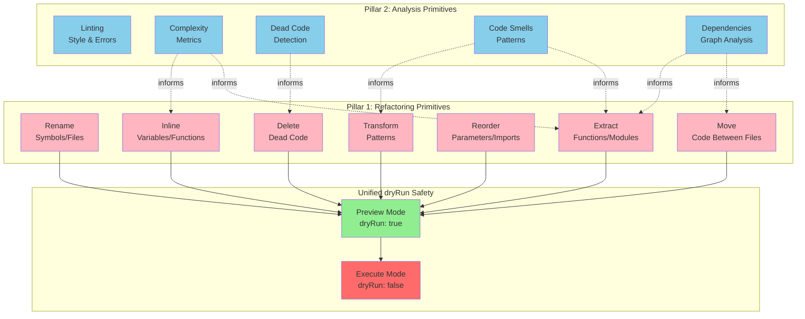
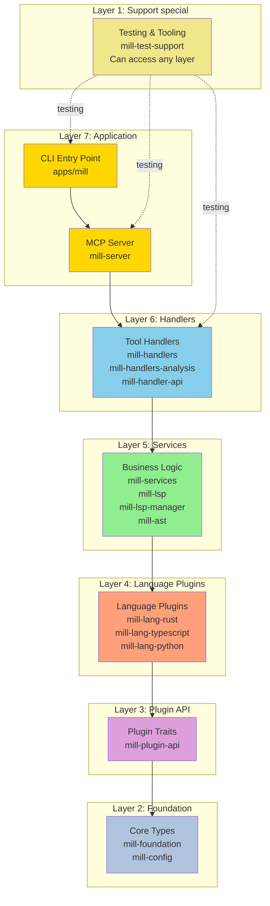
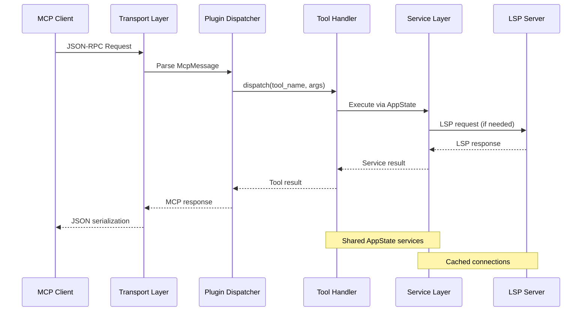

# TypeMill Core Concepts

> **System architecture fundamentals: code primitives, layered design, and key patterns**

This document explains TypeMill's architectural foundations through three lenses:
1. **Code Primitives** - The conceptual framework guiding tool design
2. **Architectural Layers** - The structural model enforcing clean dependencies
3. **System Architecture** - The implementation patterns bringing it all together

---

## Table of Contents

1. [Code Primitives Framework](#code-primitives-framework)
2. [Architectural Layers](#architectural-layers)
3. [System Architecture](#system-architecture)
4. [See Also](#see-also)

---

## Code Primitives Framework

TypeMill's design philosophy is built on **two foundational pillars** that work together to provide comprehensive code intelligence and transformation capabilities.

### The Two Pillars

**Pillar 1: Refactoring Primitives** (Code Transformation)
Atomic operations for restructuring code without changing external behavior. Each primitive is composable, focused, and language-independent.

**Pillar 2: Analysis Primitives** (Code Understanding)
Intelligence operations that measure code health, structure, and relationships, enabling informed refactoring decisions.

**Philosophy**: Analysis informs refactoring, refactoring builds on analysis.



---

### Refactoring Primitives

All refactoring primitives support the **unified dryRun API**: preview mode (default: `dryRun: true`) for safety, execution mode (`dryRun: false`) for explicit opt-in.

#### 1. Rename
**Concept**: Change symbol/file/directory names throughout the codebase.

**Tool**: `rename` (with dryRun option)

**Key Characteristics**:
- Scope-aware (local vs. global)
- Reference tracking (find all usages)
- Automatic import/export updates
- Cross-file consistency

**Use Cases**: Improving clarity, aligning with conventions, API refactoring

---

#### 2. Extract
**Concept**: Pull code blocks into functions, files, or modules for better organization.

**Tool**: `extract` (with dryRun option)

**Key Characteristics**:
- Scope preservation (captures parameters)
- Return value detection
- Dependency analysis
- Automatic import generation

**Use Cases**: Breaking down large functions, eliminating duplication, modularizing monoliths

---

#### 3. Move
**Concept**: Relocate code between files/directories while maintaining functionality.

**Tool**: `move` (with dryRun option)

**Key Characteristics**:
- Import/export rewiring
- Reference updating via ReferenceUpdater
- Namespace preservation
- Dependency tracking

**Use Cases**: Reorganizing structure, creating feature modules, consolidating code

---

#### 4. Inline
**Concept**: Replace references with values/implementations, reducing indirection.

**Tool**: `inline` (with dryRun option)

**Key Characteristics**:
- Scope-aware replacement
- Single/multiple occurrence handling
- Side effect preservation
- Type safety maintenance

**Use Cases**: Eliminating unnecessary variables, simplifying abstractions, optimization

---

#### 5. Reorder
**Concept**: Change sequence of code elements for clarity/convention compliance.

**Tools**: `reorder` (with dryRun option), `format_document`

**Key Characteristics**:
- Semantic preservation
- Convention awareness
- Dependency respect
- Style guide compliance

**Use Cases**: Organizing imports, grouping methods, following conventions

---

#### 6. Transform
**Concept**: Modify code structure while preserving behavior.

**Tools**: `transform` (with dryRun option), `get_code_actions`, `apply_edits`

**Key Characteristics**:
- Behavior preservation
- Pattern recognition
- Idiomatic conversion
- Type preservation

**Use Cases**: Converting loops to functional patterns, modernizing syntax, applying patterns

---

#### 7. Delete
**Concept**: Remove symbols, files, directories, or dead code safely.

**Tool**: `delete` (with dryRun option)

**Key Characteristics**:
- Dependency detection
- Safe removal validation
- Cascade cleanup

**Use Cases**: Cleaning legacy code, reducing bundle size, eliminating debt

---

### Analysis Primitives

Analysis primitives provide intelligence that informs refactoring decisions.

#### 1. Linting
**Concept**: Enforce style and detect simple errors.

**Tools**: `get_diagnostics`, `get_code_actions`

**Key Characteristics**:
- Real-time feedback
- Configurable rule sets
- Actionable suggestions
- LSP integration

**Use Cases**: Enforcing style, detecting mistakes, ensuring type safety

---

#### 2. Complexity Analysis
**Concept**: Measure code complexity (cyclomatic complexity, nesting depth).

**Tools**: `get_document_symbols`, `prepare_call_hierarchy`, `find_references`

**Key Characteristics**:
- Quantitative metrics
- Threshold warnings
- Hotspot identification
- Refactoring prioritization

**Use Cases**: Identifying candidates, code review guidance, technical debt tracking

---

#### 3. Dead Code Detection
**Concept**: Find unused or unreachable code.

**Tools**: `analyze.dead_code`, `find_references`, `analyze.dependencies`

**Key Characteristics**:
- Whole-program analysis
- Export tracking
- Import validation
- Safe removal suggestions

**Use Cases**: Cleaning legacy code, reducing bundle size, improving compile times

---

#### 4. Code Smell Detection
**Concept**: Identify patterns suggesting poor structure.

**Tools**: `get_diagnostics`, `get_code_actions`, `analyze.dead_code`

**Common Smells**:
- Long functions (extract candidate)
- Duplicate code (shared function)
- Large classes (split modules)
- Deep nesting (flatten control flow)

**Use Cases**: Pattern recognition, refactoring suggestions, context-aware analysis

---

#### 5. Dependency Analysis
**Concept**: Map relationships between modules, functions, files.

**Tools**: `analyze.dependencies`, `find_references`, call hierarchy tools

**Key Characteristics**:
- Graph construction
- Circular dependency detection
- Impact analysis
- Layering validation

**Use Cases**: Impact assessment, architectural analysis, breaking circular deps

---

### Primitive Composition

The power of this framework comes from **composing primitives** to achieve complex goals.

#### Example: Safe Module Extraction

**Goal**: Extract large file into multiple smaller modules.

**Primitive Sequence**:
1. **Analyze Dependencies** (`analyze.dependencies`) - Understand structure
2. **Detect Complexity** (`get_document_symbols`) - Identify candidates
3. **Extract Functions** (`extract` with `dryRun: false`) - Pull out logical units
4. **Move to New Files** (`move` with `dryRun: false`) - Create module structure
5. **Update Imports** (automatic via unified API) - Maintain references
6. **Verify No Dead Code** (`analyze.dead_code`) - Ensure clean migration
7. **Format All Files** (`format_document`) - Apply consistent style

---

### The Unified dryRun Pattern

TypeMill implements a **consistent safety pattern** for all refactoring operations.

**Preview Mode (default: `dryRun: true`)**:
- Always read-only, never modifies files
- Generates detailed refactoring plan
- Includes checksums for affected files
- Returns warnings about potential issues
- Safe default prevents accidental execution

**Execution Mode (explicit: `dryRun: false`)**:
- Applies changes immediately with validation
- Validates checksums to prevent stale edits
- Atomic execution (all succeed or all rollback)
- Optional validation command (e.g., `cargo check`)
- Automatic rollback on failure

**Safety Features**:
- Safe defaults (all tools default to preview)
- Checksum validation (prevents stale operations)
- Atomic application (transaction-like semantics)
- Optional validation (run build/test after changes)

**Example Workflow**:
```bash
# Step 1: Preview (default dryRun: true)
mill tool rename '{"target": {...}, "newName": "newUser"}'
# Output: RenamePlan with edits, warnings, checksums

# Step 2: Review plan (verify correctness)

# Step 3: Execute (explicit dryRun: false)
mill tool rename '{
  "target": {...},
  "newName": "newUser",
  "options": {
    "dryRun": false,
    "validation": {"command": "cargo check", "timeout_seconds": 60}
  }
}'
# Output: ExecutionResult with success, applied_files
```

---

### Design Principles

**1. Atomicity**: Each primitive represents a single, focused operation (clear semantics, easy testing, predictable composition).

**2. Composability**: Primitives combine to solve complex problems (flexible workflows, reusable blocks, incremental refactoring).

**3. Language Independence**: Primitives are conceptually universal across languages (consistent UX, plugin architecture, transferable knowledge).

**4. Safety First**: All primitives preserve correctness (no breaking changes, type safety, reference integrity, atomic transactions).

---

## Architectural Layers

TypeMill follows a **strict layered architecture** with enforced dependencies to prevent "spider web" complexity.

### Layer Hierarchy

> [!NOTE] Dependency Rule
> Each layer can only depend on layers below it, never above. This prevents "spider web" complexity and makes the system easier to understand and maintain.

Layers are organized from foundational (bottom) to application (top):



### Layer Definitions

#### Layer 1: Support (Special Status)
**Purpose**: Testing infrastructure, build tooling, analysis tools

**Crates**: `mill-test-support`, `xtask`, `analysis/*`

**Dependencies**: Can access any layer (testing needs)

**Rationale**: Test/tooling crates need broad access to verify behavior. Never depended upon by production code.

---

#### Layer 2: Foundation
**Purpose**: Core data structures, protocol definitions, configuration

**Crates**: `mill-foundation`, `mill-config`

**Dependencies**: External crates only (serde, tokio, etc.) - **No workspace dependencies**

**Constraints**:
- No upward dependencies
- Minimal external dependencies
- Stable APIs (changes ripple through codebase)

---

#### Layer 3: Plugin API
**Purpose**: Define language plugin trait and capabilities

**Crates**: `mill-plugin-api`

**Dependencies**: Layer 2 (Foundation)

**Constraints**:
- Must remain stable (external plugins depend on this)
- No dependencies on language implementations
- No dependencies on services or handlers

---

#### Layer 4: Language Plugins
**Purpose**: Language-specific implementations of code intelligence

**Crates**: `mill-lang-common`, `mill-lang-rust`, `mill-lang-typescript`, `mill-lang-python`, `mill-lang-swift`, `mill-lang-csharp`, `mill-lang-java`, `mill-lang-go`, `mill-lang-c`, `mill-lang-cpp`, `mill-lang-markdown`, `mill-lang-toml`, `mill-lang-yaml`

**Dependencies**: Layer 3 (Plugin API), Layer 2 (Foundation)

**Constraints**:
- Plugins are independent (no cross-plugin dependencies)
- Each plugin only depends on plugin-api and foundation
- `mill-lang-common` can be used by any plugin for shared utilities

---

#### Layer 5: Services
**Purpose**: Core business logic, file operations, AST processing, LSP integration

**Crates**: `mill-ast`, `mill-services`, `mill-lsp`, `mill-lsp-manager`, `mill-plugin-bundle`, `mill-plugin-system`

**Dependencies**: Layer 4 (Plugins), Layer 3 (Plugin API), Layer 2 (Foundation)

**Constraints**:
- Services coordinate plugins but don't implement language logic
- No dependencies on handlers or application layer
- Services can depend on each other within this layer

---

#### Layer 6: Handlers
**Purpose**: MCP tool implementations that delegate to services

**Crates**: `mill-handlers`, `mill-handlers-analysis`, `mill-handler-api`

**Dependencies**: Layer 5 (Services), Layer 4 (Plugins - for delegation), Layer 3 (Plugin API), Layer 2 (Foundation)

**Constraints**:
- Handlers are thin adapters (business logic in services)
- No upward dependencies
- May directly access plugins for simple delegation

---

#### Layer 7: Application
**Purpose**: Server, client, transport, CLI entry points

**Crates**: `mill-server`, `mill-client`, `mill-transport`, `mill-auth`, `mill-workspaces`

**Dependencies**: Layer 6 (Handlers), Layer 5 (Services), Layer 3 (Plugin API - for registration), Layer 2 (Foundation)

**Constraints**:
- Top-level wiring and initialization only
- No business logic (delegate to services/handlers)
- Entry points for binaries

---

### Dependency Rules

**✅ Allowed**:
1. Downward only (higher layers → lower layers)
2. Same layer (services can depend on each other)
3. Support access (Layer 1 can access any layer for testing)

**❌ Forbidden**:
1. Upward (lower layers → higher layers)
2. Cross-plugin (plugins depending on each other)
3. Handler bypass (application bypassing handlers → services)
4. Production depends on test (any production → `mill-test-support`)

### Enforcement

Programmatically enforced using `cargo-deny` bans feature.

**Validation**:
```bash
cargo deny check bans           # Check violations
cargo deny check                # Full check
cargo depgraph --workspace-only # Visualize
```

**Benefits**:
- **For Developers**: Clear mental model, reduced coupling, easier debugging
- **For Architecture**: Prevents rot, scalable, modular
- **For Testing**: Isolated testing, clear boundaries

---

## System Architecture

### High-Level Crate Structure

TypeMill is built on a multi-crate architecture with focused responsibilities:

```
apps/mill                    → CLI entry point
├─ mill-server               → MCP server orchestration
   ├─ mill-handlers          → Tool implementations (29 public tools)
      ├─ mill-services       → Business logic, LSP, AST
         ├─ mill-ast         → Language plugin coordination
         ├─ mill-lsp         → LSP client management
         ├─ mill-plugins     → Plugin system
            ├─ mill-lang-*   → Language plugins
               ├─ mill-plugin-api → Plugin trait
                  ├─ mill-core      → Foundation (types, protocol, config)
```

**Key crates**:
- **mill-server**: Transport, routing, state management
- **mill-handlers**: MCP tool implementations
- **mill-services**: LSP integration, AST caching, refactoring engine
- **mill-lsp**: Language server client abstraction
- **mill-ast**: Language plugin coordination

---

### Request Lifecycle

**Modern Request Flow** (plugin-based dispatch):



1. **Request Reception**
   Transport Layer (stdio/WebSocket) → JSON parsing → McpMessage

2. **Plugin Dispatch**
   PluginDispatcher::dispatch() → MessageDispatcher → Tool lookup

3. **Service Execution**
   Plugin handler → AppState services → Service implementations

4. **Response Generation**
   Service result → MCP response → JSON serialization → Transport

**Key Components**:
- **PluginDispatcher**: Central orchestrator, manages plugin lifecycle, unified error handling
- **MessageDispatcher**: Routes messages to plugins, handles tool registration
- **AppState**: Shared service container, dependency injection

---

### Handler Architecture

**Unified ToolHandler Trait** - All tool handlers implement a single, consistent interface:

```rust
#[async_trait]
pub trait ToolHandler: Send + Sync {
    fn tool_names(&self) -> &[&str];
    async fn handle_tool_call(
        &self,
        context: &ToolHandlerContext,
        tool_call: &ToolCall,
    ) -> ServerResult<Value>;
}
```

**Design Principles**:
1. Single Responsibility (each handler focuses on tool category)
2. Compile-Time Safety (Rust type system ensures correctness)
3. Zero-Cost Abstractions (no runtime overhead)
4. Context Injection (handlers receive services via ToolHandlerContext)

**Handler Context**:
```rust
pub struct ToolHandlerContext {
    pub app_state: Arc<AppState>,              // Services
    pub plugin_manager: Arc<PluginManager>,    // Language plugins
    pub lsp_adapter: Arc<Mutex<...>>,          // LSP communication
}
```

**Current Handlers (7 total, 45 tools)**:
- **SystemHandler** (3 tools): health_check, web_fetch, ping
- **LifecycleHandler** (3 tools): file open/save/close notifications
- **NavigationHandler** (10 tools): Symbol navigation, references, definitions
- **EditingHandler** (9 tools): Formatting, code actions, diagnostics
- **RefactoringHandler** (7 tools): Unified refactoring with dryRun
- **FileOpsHandler** (6 tools): File read/write/delete operations
- **WorkspaceHandler** (7 tools): Workspace-wide analysis and refactoring

---

### Plugin System

**Self-Registration** - Each language plugin registers itself via macro:

```rust
// In mill-lang-rust/src/lib.rs
use mill_plugin_registry::mill_plugin;

mill_plugin! {
    name: "rust",
    extensions: ["rs"],
    manifest: "Cargo.toml",
    capabilities: PluginCapabilities::all(),
    factory: RustPlugin::new,
    lsp: Some(LspConfig::new("rust-analyzer", &["rust-analyzer"]))
}
```

**Discovery** - Server iterates registered plugins at startup:

```rust
pub fn build_language_plugin_registry() -> Arc<PluginRegistry> {
    let mut registry = PluginRegistry::new();
    for descriptor in mill_plugin_registry::iter_plugins() {
        let plugin = (descriptor.factory)();
        registry.register(plugin);
    }
    Arc::new(registry)
}
```

**Benefits**:
- True modularity (adding language requires no core changes)
- Simplicity (no config files, build scripts, feature flags)
- Compile-time safety (plugin either linked or not)

**Priority-Based Selection** - Chooses best plugin for each request:

1. **Config Overrides** (highest): User-defined priorities
2. **Plugin Metadata**: `priority` field (default: 50)
3. **Lexicographic Order**: Deterministic fallback for ties

**Tool Scope System**:
- **File-scoped**: Requires file_path + method match (e.g., `find_definition`, `rename`)
- **Workspace-scoped**: Only method match needed (e.g., `search_workspace_symbols`, `list_files`)

---

### Language Support

**Full Parity (100%)**: Rust, TypeScript, Python, Swift, C#, Java, Go
**Partial Support**: C, C++ (experimental)

All full-parity languages implement 15 common capability traits:
- **Core LanguagePlugin** (5 methods): parse, analyze_manifest, list_functions, analyze_detailed_imports
- **Import Support** (5 traits): ImportParser, ImportRenameSupport, ImportMoveSupport, ImportMutationSupport, ImportAdvancedSupport
- **Workspace Operations** (1 trait): Multi-package management
- **Refactoring Operations** (1 trait, 3 operations): Extract Function, Inline Variable, Extract Variable
- **Code Analysis** (2 traits): ModuleReferenceScanner, ImportAnalyzer
- **Manifest Management** (1 trait): Update dependencies, generate manifests
- **Project Creation** (1 trait): Package scaffolding

---

### Key Patterns

#### 1. dryRun Safety Pattern
All refactoring tools default to preview mode. Execution requires explicit opt-in.

**Default**: `dryRun: true` (safe preview)
**Execution**: `dryRun: false` (explicit opt-in)

#### 2. Plugin Dispatch Pattern
Priority-based selection with scope awareness (file vs. workspace tools).

#### 3. Service Injection Pattern
AppState acts as dependency injection container:

```rust
pub struct AppState {
    pub ast_service: Arc<dyn AstService>,
    pub file_service: Arc<FileService>,
    pub project_root: PathBuf,
    pub lock_manager: Arc<LockManager>,
    pub operation_queue: Arc<OperationQueue>,
}
```

---

## See Also

### Architecture Documentation
- **[README.md](README.md)** - Architecture navigation hub
- **[specifications.md](specifications.md)** - API contracts, tool visibility
- **[lang_common_api.md](lang_common_api.md)** - Language plugin development
- **[internal_tools.md](internal_tools.md)** - Internal tool reference

### Project Documentation
- **[../../CLAUDE.md](../../CLAUDE.md)** - AI agent quick reference
- **[../../contributing.md](../../contributing.md)** - Development guide
- **[../tools/](../tools/)** - Tool catalog and usage
