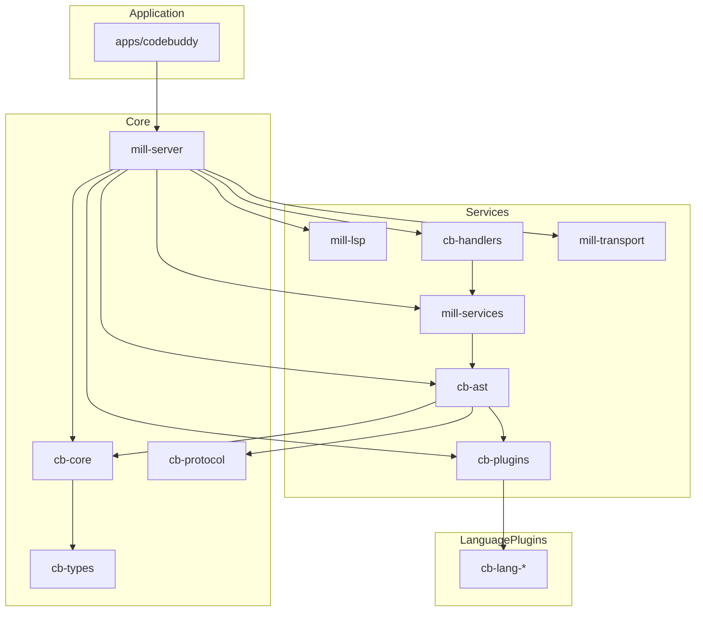
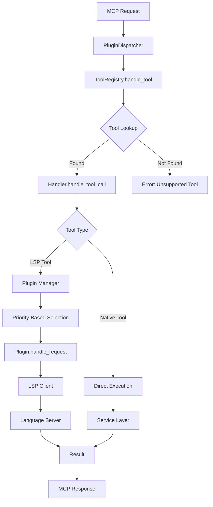

# Architecture Documentation

## Overview

Codebuddy is a pure Rust MCP server that bridges Model Context Protocol (MCP) with Language Server Protocol (LSP) functionality. The architecture follows a service-oriented design with clear crate separation, AI-friendly boundaries, and comprehensive code intelligence tools.

**For the conceptual framework underlying the tool design, see [PRIMITIVES.md](primitives.md)** - which explains the two-pillar philosophy (Refactoring Primitives and Analysis Primitives) that guides how all 44+ MCP tools are organized.

## High-Level Architecture

The system is built on a multi-crate architecture with focused responsibilities and clear dependency hierarchies:



## Crate Responsibilities

### Core Layer

- **`cb-types`**: Defines the fundamental data structures used across the entire application, such as `Symbol`, `SourceLocation`, and `FileEdit`. It has no dependencies on other workspace crates.
- **`cb-protocol`**: Contains the definitions for the Model Context Protocol (MCP), including request and response formats. Depends only on `cb-types`.
- **`cb-core`**: Provides application-wide services like configuration management, logging, and error handling. Depends on `cb-types`.
- **`mill-server`**: The central orchestration crate that wires all services together. It initializes the application state and manages the main request loop.

### Service Layer

- **`cb-ast`**: Handles Abstract Syntax Tree (AST) parsing, code analysis, and transformations. It's responsible for language intelligence features like finding unused imports and analyzing code complexity.
- **`cb-plugins`**: Manages the language plugin system, including plugin registration, discovery, and dispatching requests to the appropriate language plugin.
- **`mill-lsp`**: Provides the integration with the Language Server Protocol (LSP), managing LSP clients and translating between MCP and LSP.
- **`mill-services`**: Contains business logic for file operations, import management, and other core services.
- **`mill-handlers`**: Defines the handlers for each MCP tool, mapping tool requests to the corresponding service implementations.
- **`mill-transport`**: Implements the communication protocols, including WebSocket and stdio, for receiving MCP requests and sending responses.

### Language Plugin Layer

- **`cb-lang-*`**: A collection of individual crates, each providing language-specific support for a particular programming language (e.g., `cb-lang-rust`, `cb-lang-typescript`).
- **`cb-lang-common`**: A utility crate that provides shared code and helpers for language plugin development, reducing boilerplate.
- **`mill-plugin-api`**: Defines the `LanguagePlugin` trait and other core APIs that all language plugins must implement.

### Application Layer

- **`apps/codebuddy`**: The executable entry point for the application. It handles CLI argument parsing, server bootstrap, and process management.

## Request Lifecycle

### Modern Request Flow

The current architecture uses a plugin-based dispatch system:

1. **Request Reception**
   ```
   Transport Layer (stdio/WebSocket) → JSON parsing → McpMessage
   ```

2. **Plugin Dispatch**
   ```
   PluginDispatcher::dispatch() → MessageDispatcher → Tool lookup
   ```

3. **Service Execution**
   ```
   Plugin handler → AppState services → Service implementations
   ```

4. **Response Generation**
   ```
   Service result → MCP response → JSON serialization → Transport
   ```

### Key Components

**`PluginDispatcher`**
- Central request orchestrator
- Manages plugin lifecycle and routing
- Provides unified error handling

**`MessageDispatcher`**
- Routes messages to appropriate plugins
- Handles tool registration and discovery
- Manages concurrent request processing

**`AppState`**
- Shared service container
- Provides dependency injection for services
- Maintains application-wide state

## Core Architecture: Unified Handlers & Plugins

The "Foundations First" architecture unifies all 44 MCP tools through a consistent, high-performance handler pattern. This design eliminates technical debt, enables zero-cost abstractions, and provides a scalable foundation for future tool additions.

### The Unified `ToolHandler` Trait

All tool handlers implement a single, consistent interface defined in `../../crates/mill-server/src/handlers/tools/mod.rs`:

```rust
#[async_trait]
pub trait ToolHandler: Send + Sync {
    /// Returns the list of tool names this handler provides
    fn tool_names(&self) -> &[&str];

    /// Handles a tool call with full context
    async fn handle_tool_call(
        &self,
        context: &ToolHandlerContext,
        tool_call: &ToolCall,
    ) -> ServerResult<Value>;
}
```

**Key Design Principles:**

1. **Single Responsibility**: Each handler focuses on a specific category of tools
2. **Compile-Time Safety**: Rust's type system ensures handler correctness
3. **Zero-Cost Abstractions**: No runtime overhead for handler dispatch
4. **Context Injection**: Handlers receive all needed services through `ToolHandlerContext`

**Handler Context Structure:**

```rust
pub struct ToolHandlerContext {
    pub app_state: Arc<AppState>,
    pub plugin_manager: Arc<PluginManager>,
    pub lsp_adapter: Arc<Mutex<Option<Arc<DirectLspAdapter>>>>,
}
```

This provides handlers with access to:
- **AppState**: File service, lock manager, operation queue
- **PluginManager**: Language-specific plugin dispatch
- **LSP Adapter**: Direct LSP server communication

### Macro-Based Registration

The system uses declarative macros for clean, maintainable handler registration (defined in `../../crates/mill-server/src/handlers/macros.rs`):

```rust
register_handlers_with_logging!(registry, {
    SystemHandler => "SystemHandler with 3 tools: health_check, web_fetch, ping",
    LifecycleHandler => "LifecycleHandler with 3 tools: notify_file_opened, notify_file_saved, notify_file_closed",
    NavigationHandler => "NavigationHandler with 10 tools: find_definition, find_references, ...",
    EditingHandler => "EditingHandler with 9 tools: format_document, get_code_actions, ...",
    RefactoringHandler => "RefactoringHandler with 8 tools: rename.plan, extract.plan, inline.plan, move.plan, reorder.plan, transform.plan, delete.plan, workspace.apply_edit",
    FileOpsHandler => "FileOpsHandler with 6 tools: read_file, write_file, ...",
    WorkspaceHandler => "WorkspaceHandler with 7 tools: list_files, analyze.dead_code, ...",
});
```

**Benefits:**

- **Declarative**: Clear intent, no boilerplate
- **Automatic Logging**: Debug output for each registered handler
- **Compile-Time Validation**: Ensures all handlers implement `ToolHandler`
- **Easy Extension**: Add new handlers by adding one line

**Implementation in `plugin_dispatcher.rs`:**

```rust
pub async fn initialize(&self) -> ServerResult<()> {
    let mut registry = self.tool_registry.lock().await;

    // All tools registered (24 public + 20 internal) in ~10 lines of declarative code
    register_handlers_with_logging!(registry, {
        SystemHandler => "SystemHandler with 3 tools...",
        // ... 7 handlers total
    });

    Ok(())
}
```

### Priority-Based Plugin Selection

The plugin system uses a sophisticated multi-tiered selection algorithm to choose the best plugin for each tool request.

**Configuration in `.codebuddy/config.json`:**

```json
{
  "plugin_selection": {
    "priorities": {
      "typescript-plugin": 100,
      "rust-analyzer-plugin": 90,
      "generic-lsp-plugin": 50
    },
    "error_on_ambiguity": false
  }
}
```

**Selection Algorithm (in `crates/cb-plugins/src/registry.rs`):**

```rust
pub fn find_best_plugin(&self, file_path: &Path, method: &str) -> PluginResult<String> {
    // Step 1: Determine tool scope from capabilities
    let tool_scope = self.get_tool_scope(method);

    // Step 2: Filter plugins based on scope
    let candidates = match tool_scope {
        Some(ToolScope::File) => {
            // File-scoped tools require BOTH file extension AND method match
            self.find_plugins_for_file(file_path)
                .into_iter()
                .filter(|p| self.supports_method(p, method))
                .collect()
        }
        Some(ToolScope::Workspace) | None => {
            // Workspace-scoped tools only need method match
            self.find_plugins_for_method(method)
        }
    };

    // Step 3: Select highest priority plugin
    // Ties broken by lexicographic order (deterministic)
    self.select_by_priority(&candidates, method)
}
```

**Priority Tiers:**

1. **Config Overrides** (highest): User-defined priorities in config file
2. **Plugin Metadata**: `priority` field in `PluginMetadata` (default: 50)
3. **Lexicographic Order**: Deterministic fallback for tied priorities

**Tool Scope System:**

Tools are classified by scope to optimize plugin selection:

```rust
pub enum ToolScope {
    /// Tool operates on a specific file (requires file_path)
    File,        // Example: find_definition, rename.plan
    /// Tool operates at workspace level (no file_path required)
    Workspace,   // Example: search_workspace_symbols, list_files
}
```

**Scope Detection (in `crates/cb-plugins/src/capabilities.rs`):**

```rust
impl Capabilities {
    pub fn get_tool_scope(&self, method: &str) -> Option<ToolScope> {
        match method {
            // File-scoped tools
            | "find_definition"
            | "rename.plan"
            | "format_document" => Some(ToolScope::File),

            // Workspace-scoped tools
            | "search_workspace_symbols"
            | "list_files"
            | "analyze.dead_code" => Some(ToolScope::Workspace),

            _ => None,
        }
    }
}
```

**Performance Characteristics:**

- **Plugin Selection**: 141ns (1 plugin) to 1.7µs (20 plugins)
- **Priority Lookup**: O(1) hash map access with config overrides
- **Scope Detection**: O(1) match expression (constant time)
- **Ambiguity Resolution**: Configurable error or deterministic fallback

**Error Handling:**

When `error_on_ambiguity: true` in config:
```rust
PluginError::AmbiguousPluginSelection {
    method: "find_definition",
    plugins: vec!["plugin-a", "plugin-b"],
    priority: 50,
}
```

When `error_on_ambiguity: false` (default):
- Automatically selects first plugin by lexicographic order
- Logs warning with candidates for debugging

### Handler Architecture

**Current Handler Organization:**

| Handler | Tools | Scope | Purpose |
|---------|-------|-------|---------|
| **SystemHandler** | 3 | System | Health checks, web fetch, ping |
| **LifecycleHandler** | 3 | Lifecycle | File open/save/close notifications |
| **NavigationHandler** | 10 | LSP | Symbol navigation, references, definitions |
| **EditingHandler** | 9 | LSP | Formatting, code actions, diagnostics |
| **RefactoringHandler** | 8 | Unified API | Unified refactoring: *.plan commands + workspace.apply_edit |
| **FileOpsHandler** | 6 | File | File read/write/delete/create operations |
| **WorkspaceHandler** | 7 | Workspace | Workspace-wide analysis and refactoring |

**Total: 46 Tools across 7 Handlers**

### Dispatch Flow



**Key Optimizations:**

1. **Single Lookup**: Tool name → Handler (O(1) hash map)
2. **No Adapters**: Direct handler invocation (zero overhead)
3. **Lazy Plugin Selection**: Only computed when needed
4. **Concurrent Safe**: All handlers are `Send + Sync`

### Backward Compatibility

The architecture maintains full backward compatibility through the `compat` module:

```rust
// ../../crates/mill-server/src/handlers/compat.rs
pub use crate::handlers::tools::ToolHandler as LegacyToolHandler;
pub use crate::handlers::tools::ToolHandlerContext as ToolContext;
```

Legacy handlers can be gradually migrated without breaking existing functionality.

### Testing Strategy

**Safety Net Test (../../crates/mill-server/tests/tool_registration_test.rs):**

```rust
#[tokio::test]
async fn test_all_42_tools_are_registered() {
    let dispatcher = create_test_dispatcher();
    dispatcher.initialize().await.unwrap();

    let registry = dispatcher.tool_registry.lock().await;
    let registered_tools = registry.list_tools();

    // Verify all public tools are present
    assert_eq!(registered_tools.len(), 24);
    assert!(registered_tools.contains(&"find_definition".to_string()));
    // ... validate all tools
}
```

This test ensures no tools are accidentally removed during refactoring.

**Plugin Selection Tests (crates/cb-plugins/src/registry.rs):**

- `test_scope_aware_file_tool_selection`: File-scoped tool routing
- `test_scope_aware_workspace_tool_selection`: Workspace-scoped tool routing
- `test_priority_based_selection`: Priority ordering
- `test_priority_override`: Config override behavior
- `test_ambiguous_selection_error`: Ambiguity detection
- `test_ambiguous_selection_fallback`: Deterministic fallback

**Total: 41 cb-plugins tests, 67 cb-ast tests, 1 integration test - All passing**

## Component Interactions

### Service Architecture

The architecture is built around service traits defined in `cb-api`:

```rust
// Core service traits
pub trait AstService: Send + Sync {
    async fn analyze_dependencies(&self, file_path: &Path) -> ApiResult<ImportGraph>;
    async fn generate_edit_plan(&self, request: RefactorRequest) -> ApiResult<EditPlan>;
}

pub trait LspService: Send + Sync {
    async fn request(&self, message: Message) -> ApiResult<Message>;
    async fn notify_file_opened(&self, file_path: &Path) -> ApiResult<()>;
}
```

### AppState Service Container

The `AppState` acts as a dependency injection container:

```rust
pub struct AppState {
    pub ast_service: Arc<dyn AstService>,
    pub file_service: Arc<FileService>,
    pub project_root: PathBuf,
    pub lock_manager: Arc<LockManager>,
    pub operation_queue: Arc<OperationQueue>,
}
```

## Language Plugin System

**Architecture**: Self-registering plugins with link-time discovery.

**Core Design**:
- **Decoupling**: The core system (`mill-services`, `cb-core`, etc.) has no direct knowledge of specific language plugins.
- **Self-Registration**: Each language plugin crate is responsible for registering itself with the system.
- **Link-Time Discovery**: The main server binary discovers all available plugins at link time, meaning no runtime file scanning or complex configuration is needed. Adding a language is as simple as adding the crate to the workspace.

### The `cb-plugin-registry` Crate

This crate is the heart of the self-registration mechanism. It provides:
- A `PluginDescriptor` struct that holds all metadata about a language plugin (its name, file extensions, capabilities, and a factory function to create an instance).
- A macro, `codebuddy_plugin!`, that language plugins use to declare their metadata.
- An iterator, `iter_plugins()`, which the server uses at startup to get a list of all registered plugins.

The magic is handled by the `inventory` crate, which collects all the static `PluginDescriptor` instances created by the macro into a single, iterable collection that the application can access.

### How a Plugin Registers Itself

Inside a language plugin crate (e.g., `cb-lang-rust`), registration is a single macro call:

```rust
// In crates/cb-lang-rust/src/lib.rs
use cb_plugin_registry::codebuddy_plugin;

codebuddy_plugin! {
    name: "rust",
    extensions: ["rs"],
    manifest: "Cargo.toml",
    capabilities: PluginCapabilities::all(),
    factory: RustPlugin::new,
    lsp: Some(LspConfig::new("rust-analyzer", &["rust-analyzer"]))
}
```

This macro expands into a static `PluginDescriptor` that `inventory` picks up.

### How the Server Discovers Plugins

At startup, the `PluginRegistry` is built by simply iterating over the discovered plugins:

```rust
// In ../../crates/mill-services/src/services/registry_builder.rs
pub fn build_language_plugin_registry() -> Arc<PluginRegistry> {
    let mut registry = PluginRegistry::new();
    for descriptor in cb_plugin_registry::iter_plugins() {
        let plugin = (descriptor.factory)();
        registry.register(plugin);
    }
    Arc::new(registry)
}
```

**Benefits**:
- **True Modularity**: Adding or removing a language plugin requires no changes to core crates.
- **Simplicity**: No more `languages.toml`, build scripts, or feature flags for managing languages.
- **Compile-Time Safety**: The plugin is either linked and registered, or it's not. No runtime errors from misconfiguration.

### LSP Integration

The LSP system provides direct language server communication:

- **`LspManager`**: Orchestrates multiple LSP clients by file extension
- **`LspClient`**: Manages individual LSP server processes
- **Direct Communication**: Bypasses legacy request mapping through plugin adapters

### Modern Tool Registration

Tools are registered through the plugin system rather than hardcoded mappings:

```rust
// Plugin-based tool registration
impl LanguagePlugin for SystemToolsPlugin {
    async fn handle_request(&self, request: &ToolRequest, app_state: &AppState) -> PluginResult<ToolResponse> {
        match request.tool.as_str() {
            "find_definition" => self.find_definition(request, app_state).await,
            "get_diagnostics" => self.get_diagnostics(request, app_state).await,
            _ => Err(PluginError::UnsupportedTool(request.tool.clone()))
        }
    }
}
```

## Tool Categories

The system provides comprehensive code intelligence through various tool categories:

### 1. Navigation Tools
- **Symbol Definition**: Find where symbols are defined
- **Symbol References**: Find all references to symbols
- **Workspace Symbols**: Search for symbols across the project
- **Document Symbols**: Get all symbols in a file

### 2. Intelligence Tools
- **Hover Information**: Rich documentation and type information
- **Code Completions**: Context-aware code suggestions
- **Signature Help**: Function parameter assistance
- **Diagnostics**: Real-time error and warning detection

### 3. Editing Tools
- **Symbol Renaming**: Project-wide symbol renaming
- **Code Formatting**: Language-specific formatting
- **Code Actions**: Quick fixes and refactoring suggestions
- **Workspace Edits**: Multi-file atomic editing operations

### 4. Analysis Tools
- **Import Analysis**: Dependency graph analysis via `cb-ast`
- **Dead Code Detection**: Unused code identification
- **Call Hierarchy**: Function call relationships
- **Type Hierarchy**: Type inheritance relationships

### 5. Filesystem Tools
- **File Operations**: Cross-platform file manipulation
- **Directory Operations**: Workspace management
- **Path Resolution**: Canonical path handling
- **File Watching**: Real-time file system monitoring

### 6. Refactoring Tools (Unified API)
The unified refactoring API provides a consistent `plan -> apply` pattern for all refactoring operations:

- **Planning Tools**: Generate refactoring plans without modifying files
  - `rename.plan` - Plan symbol, file, or directory rename
  - `extract.plan` - Plan code extraction (function, variable, constant)
  - `inline.plan` - Plan inlining (variable, function)
  - `move.plan` - Plan moving code between files/modules
  - `reorder.plan` - Plan reordering (parameters, imports)
  - `transform.plan` - Plan code transformations (async conversion, etc.)
  - `delete.plan` - Plan deletion of unused code
- **Application Tool**: Execute any refactoring plan
  - `workspace.apply_edit` - Apply plans with atomic execution, checksum validation, and rollback

## Configuration Management

### Hierarchical Configuration

Configuration is managed through the `cb-core` crate with support for multiple sources:

1. **Default Configuration**: Built-in sensible defaults
2. **Configuration Files**: JSON/TOML support (`.codebuddy/config.json`)
3. **Environment Variables**: Runtime overrides
4. **Command Line**: Highest precedence overrides

### Configuration Structure

```rust
#[derive(Debug, Clone, Default, Serialize, Deserialize)]
pub struct AppConfig {
    pub server: ServerConfig,    // WebSocket/stdio server settings
    pub lsp: LspConfig,         // Language server configurations
    pub fuse: Option<FuseConfig>, // Optional FUSE filesystem
    pub logging: LoggingConfig,  // Logging configuration
    pub cache: CacheConfig,     // Caching settings
}
```

### LSP Server Configuration

Each language server is configured with:

```rust
#[derive(Debug, Clone, Serialize, Deserialize)]
pub struct LspServerConfig {
    pub extensions: Vec<String>,        // File extensions handled
    pub command: Vec<String>,           // Command to start LSP server
    pub root_dir: Option<PathBuf>,      // Working directory
    pub restart_interval: Option<u64>,  // Auto-restart interval
}
```

## Error Handling Strategy

### Error Types Hierarchy

The system uses a layered error handling approach:

```rust
ApiError ← CoreError ← ServerError ← Transport-specific errors
```

### Error Propagation

- **Service Errors**: Propagated through `ApiResult<T>` from service traits
- **LSP Errors**: Wrapped as `ApiError` with contextual information
- **File System Errors**: Converted to appropriate error responses
- **Configuration Errors**: Fail fast during application startup

### Error Recovery

- **LSP Server Failures**: Graceful degradation with optional restart
- **Network Errors**: Connection-level retry logic
- **Parse Errors**: Detailed error messages with context
- **Resource Exhaustion**: Configurable limits and throttling

## Multi-Tenancy Architecture

To support multiple users securely, Codebuddy implements a multi-tenancy model that ensures user data and workspaces are isolated.

### Core Principles

1.  **User-Scoped Workspaces**: All workspace operations are scoped to the currently authenticated user. A user cannot see, access, or modify another user's workspaces.
2.  **JWT-Based Authentication**: User identity is established via a JSON Web Token (JWT) passed in the `Authorization` header of API requests.
3.  **Centralized Enforcement**: Multi-tenancy is enforced at the API gateway and service layers, ensuring consistent security across all workspace-related tools.

### Implementation Details

-   **`user_id` Claim**: The JWT payload must contain a `user_id` claim, which is a unique identifier for the user.
-   **`WorkspaceManager` Partitioning**: The `WorkspaceManager` no longer uses a simple `workspace_id` as the key. Instead, it uses a composite key `(user_id, workspace_id)`. This change in `../../../../../../crates/mill-foundation/src/core/src/workspaces.rs` is the core of the data isolation model.
-   **API Endpoint Authorization**: Endpoints that manage workspaces (e.g., `/workspaces/register`, `/workspaces/{id}/execute`) now extract the `user_id` from the JWT. All subsequent calls to the `WorkspaceManager` must provide this `user_id`, ensuring that operations are performed only on the workspaces owned by that user.

This architecture provides a robust and secure foundation for multi-user environments, preventing data leakage and unauthorized access.

---

## Performance Architecture

### Async Runtime

- **Tokio-based**: Efficient async I/O with minimal thread overhead
- **Concurrent Processing**: Multiple MCP requests handled simultaneously
- **Resource Pooling**: Shared LSP clients and service instances

### Memory Management

- **Arc-based Sharing**: Efficient shared ownership of services
- **Lazy Initialization**: Services created on-demand
- **Bounded Caching**: TTL-based caching with size limits

### Optimization Features

- **Native Performance**: Zero-cost Rust abstractions
- **Memory Safety**: Compile-time guarantees prevent common vulnerabilities
- **Minimal Allocations**: Efficient data structures and borrowing

## Security Model

### Process Isolation

- **LSP Servers**: Run as separate child processes
- **Workspace Boundaries**: File operations restricted to project scope
- **Command Validation**: LSP commands validated against configuration

### Input Validation

- **JSON Schema**: All MCP requests validated against schemas
- **Path Sanitization**: Prevents directory traversal attacks
- **Type Safety**: Rust's type system prevents many common vulnerabilities

## Development Workflow

### Adding New Tools

1. **Define Tool Schema**: Add to appropriate plugin
2. **Implement Handler**: Create async handler function
3. **Register Tool**: Add to plugin's tool registry
4. **Add Tests**: Unit and integration tests
5. **Update Documentation**: Tool-specific documentation

### Language Plugin Development

For adding support for new programming languages, see the **[Language Plugins Guide](../../crates/languages/README.md)** which provides:

1. **Plugin Structure**: Directory layout and file organization
2. **Trait Implementation**: `LanguagePlugin` trait requirements
3. **Registration**: Calling the `codebuddy_plugin!` macro to enable self-registration.
4. **Testing**: Unit and integration test requirements
5. **Reference Examples**: Rust, Go, TypeScript plugin implementations

This architecture provides a robust, scalable foundation for bridging MCP and LSP protocols while maintaining excellent performance and reliability characteristics through Rust's safety guarantees and zero-cost abstractions.

---

## API Contracts

This section defines the external and internal contracts for the MCP server implementation.

### Transport Layer Contracts

#### WebSocket Transport (Default)
- **Endpoint**: `ws://127.0.0.1:3040`
- **Protocol**: JSON-RPC 2.0 over WebSocket
- **Command**: `codebuddy serve`
- **Features**: Session management, concurrent connections, health endpoints

#### Stdio Transport
- **Protocol**: JSON-RPC 2.0 over stdin/stdout (newline-delimited)
- **Command**: `codebuddy start`
- **Features**: MCP protocol compatibility, editor integration support
- **Usage**: Designed for MCP clients like Claude Code

### Request/Response Format Contract

#### Standard MCP Request
```json
{
  "jsonrpc": "2.0",
  "id": "unique-request-id",
  "method": "tools/call",
  "params": {
    "name": "tool_name",
    "arguments": {
      "file_path": "/absolute/path/to/file",
      "line": 10,
      "character": 5
    }
  }
}
```

#### Standard MCP Response
```json
{
  "jsonrpc": "2.0",
  "id": "unique-request-id",
  "result": {
    "content": {
      // Tool-specific response data
    }
  }
}
```

#### Error Response Contract
```json
{
  "jsonrpc": "2.0",
  "id": "unique-request-id",
  "error": {
    "code": -1,
    "message": "Error description",
    "data": null
  }
}
```

### Performance Contracts

- **Bootstrap Time**: < 500ms (server initialization)
- **Request Dispatch**: < 10ms average (routing and validation)
- **Memory Baseline**: < 50MB (without LSP servers)
- **Health Check**: < 5ms response time

### Thread Safety Guarantees

- All public types are `Send + Sync` where appropriate
- Async functions are cancellation-safe
- No global mutable state
- All shared state protected by appropriate synchronization primitives (Arc, Mutex, RwLock)

### Error Handling Contract

- All errors implement `std::error::Error`
- Errors are convertible to `CoreError` for cross-crate consistency
- Error messages are descriptive and actionable
- No panics in production code paths (all use `.expect()` with context)

### Backward Compatibility

- Public APIs are stable within major versions
- Deprecated items have at least one minor version warning period
- Migration guides provided for breaking changes
- Semantic versioning strictly followed
