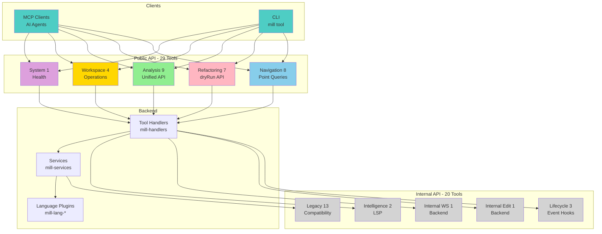

# TypeMill API Specifications

> **Formal contracts for MCP tools: request/response formats, tool visibility, and validation rules**

This document provides authoritative specifications for TypeMill's public and internal APIs.

---

## Table of Contents

1. [Tools Visibility Specification](#tools-visibility-specification)
2. [Unified Analysis API Contracts](#unified-analysis-api-contracts)
3. [Unified Refactoring API Contracts](#unified-refactoring-api-contracts)
4. [Contract Validation](#contract-validation)

---

## Tools Visibility Specification

**Purpose**: Definitive reference for which tools are public vs internal.



### Public Tools (29 total)

#### Navigation (8) - Point Queries for IDE Workflows
- `find_definition`
- `find_references`
- `find_implementations`
- `find_type_definition`
- `search_symbols`
- `get_symbol_info`
- `get_diagnostics`
- `get_call_hierarchy`

#### Refactoring (7) - Unified API with dryRun Option
- `rename` - Rename files, directories, symbols (options.dryRun: true/false)
- `extract` - Extract function, variable, constant (options.dryRun: true/false)
- `inline` - Inline variable, function, constant (options.dryRun: true/false)
- `move` - Move symbols, files, directories (options.dryRun: true/false)
- `reorder` - Reorder imports, parameters, fields (options.dryRun: true/false)
- `transform` - Code transformations (options.dryRun: true/false)
- `delete` - Delete files, directories, dead code (options.dryRun: true/false)

#### Analysis (9) - Unified Analysis API
- `analyze.quality` - Code quality analysis (complexity, smells, maintainability, readability)
- `analyze.dead_code` - Unused code detection (imports, symbols, parameters, variables, types, unreachable)
- `analyze.dependencies` - Dependency analysis (imports, graph, circular, coupling, cohesion, depth)
- `analyze.cycles` - Circular dependency detection with paths
- `analyze.structure` - Code structure analysis (symbols, hierarchy, interfaces, inheritance, modules)
- `analyze.documentation` - Documentation quality (coverage, quality, style, examples, todos)
- `analyze.tests` - Test analysis (coverage, quality, assertions, organization)
- `analyze.batch` - Multi-file batch analysis with optimized AST caching
- `analyze.module_dependencies` - Rust module dependency analysis for crate extraction

#### Workspace (4) - Workspace Operations
- `workspace.create_package`
- `workspace.extract_dependencies`
- `workspace.update_members`
- `workspace.find_replace`

#### System (1) - Health Monitoring
- `health_check`

---

### Internal Tools (20 total)

#### Lifecycle (3) - Event Notifications
- `notify_file_opened`
- `notify_file_saved`
- `notify_file_closed`

#### Internal Editing (1) - Backend Plumbing
- `rename_symbol_with_imports`

#### Internal Workspace (1) - Backend Plumbing
- `apply_workspace_edit`

#### Internal Intelligence (2) - LSP Backend
- `get_completions`
- `get_signature_help`

#### Workspace Tools (3) - Legacy Operations
- `move_directory`
- `update_dependencies`
- `update_dependency`

#### File Operations (4) - Legacy CRUD
- `create_file`
- `delete_file`
- `rename_file`
- `rename_directory`

#### File Utilities (3) - Basic I/O
- `read_file`
- `write_file`
- `list_files`

#### Legacy Advanced (2) - Low-Level Plumbing
- `execute_edits` → replaced by unified refactoring API
- `execute_batch` → replaced by `analyze.batch`

#### Legacy Analysis - FULLY REMOVED ✅
The following legacy analysis tools were retired:
- `analyze_project` → replaced by `analyze.quality("maintainability")`
- `analyze_imports` → replaced by `analyze.dependencies("imports")`
- `find_dead_code` → replaced by `analyze.dead_code`
- `find_unused_imports` → covered by `analyze.dead_code`
- `analyze_code` → covered by unified analysis API

---

### Design Rationale

**Public API Philosophy**: AI agents and MCP clients see high-level semantic operations (navigation point queries, two-step refactoring plan → apply, bulk workspace analysis).

**Internal API Philosophy**: Backend/workflows have access to low-level primitives (direct file I/O, legacy operations for backward compatibility, LSP plumbing, event lifecycle hooks).

**Migration Path**:
1. Previous state: 17 public, 25 internal (before Unified Analysis API)
2. After Unified API: 23 public, 25 internal (6 analysis tools moved to public)
3. Proposal 45 cleanup: 23 public, 19 internal (5 legacy analysis tools removed)
4. Final state: 29 public, 20 internal (analyze tools now public)

---

## Unified Analysis API Contracts

> **Note:** For user-friendly documentation with examples, see [../tools/README.md](../tools/README.md).

### Scope

- Defines canonical request/response contracts for unified analysis API
- Applies to MCP tools exposed by `mill` server
- Overrides conflicting details in proposal drafts

### Serialization Conventions

- **Transport format**: UTF-8 JSON
- **Identifiers**: lowercase snake case (`plan_type`, `file_path`)
- **Timestamps**: ISO-8601 UTC (`YYYY-MM-DDTHH:MM:SSZ`)
- **Numbers**: JSON numbers (no quoted numerics); floats allowed where noted
- **Strings**: Case-sensitive
- **Objects**: Closed by default (unknown properties rejected) unless explicitly noted `// additional properties allowed`

### Shared Types

#### Position
```json
{ "line": 0, "character": 0 }
```
Zero-based indices aligned with LSP.

#### Range
```json
{ "start": { "line": 0, "character": 0 }, "end": { "line": 0, "character": 0 } }
```
End is exclusive.

#### Location
```json
{ "file_path": "src/lib.rs", "range": { ... } }
```
`file_path` is workspace-relative POSIX path.

#### SymbolIdentifier
```json
{
  "symbol": "process_order",
  "symbol_kind": "function",
  "language": "rust"
}
```
`symbol_kind` matches LSP `SymbolKind` enums (lowercase strings).

#### Severity
Enumerated string: `"high" | "medium" | "low"`.

---

### Request Envelope

```json
{
  "category": "quality",
  "kind": "complexity",
  "scope": { ... },
  "options": { ... }
}
```

- **category**: `"quality" | "dead_code" | "dependencies" | "structure" | "documentation" | "tests"`
- **kind**: Category-specific enumerations (see below)
- **scope**: Filters target files
- **options**: Category-specific parameters; all optional unless marked required

#### Scope
```json
{
  "type": "workspace" | "directory" | "file" | "symbol",
  "path": "src/",
  "symbol_name": "MyStruct",
  "include": ["*.rs"],
  "exclude": ["tests/"]
}
```

- `type` required
- `path` required for `directory` and `file`
- `symbol_name` required when `type="symbol"`
- `include`/`exclude` arrays use glob syntax

#### Pagination
Available for all categories. Clients may omit `options` entirely.

```json
{
  "limit": 1000,
  "offset": 0
}
```

- `limit`: integer 1–5000 (default 1000)
- `offset`: integer ≥0 (default 0)

---

### Response Envelope: AnalysisResult

```json
{
  "findings": [ { ... } ],
  "summary": {
    "total_findings": 0,
    "returned_findings": 0,
    "has_more": false,
    "by_severity": { "high": 0, "medium": 0, "low": 0 },
    "files_analyzed": 0,
    "symbols_analyzed": 0,
    "analysis_time_ms": 0
  },
  "metadata": {
    "category": "quality",
    "kind": "complexity",
    "scope": { ... },
    "language": "rust",
    "timestamp": "2025-10-10T12:00:00Z",
    "thresholds": { "cyclomatic_complexity": 15 }
  }
}
```

- `findings`: array length ≤ `limit`
- `summary.has_more`: true when additional findings exist beyond `offset + return_count`
- `summary.by_severity`: must include keys for all Severity values (0 allowed)
- `metadata.language`: optional; omit when heterogeneous
- `metadata.thresholds`: echoes applied thresholds; empty object allowed

#### Finding
```json
{
  "id": "complexity-1",
  "kind": "complexity_hotspot",
  "severity": "high",
  "location": { ... },
  "symbol": { ... },
  "metrics": { "cyclomatic_complexity": 25 },
  "message": "Function has high cyclomatic complexity (25)",
  "suggestions": [ { ... } ]
}
```

- `id`: stable identifier within result set
- `kind`: category-specific enumeration (snake case)
- `symbol`: optional `SymbolIdentifier`
- `metrics`: numeric or string values; explicit keys per category
- `suggestions`: optional array (see Refactoring integration)

#### Suggestion
```json
{
  "action": "extract_function",
  "description": "Extract nested conditional block",
  "target": { "range": { ... } },
  "estimated_impact": "reduces complexity by ~8 points",
  "refactor_call": {
    "command": "extract",
    "arguments": { ... }
  }
}
```

- `refactor_call` required when actionable
- `command` references unified refactor API commands
- `arguments` must conform to target plan schema

---

### Category Enumerations & Metrics

#### Quality (`analyze.quality`)
**kind**: `"complexity" | "smells" | "maintainability" | "readability"`

**metrics** keys:
- `cyclomatic_complexity` (int ≥0)
- `cognitive_complexity` (int ≥0)
- `maintainability_index` (float 0–100)
- `nesting_depth` (int ≥0)
- `parameter_count` (int ≥0)
- `function_length` (int ≥0)

**options.thresholds** may include matching keys.

---

#### Dead Code (`analyze.dead_code`)
**kind**: `"unused_symbols" | "unused_imports" | "unreachable_code" | "unused_parameters" | "unused_types" | "unused_variables"`

**metrics**:
- `occurrences` (int ≥1)
- `last_reference_ts` (ISO timestamp) when available

**options**:
- `aggressive`: boolean (default false)
- `include_tests`: boolean (default false)
- `include_private`: boolean (default true)

---

#### Dependencies (`analyze.dependencies`)
**kind**: `"imports" | "graph" | "circular" | "coupling" | "cohesion" | "depth"`

**metrics** keys:
- `in_degree`, `out_degree` (ints)
- `circular_path` (string array) for circular
- `coupling_score` / `cohesion_score` (floats 0–1)
- `dependency_depth` (int ≥0)

**options.format**: `"detailed" | "summary" | "graph"`

When `"graph"`, response includes `graph` under `metadata`:
```json
{
  "graph": {
    "format": "mermaid",
    "payload": "graph TD...",
    "encoding": "utf8",
    "size_bytes": 1280
  }
}
```

**options.export_format**: `"json" | "graphviz" | "mermaid"` (default `"json"`)

---

#### Structure (`analyze.structure`)
**kind**: `"symbols" | "hierarchy" | "interfaces" | "inheritance" | "modules"`

**metrics** keys: `inheritance_depth`, `implementation_count`, `child_count`

**options**:
- `symbol_kinds`: array of lowercase LSP symbol kinds
- `include_private`: boolean (default false)

---

#### Documentation (`analyze.documentation`)
**kind**: `"coverage" | "quality" | "missing" | "outdated" | "todos"`

**metrics** keys:
- `coverage_ratio` (float 0–1)
- `todo_count` (int ≥0)
- `staleness_days` (int ≥0)

**options**:
- `visibility`: `"public" | "all"` (default `"public"`)
- `require_examples`: boolean (default false)

---

#### Tests (`analyze.tests`)
**kind**: `"coverage" | "untested" | "quality" | "smells"`

**metrics** keys:
- `coverage_ratio` (float 0–1)
- `missing_tests` (int ≥0)
- `assertion_count` (int ≥0)
- `smell_labels` (string array)

**options**:
- Coverage ingestion requires `coverage_format` (`"lcov" | "cobertura" | "jacoco"`) and `coverage_file`

---

### Error Contract

```json
{
  "error": {
    "code": "INVALID_SCOPE",
    "message": "Scope path must be provided for type 'directory'",
    "details": { "field": "scope.path" }
  }
}
```

- `code`: uppercase snake case stable identifiers
- `message`: human-readable English sentence
- `details`: optional object; may include `field`, `expected`, `actual`

---

## Unified Refactoring API Contracts

### Plan Request Envelope

```json
{
  "operation": "rename",
  "kind": "symbol",
  "arguments": { ... },
  "options": { ... }
}
```

- **operation**: `"rename" | "extract" | "inline" | "move" | "reorder" | "transform" | "delete"`
- **kind**: operation-specific enumeration

---

### Plan Response (PlanBase)

```json
{
  "plan_type": "RenamePlan",
  "plan_version": "1.0",
  "edits": [ /* WorkspaceEdit */ ],
  "summary": {
    "affected_files": 0,
    "created_files": 0,
    "deleted_files": 0
  },
  "warnings": [ { "code": "AMBIGUOUS_TARGET", "message": "..." } ],
  "metadata": {
    "kind": "rename.symbol",
    "language": "rust",
    "estimated_impact": "low",
    "created_at": "2025-10-10T12:00:00Z"
  },
  "file_checksums": {
    "src/lib.rs": "sha256:abc123"
  }
}
```

- **plan_type**: `"RenamePlan" | "ExtractPlan" | "InlinePlan" | "MovePlan" | "ReorderPlan" | "TransformPlan" | "DeletePlan"`
- **plan_version**: string, default `"1.0"` (increment for breaking changes)
- **edits**: conforms to LSP `WorkspaceEdit`
- **summary**: counts must match unique file paths in `edits`
- **warnings**: optional array
- **metadata.estimated_impact**: `"low" | "medium" | "high"`
- **file_checksums**: map of `file_path` → `sha256:<hex>`

#### Warning Codes
- `AMBIGUOUS_TARGET`: multiple matches for target selector
- `POTENTIAL_BEHAVIOR_CHANGE`: transformation may alter semantics
- `PARTIAL_APPLY`: plan omits unsupported files
- `VALIDATION_SKIPPED`: generated under `force: true`

---

### Operation-Specific Arguments

#### rename
- **kind**: `"symbol" | "parameter" | "type" | "file" | "directory"`
- **arguments.target**:
  ```json
  {
    "path": "src/lib.rs",
    "selector": {
      "position": { "line": 0, "character": 0 },
      "name": "old_name"
    }
  }
  ```
- **arguments.new_name**: non-empty string
- **options**: `strict`, `update_imports`, `validate_scope`, `workspace_limits`

---

#### extract
- **kind**: `"function" | "variable" | "module" | "interface" | "class" | "constant" | "type_alias"`
- **arguments.source**: requires `file_path` and `range`
- Optional `destination` path or module
- **options.visibility**: `"public" | "private"` (default `"private"`)

---

#### inline
- **kind**: `"variable" | "function" | "constant" | "type_alias"`
- **arguments.target**: `{ "file_path": "...", "position": { ... } }`
- **options.inline_all**: boolean (default false)

---

#### move
- **kind**: `"symbol" | "to_module" | "to_namespace" | "consolidate"`
- For symbol moves:
  ```json
  {
    "source": { "file_path": "...", "position": { ... } },
    "destination": { "file_path": "...", "module_path": "crate::foo" }
  }
  ```
- **options.merge_dependencies**: boolean (default true) for consolidation

---

#### reorder
- **kind**: `"parameters" | "imports" | "members" | "statements"`
- **arguments.target**: `file_path` plus either `position` or `range`
- **arguments.new_order**: array of zero-based indices
- **options.strategy**: `"alphabetical" | "visibility" | "dependency"` (mutually exclusive with `new_order`)

---

#### transform
- **kind**: `"to_arrow_function" | "to_async" | "loop_to_iterator" | "callback_to_promise" | "add_null_check" | "remove_dead_branch"`
- **arguments.target**: `file_path` and `position` or `range`
- **options.language_specific**: object (`// additional properties allowed`)

---

#### delete
- **kind**: `"unused_imports" | "dead_code" | "redundant_code" | "file"`
- **arguments.target**: file-based or scoped deletions
- **options.aggressive**: boolean (default false)

---

### Unified Refactoring API (with dryRun option)

All refactoring tools support execution via the `options` parameter:

```json
{
  "target": { ... },
  "newName": "...",
  "options": {
    "dryRun": false,
    "validateChecksums": true,
    "force": false
  }
}
```

**Options**:
- **dryRun**: when `true` (default), preview changes; when `false`, execute
- **validateChecksums**: compares file hashes before applying
- **force**: bypasses validations (sets `VALIDATION_SKIPPED` warning)

**Execution**:
- Default: `dryRun: true` returns preview plan
- Explicit: `dryRun: false` applies changes atomically with rollback on error

---

### Apply Response

```json
{
  "success": true,
  "applied_files": ["src/app.rs"],
  "created_files": [],
  "deleted_files": [],
  "warnings": [],
  "rollback_available": true,
  "snapshot_id": "rollback-123"
}
```

- **success**: boolean
- **applied_files**: list of touched paths (empty on dry run)
- **created_files**/**deleted_files**: unique sets
- **warnings**: any warnings emitted during apply
- **rollback_available**: indicates snapshot stored for undo
- **snapshot_id**: optional identifier for rollback (deferred feature)

---

### Apply Error Contract

```json
{
  "error": {
    "code": "STALE_PLAN",
    "message": "Plan checksums no longer match workspace state",
    "details": { "file_path": "src/app.rs" }
  }
}
```

**Error codes**:
- `INVALID_PLAN_TYPE`: plan_type unrecognized
- `CHECKSUM_MISMATCH`: specific file mismatch
- `APPLY_FAILED`: underlying edit apply failed
- `ROLLBACK_FAILED`: rollback attempt unsuccessful
- `STALE_PLAN`: checksums no longer match

---

## Contract Validation

### Tooling

- Maintain JSON Schema files (`schemas/unified_analysis.schema.json`, `schemas/unified_refactor.schema.json`) for automated validation (future work)
- CI must:
  - Validate sample payloads against schemas
  - Ensure `suggestions[].refactor_call` references valid operations
  - Confirm all plan implementations set `plan_type`, `plan_version`, `file_checksums`

### Change Management

- Increment `plan_version` when making breaking changes to plan payloads
- Add new enum values by appending to lists above; never recycle identifiers
- Record contract updates in `CHANGELOG.md` under "Contracts" section
- Consumers must treat unknown fields as errors unless explicitly allowed

---

## See Also

- **[core-concepts.md](core-concepts.md)** - Architectural foundations
- **[../tools/README.md](../tools/README.md)** - User-friendly tool documentation
- **[../../CLAUDE.md](../../CLAUDE.md)** - AI agent quick reference
