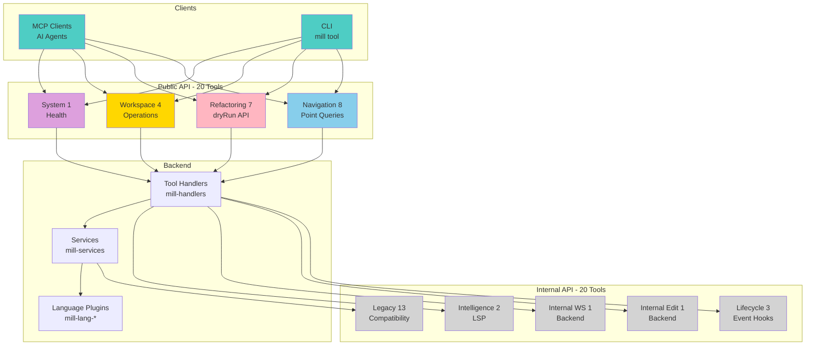

# TypeMill API Specifications

> **Formal contracts for MCP tools: request/response formats, tool visibility, and validation rules**

This document provides authoritative specifications for TypeMill's public and internal APIs.

---

## Table of Contents

1. [Tools Visibility Specification](#tools-visibility-specification)
2. [Unified Refactoring API Contracts](#unified-refactoring-api-contracts)
3. [Contract Validation](#contract-validation)

---

## Tools Visibility Specification

**Purpose**: Definitive reference for which tools are public vs internal.



### Public Tools (20 total)

#### Navigation (8) - Point Queries for IDE Workflows
- `find_definition`
- `find_references`
- `find_implementations`
- `find_type_definition`
- `search_symbols`
- `get_symbol_info`
- `get_diagnostics`
- `get_call_hierarchy`

#### Refactoring (5) - Unified API with dryRun Option
- `rename` - Rename files, directories, symbols (options.dryRun: true/false)
- `extract` - Extract function, variable, constant (options.dryRun: true/false)
- `inline` - Inline variable, function, constant (options.dryRun: true/false)
- `move` - Move symbols, files, directories (options.dryRun: true/false)
- `delete` - Delete files, directories, dead code (options.dryRun: true/false)

#### Workspace (3) - Workspace Operations
- `workspace.create_package`
- `workspace.extract_dependencies`
- `workspace.find_replace`

#### System (1) - Health Monitoring
- `health_check`

---

### Internal Tools (20 total)

#### Lifecycle (3) - Event Notifications
- `notify_file_opened`
- `notify_file_saved`
- `notify_file_closed`

#### Internal Editing (1) - Backend Plumbing
- `rename_symbol_with_imports`

#### Internal Workspace (1) - Backend Plumbing
- `apply_workspace_edit`

#### Internal Intelligence (2) - LSP Backend
- `get_completions`
- `get_signature_help`

#### Workspace Tools (3) - Legacy Operations
- `move_directory`
- `update_dependencies`
- `update_dependency`

#### File Operations (4) - Legacy CRUD
- `create_file`
- `delete_file`
- `rename_file`
- `rename_directory`

#### File Utilities (3) - Basic I/O
- `read_file`
- `write_file`
- `list_files`

#### Legacy Advanced (2) - Low-Level Plumbing
- `execute_edits` → replaced by unified refactoring API
- `execute_batch` → replaced by internal workflow batching

---

### Design Rationale

**Public API Philosophy**: AI agents and MCP clients see high-level semantic operations (navigation point queries, two-step refactoring plan → apply, bulk workspace operations).

**Internal API Philosophy**: Backend/workflows have access to low-level primitives (direct file I/O, legacy operations for backward compatibility, LSP plumbing, event lifecycle hooks).

---

## Unified Refactoring API Contracts

### Plan Request Envelope

```json
{
  "operation": "rename",
  "kind": "symbol",
  "arguments": { ... },
  "options": { ... }
}
```

- **operation**: `"rename" | "extract" | "inline" | "move" | "delete"`
- **kind**: operation-specific enumeration

---

### Plan Response (PlanBase)

```json
{
  "plan_type": "RenamePlan",
  "plan_version": "1.0",
  "edits": [ /* WorkspaceEdit */ ],
  "summary": {
    "affected_files": 0,
    "created_files": 0,
    "deleted_files": 0
  },
  "warnings": [ { "code": "AMBIGUOUS_TARGET", "message": "..." } ],
  "metadata": {
    "kind": "rename.symbol",
    "language": "rust",
    "estimated_impact": "low",
    "created_at": "2025-10-10T12:00:00Z"
  },
  "file_checksums": {
    "src/lib.rs": "sha256:abc123"
  }
}
```

- **plan_type**: `"RenamePlan" | "ExtractPlan" | "InlinePlan" | "MovePlan" | "DeletePlan"`
- **plan_version**: string, default `"1.0"` (increment for breaking changes)
- **edits**: conforms to LSP `WorkspaceEdit`
- **summary**: counts must match unique file paths in `edits`
- **warnings**: optional array
- **metadata.estimated_impact**: `"low" | "medium" | "high"`
- **file_checksums**: map of `file_path` → `sha256:<hex>`

#### Warning Codes
- `AMBIGUOUS_TARGET`: multiple matches for target selector
- `POTENTIAL_BEHAVIOR_CHANGE`: transformation may alter semantics
- `PARTIAL_APPLY`: plan omits unsupported files
- `VALIDATION_SKIPPED`: generated under `force: true`

---

### Operation-Specific Arguments

#### rename
- **kind**: `"symbol" | "parameter" | "type" | "file" | "directory"`
- **arguments.target**:
  ```json
  {
    "path": "src/lib.rs",
    "selector": {
      "position": { "line": 0, "character": 0 },
      "name": "old_name"
    }
  }
  ```
- **arguments.new_name**: non-empty string
- **options**: `strict`, `update_imports`, `validate_scope`, `workspace_limits`

---

#### extract
- **kind**: `"function" | "variable" | "module" | "interface" | "class" | "constant" | "type_alias"`
- **arguments.source**: requires `file_path` and `range`
- Optional `destination` path or module
- **options.visibility**: `"public" | "private"` (default `"private"`)

---

#### inline
- **kind**: `"variable" | "function" | "constant" | "type_alias"`
- **arguments.target**: `{ "file_path": "...", "position": { ... } }`
- **options.inline_all**: boolean (default false)

---

#### move
- **kind**: `"symbol" | "to_module" | "to_namespace" | "consolidate"`
- For symbol moves:
  ```json
  {
    "source": { "file_path": "...", "position": { ... } },
    "destination": { "file_path": "...", "module_path": "crate::foo" }
  }
  ```
- **options.merge_dependencies**: boolean (default true) for consolidation

---

#### delete
- **kind**: `"unused_imports" | "dead_code" | "redundant_code" | "file"`
- **arguments.target**: file-based or scoped deletions
- **options.aggressive**: boolean (default false)

---

### Unified Refactoring API (with dryRun option)

All refactoring tools support execution via the `options` parameter:

```json
{
  "target": { ... },
  "newName": "...",
  "options": {
    "dryRun": false,
    "validateChecksums": true,
    "force": false
  }
}
```

**Options**:
- **dryRun**: when `true` (default), preview changes; when `false`, execute
- **validateChecksums**: compares file hashes before applying
- **force**: bypasses validations (sets `VALIDATION_SKIPPED` warning)

**Execution**:
- Default: `dryRun: true` returns preview plan
- Explicit: `dryRun: false` applies changes atomically with rollback on error

---

### Apply Response

```json
{
  "success": true,
  "applied_files": ["src/app.rs"],
  "created_files": [],
  "deleted_files": [],
  "warnings": [],
  "rollback_available": true,
  "snapshot_id": "rollback-123"
}
```

- **success**: boolean
- **applied_files**: list of touched paths (empty on dry run)
- **created_files**/**deleted_files**: unique sets
- **warnings**: any warnings emitted during apply
- **rollback_available**: indicates snapshot stored for undo
- **snapshot_id**: optional identifier for rollback (deferred feature)

---

### Apply Error Contract

```json
{
  "error": {
    "code": "STALE_PLAN",
    "message": "Plan checksums no longer match workspace state",
    "details": { "file_path": "src/app.rs" }
  }
}
```

**Error codes**:
- `INVALID_PLAN_TYPE`: plan_type unrecognized
- `CHECKSUM_MISMATCH`: specific file mismatch
- `APPLY_FAILED`: underlying edit apply failed
- `ROLLBACK_FAILED`: rollback attempt unsuccessful
- `STALE_PLAN`: checksums no longer match

---

## Contract Validation

### Tooling

- Maintain JSON Schema files (`schemas/unified_refactor.schema.json`) for automated validation (future work)
- CI must:
  - Validate sample payloads against schemas
  - Ensure `suggestions[].refactor_call` references valid operations
  - Confirm all plan implementations set `plan_type`, `plan_version`, `file_checksums`

### Change Management

- Increment `plan_version` when making breaking changes to plan payloads
- Add new enum values by appending to lists above; never recycle identifiers
- Record contract updates in `CHANGELOG.md` under "Contracts" section
- Consumers must treat unknown fields as errors unless explicitly allowed

---

## See Also

- **[core-concepts.md](core-concepts.md)** - Architectural foundations
- **[../tools/README.md](../tools/README.md)** - User-friendly tool documentation
- **[../../CLAUDE.md](../../CLAUDE.md)** - AI agent quick reference
