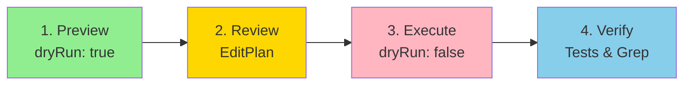
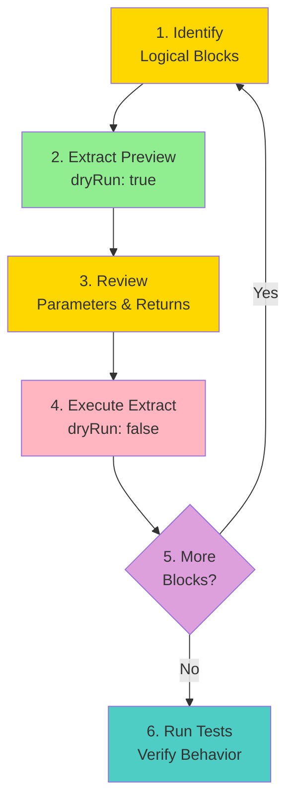

# TypeMill Cookbook

> **Practical workflows for common refactoring tasks**

This cookbook provides step-by-step recipes for real-world TypeMill usage. Each recipe shows how to combine multiple tools to accomplish common development tasks.

---

## Table of Contents

1. [Safely Rename a Directory](#safely-rename-a-directory)
2. [Refactor a Large Function](#refactor-a-large-function)
3. [Set Up a Multi-Language Workspace](#set-up-a-multi-language-workspace)

---

## Safely Rename a Directory

**Goal**: Rename a directory while automatically updating all imports, module declarations, and path references across the codebase.

**Scenario**: You have `src/old-utils/` and want to rename it to `src/helpers/`

**Tools Used**: `rename_all`

### Steps



1. **Preview the changes** (dry run mode - default):
   ```bash
   mill tool rename_all --target directory:src/old-utils --new-name src/helpers
   ```

2. **Review the EditPlan**:
   - Check which files will be modified
   - Verify import updates look correct
   - Look for any unexpected changes

3. **Execute the rename**:
   ```bash
   mill tool rename_all --target directory:src/old-utils --new-name src/helpers '{"options": {"dryRun": false}}'
   ```

4. **Verify the changes**:
   ```bash
   # Check imports were updated
   grep -r "old-utils" src/

   # Run tests to verify nothing broke
   cargo test  # Rust
   npm test    # TypeScript
   ```

### What Gets Updated Automatically

✅ **Code files**: Import statements, module declarations, use statements
✅ **Documentation**: Markdown links, inline code references
✅ **Configuration**: Cargo.toml members, path values
✅ **String literals**: Path strings in code (e.g., `"old-utils/file.rs"`)

### Common Pitfalls

⚠️ **Scope too broad**: Using `scope: "everything"` updates markdown prose, which may include false positives. Start with `scope: "standard"` (default).

⚠️ **Git staging**: TypeMill modifies files directly. Commit your work before running rename operations, or use git to review changes:
```bash
git diff  # Review all changes
git checkout -- .  # Revert if needed
```

---

## Refactor a Large Function

**Goal**: Break down a complex function into smaller, testable units.

**Scenario**: You have a 200-line function `processRequest` and want to extract logical chunks into helper functions.

**Tools Used**: `refactor`

### Steps



1. **Identify extraction candidates**:
   Read the function and identify logical blocks:
   - Authentication logic
   - Validation logic
   - Data transformation
   - Error handling

2. **Extract first helper function** (dry run):
   Place your cursor at the start of the code block to extract:
   ```bash
   mill tool refactor '{
     "action": "extract",
     "params": {
       "kind": "function",
       "filePath": "src/handlers/request.rs",
       "range": {"startLine": 44, "startCharacter": 8, "endLine": 60, "endCharacter": 0},
       "name": "authenticate_user"
     }
   }'
   ```

3. **Review the extraction plan**:
   - Check parameter detection (does it capture the right variables?)
   - Verify return type inference
   - Look for any edge cases

4. **Execute the extraction**:
   ```bash
   mill tool refactor '{
     "action": "extract",
     "params": {
       "kind": "function",
       "filePath": "src/handlers/request.rs",
       "range": {"startLine": 44, "startCharacter": 8, "endLine": 60, "endCharacter": 0},
       "name": "authenticate_user"
     },
     "options": {"dryRun": false}
   }'
   ```

5. **Repeat for other logical blocks**:
   - Extract validation → `validate_request_data`
   - Extract transformation → `transform_to_response`
   - Extract error handling → `handle_request_error`

6. **Run tests**:
   ```bash
   cargo test handlers::request::tests
   ```

### What Extract Does Automatically

✅ Detects parameters needed by extracted code
✅ Infers return type from extracted code
✅ Places new function before the original function
✅ Replaces original code with function call

### Manual Steps

⚠️ **Visibility**: Extracted functions are private by default. Add `pub` if needed.
⚠️ **Documentation**: Add doc comments to extracted functions.
⚠️ **Error handling**: Review error propagation between original and extracted functions.

---

## Set Up a Multi-Language Workspace

**Goal**: Create a project with multiple languages (Rust + TypeScript) sharing common tools.

**Scenario**: Build a web application with Rust backend and TypeScript frontend

**Tools Used**: `workspace` (`action: "create_package"`), `setup`

### Steps



```mermaid
flowchart LR
    Init[1. Initialize<br/>mill setup] --> Backend[2. Create Backend<br/>rust_binary]
    Backend --> Frontend[3. Create Frontend<br/>typescript_package]
    Frontend --> Shared[4. Create Shared<br/>rust_library]
    Shared --> WSRoot[5. Setup Workspace<br/>Cargo.toml]
    WSRoot --> InstallLSP[6. Install LSPs<br/>rust + typescript]
    InstallLSP --> Verify[7. Verify<br/>mill status]
    Verify --> Test[8. Test Refactoring<br/>Cross-language]

    style Init fill:#90EE90
    style Backend fill:#FFA07A
    style Frontend fill:#87CEEB
    style Shared fill:#FFA07A
    style WSRoot fill:#FFD700
    style InstallLSP fill:#DDA0DD
    style Verify fill:#4ECDC4
    style Test fill:#4ECDC4
```

1. **Initialize TypeMill**:
   ```bash
   cd my-project
   mill setup
   ```

   This creates `.typemill/config.json` and detects existing languages.

2. **Create Rust backend crate**:
   ```bash
   mill tool workspace '{
     "action": "create_package",
     "params": {
       "name": "backend",
       "packageType": "rust_binary",
       "path": "backend"
     },
     "options": {"dryRun": false}
   }'
   ```

3. **Create TypeScript frontend package**:
   ```bash
   mill tool workspace '{
     "action": "create_package",
     "params": {
       "name": "frontend",
       "packageType": "typescript_package",
       "path": "frontend"
     },
     "options": {"dryRun": false}
   }'
   ```

4. **Create shared library crate**:
   ```bash
   mill tool workspace '{
     "action": "create_package",
     "params": {
       "name": "shared",
       "packageType": "rust_library",
       "path": "shared"
     },
     "options": {"dryRun": false}
   }'
   ```

5. **Set up workspace root** (Rust):
   Create `Cargo.toml`:
   ```toml
   [workspace]
   members = ["backend", "shared"]
   resolver = "2"
   ```

6. **Install LSP servers**:
   ```bash
   mill install-lsp rust
   mill install-lsp typescript
   ```

7. **Verify LSP connectivity**:
   ```bash
   mill status
   ```

   Should show both `rust-analyzer` and `typescript-language-server` running.

8. **Test refactoring across languages**:
  - Rename a Rust file: `mill tool rename_all --target file:shared/src/types.rs --new-name shared/src/models.rs`
  - Rename a TypeScript file: `mill tool rename_all --target file:frontend/src/utils.ts --new-name frontend/src/helpers.ts`

### Project Structure

```
my-project/
├── .typemill/
│   └── config.json          # LSP configuration
├── backend/                 # Rust binary
│   ├── Cargo.toml
│   └── src/
├── frontend/                # TypeScript package
│   ├── package.json
│   ├── tsconfig.json
│   └── src/
├── shared/                  # Rust library
│   ├── Cargo.toml
│   └── src/
└── Cargo.toml              # Workspace root
```

### Best Practices

✅ **Shared types**: Put shared data structures in `shared/` crate
✅ **LSP per language**: Each language gets its own LSP server configuration
✅ **Independent builds**: Frontend and backend can be built independently
✅ **Workspace operations**: Use `workspace.*` tools for cross-package refactoring

---

## Tips for All Recipes

### Always Preview First
All refactoring tools default to dry run mode. Review the EditPlan before executing.

### Use Version Control
Commit your work before large refactoring operations. TypeMill modifies files directly.

### Verify with Tests
Run your test suite after refactoring operations to catch issues early.

### Check Documentation
For detailed parameter reference, see:
- [Refactor Tool](tools/refactor.md)
- [Workspace Tools](tools/workspace.md)

### Get Help
- **CLI help**: `mill tool <name> --help`
- **Tool list**: `mill tools`
- **Server status**: `mill status`
- **Troubleshooting**: [user-guide/troubleshooting.md](user-guide/troubleshooting.md)
