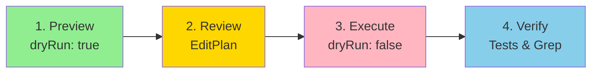
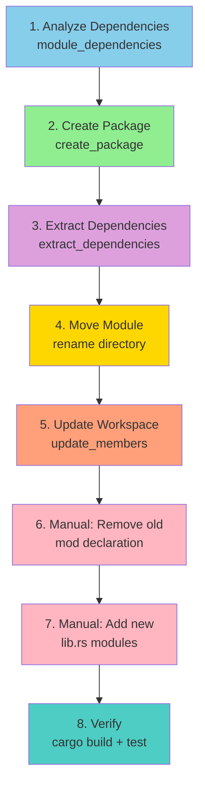
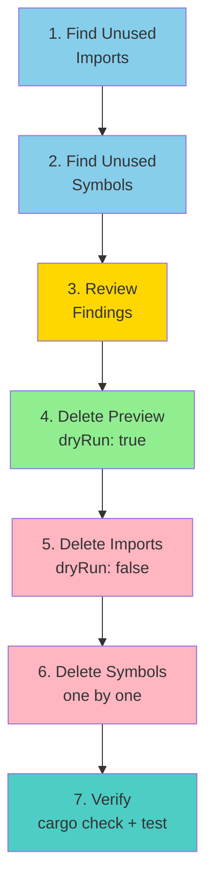
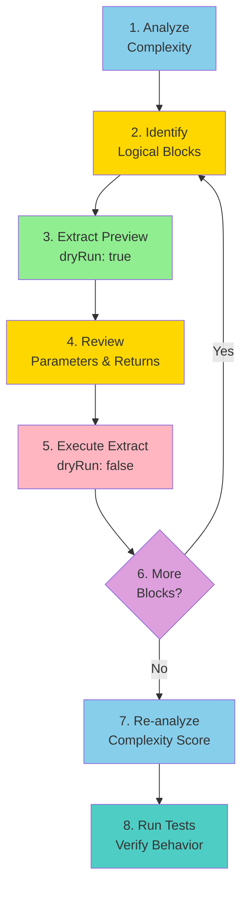
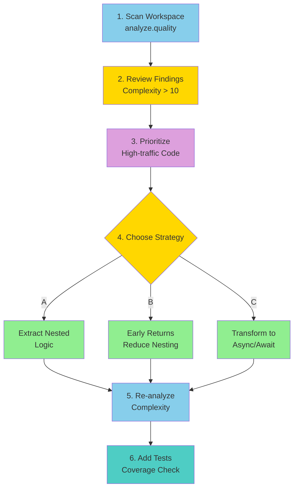

# TypeMill Cookbook

> **Practical workflows for common refactoring and analysis tasks**

This cookbook provides step-by-step recipes for real-world TypeMill usage. Each recipe shows how to combine multiple tools to accomplish common development tasks.

---

## Table of Contents

1. [Safely Rename a Directory](#safely-rename-a-directory)
2. [Extract a Module to a New Crate (Rust)](#extract-a-module-to-a-new-crate-rust)
3. [Find and Remove Dead Code](#find-and-remove-dead-code)
4. [Refactor a Large Function](#refactor-a-large-function)
5. [Set Up a Multi-Language Workspace](#set-up-a-multi-language-workspace)
6. [Analyze and Reduce Code Complexity](#analyze-and-reduce-code-complexity)

---

## Safely Rename a Directory

**Goal**: Rename a directory while automatically updating all imports, module declarations, and path references across the codebase.

**Scenario**: You have `src/old-utils/` and want to rename it to `src/helpers/`

**Tools Used**: `rename`

### Steps



1. **Preview the changes** (dry run mode - default):
   ```bash
   mill tool rename --target directory:src/old-utils --new-name src/helpers
   ```

2. **Review the EditPlan**:
   - Check which files will be modified
   - Verify import updates look correct
   - Look for any unexpected changes

3. **Execute the rename**:
   ```bash
   mill tool rename --target directory:src/old-utils --new-name src/helpers '{"options": {"dryRun": false}}'
   ```

4. **Verify the changes**:
   ```bash
   # Check imports were updated
   grep -r "old-utils" src/

   # Run tests to verify nothing broke
   cargo test  # Rust
   npm test    # TypeScript
   ```

### What Gets Updated Automatically

✅ **Code files**: Import statements, module declarations, use statements
✅ **Documentation**: Markdown links, inline code references
✅ **Configuration**: Cargo.toml members, path values
✅ **String literals**: Path strings in code (e.g., `"old-utils/file.rs"`)

### Common Pitfalls

⚠️ **Scope too broad**: Using `scope: "everything"` updates markdown prose, which may include false positives. Start with `scope: "standard"` (default).

⚠️ **Git staging**: TypeMill modifies files directly. Commit your work before running rename operations, or use git to review changes:
```bash
git diff  # Review all changes
git checkout -- .  # Revert if needed
```

---

## Extract a Module to a New Crate (Rust)

**Goal**: Move a Rust module from one crate into a new standalone crate while preserving all dependencies.

**Scenario**: Extract `crates/mill-handlers/src/analysis/` into `crates/mill-analysis/`

**Tools Used**: `analyze.module_dependencies`, `workspace.extract_dependencies`, `rename`, `workspace.update_members`

### Steps



1. **Analyze module dependencies**:
   ```bash
   mill tool analyze.module_dependencies '{
     "crate_path": "crates/mill-handlers",
     "module_path": "src/analysis"
   }'
   ```

   Review the output to understand:
   - External dependencies this module needs
   - Internal modules it depends on
   - Which modules depend on it

2. **Create the new crate structure**:
   ```bash
   mill tool workspace.create_package '{
     "name": "mill-analysis",
     "packageType": "rust_library",
     "path": "crates/mill-analysis",
     "options": {"dryRun": false}
   }'
   ```

3. **Extract dependencies to Cargo.toml**:
   ```bash
   mill tool workspace.extract_dependencies '{
     "source_crate": "crates/mill-handlers",
     "target_crate": "crates/mill-analysis",
     "module_path": "src/analysis",
     "options": {"dryRun": false}
   }'
   ```

4. **Move the module directory**:
   ```bash
   mill tool rename --target directory:crates/mill-handlers/src/analysis \
     --new-name crates/mill-analysis/src '{"options": {"dryRun": false}}'
   ```

5. **Update workspace members**:
   ```bash
   mill tool workspace.update_members '{
     "operation": "add",
     "members": ["crates/mill-analysis"],
     "options": {"dryRun": false}
   }'
   ```

6. **Update lib.rs in source crate**:
   Manually remove the old module declaration from `crates/mill-handlers/src/lib.rs`:
   ```rust
   // Remove this line:
   // pub mod analysis;
   ```

7. **Add lib.rs in new crate**:
   Create `crates/mill-analysis/src/lib.rs`:
   ```rust
   pub mod quality;
   pub mod dead_code;
   pub mod dependencies;
   // ... other submodules
   ```

8. **Verify compilation**:
   ```bash
   cargo build --workspace
   cargo test --workspace
   ```

### What Happens Automatically

✅ Dependencies merged from source Cargo.toml
✅ Import paths updated across all crates
✅ Workspace members updated
✅ Module file structure preserved

### Manual Steps Required

⚠️ **Module declarations**: Add `pub mod` statements to new crate's `lib.rs`
⚠️ **Feature flags**: Manually reconcile feature flags between crates
⚠️ **Re-exports**: Update public API surface if the module was re-exported

---

## Find and Remove Dead Code

**Goal**: Identify unused code (imports, functions, variables) and safely remove it.

**Scenario**: Clean up a Rust project with accumulated unused code

**Tools Used**: `analyze.dead_code`, `delete`

### Steps



1. **Find unused imports**:
   ```bash
   mill tool analyze.dead_code '{
     "kind": "unused_imports",
     "scope": {"kind": "workspace"}
   }'
   ```

2. **Find unused symbols** (functions, structs, etc.):
   ```bash
   mill tool analyze.dead_code '{
     "kind": "unused_symbols",
     "scope": {"kind": "workspace"}
   }'
   ```

3. **Review the findings**:
   - Check if any "unused" code is actually part of public API
   - Look for false positives (proc macros, conditional compilation)
   - Prioritize obvious dead code (unused private functions)

4. **Delete unused imports** (dry run first):
   ```bash
   mill tool delete '{
     "kind": "unused_imports",
     "scope": {"kind": "file", "path": "src/app.rs"}
   }'
   ```

5. **Execute deletion**:
   ```bash
   mill tool delete '{
     "kind": "unused_imports",
     "scope": {"kind": "workspace"},
     "options": {"dryRun": false}
   }'
   ```

6. **Delete unused functions**:
   For each unused function found in step 2:
   ```bash
   mill tool delete '{
     "kind": "symbol",
     "target": {"file": "src/utils.rs", "line": 42, "character": 4},
     "options": {"dryRun": false}
   }'
   ```

7. **Verify code still compiles**:
   ```bash
   cargo check --workspace
   cargo test --workspace
   ```

### Best Practices

✅ **Start small**: Clean one file or module at a time
✅ **Test frequently**: Run tests after each deletion
✅ **Use version control**: Commit before cleanup, review diffs carefully
✅ **Check public API**: Don't delete code exposed to external users

### Common False Positives

⚠️ **Proc macros**: Macro-generated code may use imports that appear unused
⚠️ **Conditional compilation**: Code behind `#[cfg(...)]` may not be analyzed
⚠️ **Public API**: Library code may be unused internally but used by consumers

---

## Refactor a Large Function

**Goal**: Break down a complex function into smaller, testable units.

**Scenario**: You have a 200-line function `processRequest` and want to extract logical chunks into helper functions.

**Tools Used**: `analyze.quality`, `extract`

### Steps



1. **Analyze function complexity**:
   ```bash
   mill tool analyze.quality '{
     "kind": "complexity",
     "scope": {"kind": "file", "path": "src/handlers/request.rs"}
   }'
   ```

   Look for:
   - Cyclomatic complexity score (>10 = refactor candidate)
   - Number of lines (>50 = hard to understand)
   - Number of branches

2. **Identify extraction candidates**:
   Read the function and identify logical blocks:
   - Authentication logic
   - Validation logic
   - Data transformation
   - Error handling

3. **Extract first helper function** (dry run):
   Place your cursor at the start of the code block to extract:
   ```bash
   mill tool extract '{
     "kind": "function",
     "source": {"file": "src/handlers/request.rs", "line": 45, "character": 8},
     "name": "authenticate_user"
   }'
   ```

4. **Review the extraction plan**:
   - Check parameter detection (does it capture the right variables?)
   - Verify return type inference
   - Look for any edge cases

5. **Execute the extraction**:
   ```bash
   mill tool extract '{
     "kind": "function",
     "source": {"file": "src/handlers/request.rs", "line": 45, "character": 8},
     "name": "authenticate_user",
     "options": {"dryRun": false}
   }'
   ```

6. **Repeat for other logical blocks**:
   - Extract validation → `validate_request_data`
   - Extract transformation → `transform_to_response`
   - Extract error handling → `handle_request_error`

7. **Re-analyze complexity**:
   ```bash
   mill tool analyze.quality '{
     "kind": "complexity",
     "scope": {"kind": "file", "path": "src/handlers/request.rs"}
   }'
   ```

   Verify complexity score decreased.

8. **Run tests**:
   ```bash
   cargo test handlers::request::tests
   ```

### What Extract Does Automatically

✅ Detects parameters needed by extracted code
✅ Infers return type from extracted code
✅ Places new function before the original function
✅ Replaces original code with function call

### Manual Steps

⚠️ **Visibility**: Extracted functions are private by default. Add `pub` if needed.
⚠️ **Documentation**: Add doc comments to extracted functions.
⚠️ **Error handling**: Review error propagation between original and extracted functions.

---

## Set Up a Multi-Language Workspace

**Goal**: Create a project with multiple languages (Rust + TypeScript) sharing common tools.

**Scenario**: Build a web application with Rust backend and TypeScript frontend

**Tools Used**: `workspace.create_package`, `setup`

### Steps



```mermaid
flowchart LR
    Init[1. Initialize<br/>mill setup] --> Backend[2. Create Backend<br/>rust_binary]
    Backend --> Frontend[3. Create Frontend<br/>typescript_package]
    Frontend --> Shared[4. Create Shared<br/>rust_library]
    Shared --> WSRoot[5. Setup Workspace<br/>Cargo.toml]
    WSRoot --> InstallLSP[6. Install LSPs<br/>rust + typescript]
    InstallLSP --> Verify[7. Verify<br/>mill status]
    Verify --> Test[8. Test Refactoring<br/>Cross-language]

    style Init fill:#90EE90
    style Backend fill:#FFA07A
    style Frontend fill:#87CEEB
    style Shared fill:#FFA07A
    style WSRoot fill:#FFD700
    style InstallLSP fill:#DDA0DD
    style Verify fill:#4ECDC4
    style Test fill:#4ECDC4
```

1. **Initialize TypeMill**:
   ```bash
   cd my-project
   mill setup
   ```

   This creates `.typemill/config.json` and detects existing languages.

2. **Create Rust backend crate**:
   ```bash
   mill tool workspace.create_package '{
     "name": "backend",
     "packageType": "rust_binary",
     "path": "backend",
     "options": {"dryRun": false}
   }'
   ```

3. **Create TypeScript frontend package**:
   ```bash
   mill tool workspace.create_package '{
     "name": "frontend",
     "packageType": "typescript_package",
     "path": "frontend",
     "options": {"dryRun": false}
   }'
   ```

4. **Create shared library crate**:
   ```bash
   mill tool workspace.create_package '{
     "name": "shared",
     "packageType": "rust_library",
     "path": "shared",
     "options": {"dryRun": false}
   }'
   ```

5. **Set up workspace root** (Rust):
   Create `Cargo.toml`:
   ```toml
   [workspace]
   members = ["backend", "shared"]
   resolver = "2"
   ```

6. **Install LSP servers**:
   ```bash
   mill install-lsp rust
   mill install-lsp typescript
   ```

7. **Verify LSP connectivity**:
   ```bash
   mill status
   ```

   Should show both `rust-analyzer` and `typescript-language-server` running.

8. **Test refactoring across languages**:
   - Rename a Rust file: `mill tool rename --target file:shared/src/types.rs --new-name shared/src/models.rs`
   - Rename a TypeScript file: `mill tool rename --target file:frontend/src/utils.ts --new-name frontend/src/helpers.ts`

### Project Structure

```
my-project/
├── .typemill/
│   └── config.json          # LSP configuration
├── backend/                 # Rust binary
│   ├── Cargo.toml
│   └── src/
├── frontend/                # TypeScript package
│   ├── package.json
│   ├── tsconfig.json
│   └── src/
├── shared/                  # Rust library
│   ├── Cargo.toml
│   └── src/
└── Cargo.toml              # Workspace root
```

### Best Practices

✅ **Shared types**: Put shared data structures in `shared/` crate
✅ **LSP per language**: Each language gets its own LSP server configuration
✅ **Independent builds**: Frontend and backend can be built independently
✅ **Workspace operations**: Use `workspace.*` tools for cross-package refactoring

---

## Analyze and Reduce Code Complexity

**Goal**: Identify complex code areas and refactor them to improve maintainability.

**Scenario**: Find high-complexity functions in your codebase and reduce their complexity score.

**Tools Used**: `analyze.quality`, `extract`, `inline`, `transform`

### Steps



1. **Scan for complexity across workspace**:
   ```bash
   mill tool analyze.quality '{
     "kind": "complexity",
     "scope": {"kind": "workspace"}
   }'
   ```

2. **Review complexity findings**:
   Look for:
   - Functions with cyclomatic complexity > 10
   - Functions with cognitive complexity > 15
   - Deeply nested code (indentation depth > 4)

3. **Prioritize refactoring targets**:
   Focus on:
   - High-traffic code (frequently called functions)
   - Bug-prone areas (historical defect data)
   - Code with poor test coverage

4. **For each high-complexity function, choose a strategy**:

   **Strategy A: Extract nested logic**
   ```bash
   # Extract complex conditional logic into helper function
   mill tool extract '{
     "kind": "function",
     "source": {"file": "src/processor.rs", "line": 89, "character": 12},
     "name": "should_process_item",
     "options": {"dryRun": false}
   }'
   ```

   **Strategy B: Early returns** (reduce nesting)
   Use find_definition to locate validation code, then refactor manually:
   - Replace nested if-else with guard clauses
   - Use early returns to reduce indentation

   **Strategy C: Transform async patterns**
   ```bash
   # Convert callback hell to async/await
   mill tool transform '{
     "kind": "to_async",
     "target": {"file": "src/api.ts", "line": 34, "character": 0},
     "options": {"dryRun": false}
   }'
   ```

5. **Re-analyze after each refactoring**:
   ```bash
   mill tool analyze.quality '{
     "kind": "complexity",
     "scope": {"kind": "file", "path": "src/processor.rs"}
   }'
   ```

   Verify complexity decreased.

6. **Add tests for refactored code**:
   ```bash
   # Check test coverage
   mill tool analyze.tests '{
     "kind": "coverage",
     "scope": {"kind": "file", "path": "src/processor.rs"}
   }'
   ```

### Complexity Reduction Techniques

✅ **Extract method**: Break large functions into smaller ones (target: <50 lines)
✅ **Early returns**: Replace nested if-else with guard clauses
✅ **Extract variable**: Name complex expressions for clarity
✅ **Inline trivial code**: Remove unnecessary abstraction layers
✅ **Replace conditionals with polymorphism**: Use trait dispatch instead of switch statements

### Target Metrics

- **Cyclomatic Complexity**: < 10 per function (ideal: < 5)
- **Cognitive Complexity**: < 15 per function
- **Function Length**: < 50 lines (ideal: < 30)
- **Indentation Depth**: < 4 levels

### Verification

After refactoring:
```bash
# Run full test suite
cargo test --workspace  # Rust
npm test               # TypeScript

# Check for performance regressions
cargo bench            # Rust benchmarks
```

---

## Tips for All Recipes

### Always Preview First
All refactoring tools default to dry run mode. Review the EditPlan before executing.

### Use Version Control
Commit your work before large refactoring operations. TypeMill modifies files directly.

### Verify with Tests
Run your test suite after refactoring operations to catch issues early.

### Check Documentation
For detailed parameter reference, see:
- [Refactoring Tools](tools/refactoring.md)
- [Analysis Tools](tools/analysis.md)
- [Workspace Tools](tools/workspace.md)

### Get Help
- **CLI help**: `mill tool <name> --help`
- **Tool list**: `mill tools`
- **Server status**: `mill status`
- **Troubleshooting**: [user-guide/troubleshooting.md](user-guide/troubleshooting.md)
