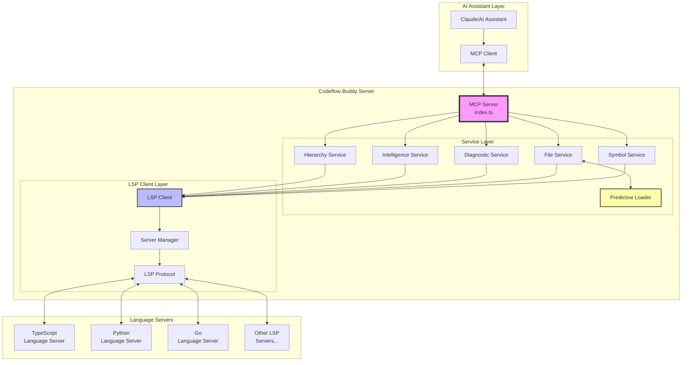
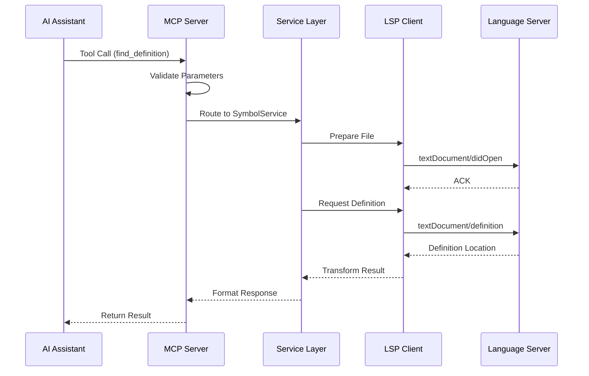
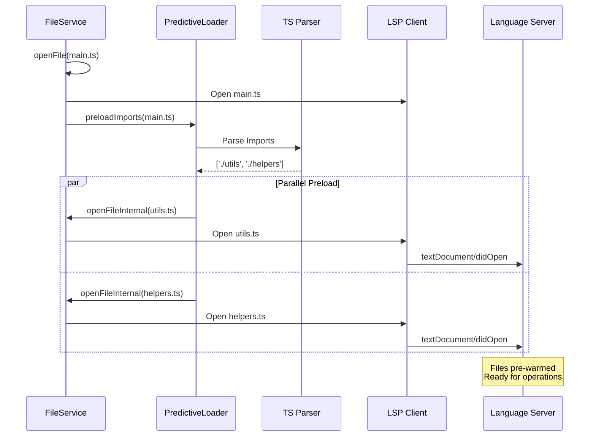

# System Overview

## High-Level Architecture

Codeflow Buddy acts as an intelligent bridge between AI assistants (via MCP) and language servers (via LSP), providing deep code intelligence capabilities.



## Component Descriptions

### 1. MCP Server Layer (`index.ts`)
- **Role**: Entry point and request router
- **Responsibilities**:
  - Receives MCP tool calls from AI assistants
  - Validates input parameters
  - Routes to appropriate service handlers
  - Formats responses for MCP protocol
  - Manages server lifecycle

### 2. Service Layer

#### Symbol Service
- Find definitions, references, and symbols
- Document and workspace symbol search
- Symbol renaming operations

#### File Service  
- Document formatting
- Code actions and quick fixes
- File operations (create, delete, rename)
- Predictive loading integration

#### Diagnostic Service
- Error and warning detection
- Code quality issues
- Compilation errors

#### Intelligence Service
- Hover information
- Code completion
- Signature help
- Semantic tokens

#### Hierarchy Service
- Call hierarchy (incoming/outgoing calls)
- Type hierarchy (supertypes/subtypes)
- Implementation relationships

#### Predictive Loader Service
- Import statement parsing
- Dependency graph analysis
- Proactive file opening
- Cache management

### 3. LSP Client Layer

#### LSP Client
- Facade for LSP operations
- Configuration management
- High-level API for services

#### Server Manager
- Language server process lifecycle
- Server pool management
- Auto-restart capabilities
- Health monitoring

#### LSP Protocol
- JSON-RPC 2.0 implementation
- Request/response correlation
- Notification handling
- Message framing

### 4. Language Servers
- TypeScript/JavaScript (typescript-language-server)
- Python (pylsp, pyright)
- Go (gopls)
- Rust (rust-analyzer)
- Java (jdtls)
- C/C++ (clangd)
- And many more...

## Data Flow

### Request Flow



### Predictive Loading Flow



## Key Design Patterns

### 1. Facade Pattern
- `LSPClient` provides simplified interface to complex LSP operations
- Services use high-level methods instead of raw protocol

### 2. Service Layer Pattern
- Business logic separated from protocol details
- Each service handles specific domain (symbols, files, diagnostics)
- Services share common context and utilities

### 3. Repository Pattern
- `ServerManager` manages collection of language servers
- Provides abstraction over server lifecycle

### 4. Strategy Pattern
- Different language servers selected based on file extension
- Configuration determines server selection strategy

### 5. Observer Pattern
- Event-driven notifications from language servers
- Diagnostic updates pushed to clients
- File change notifications

## Configuration Architecture

```yaml
# .codebuddy/config.json structure
{
  "servers": [
    {
      "extensions": ["ts", "tsx", "js", "jsx"],
      "command": ["typescript-language-server", "--stdio"],
      "restartInterval": 10,
      "initializationOptions": { ... }
    },
    {
      "extensions": ["py"],
      "command": ["pylsp"]
    }
  ],
  "serverOptions": {
    "enablePredictiveLoading": true,
    "predictiveLoadingDepth": 1,
    "predictiveLoadingExtensions": [".ts", ".tsx", ".js", ".jsx"]
  }
}
```

## Performance Characteristics

### Latency Optimization
- **Predictive Loading**: ~50-70% reduction in "Go to Definition" latency
- **Connection Pooling**: Eliminates server startup overhead
- **File Caching**: In-memory cache for frequently accessed files
- **Parallel Processing**: Concurrent operations where possible

### Resource Usage
- **Memory**: ~50-100MB base + 100-200MB per language server
- **CPU**: Low idle usage, spikes during parsing/analysis
- **I/O**: Optimized with caching and batch operations

### Scalability Limits
- **Concurrent Requests**: Handles 100+ simultaneous operations
- **File Size**: Tested with files up to 1MB
- **Project Size**: Supports repositories with 10,000+ files
- **Language Servers**: Can manage 5-10 concurrent server processes

## Security Considerations

### Process Isolation
- Each language server runs in separate process
- Limited file system access based on workspace
- No network access for language servers

### Input Validation
- All MCP inputs validated before processing
- Path traversal prevention
- Command injection protection

### Authentication (Optional)
- JWT token support for WebSocket connections
- Per-project access control
- Audit logging capabilities

## Monitoring & Diagnostics

### Structured Logging
```typescript
logger.info('MCP tool request', {
  tool: 'find_definition',
  file: '/src/index.ts',
  symbol: 'main',
  latency_ms: 45
});
```

### Health Checks
- Server process monitoring
- Memory usage tracking
- Request latency metrics
- Error rate monitoring

### Debug Features
- Trace mode for detailed request flow
- Protocol message logging
- Performance profiling hooks

## Next Steps

- Continue to [MCP-LSP Bridge](./02-mcp-lsp-bridge.md) for protocol mapping details
- Review [Service Architecture](./03-service-architecture.md) for code organization
- Explore [Predictive Loading System](./04-predictive-loading.md) for optimization details