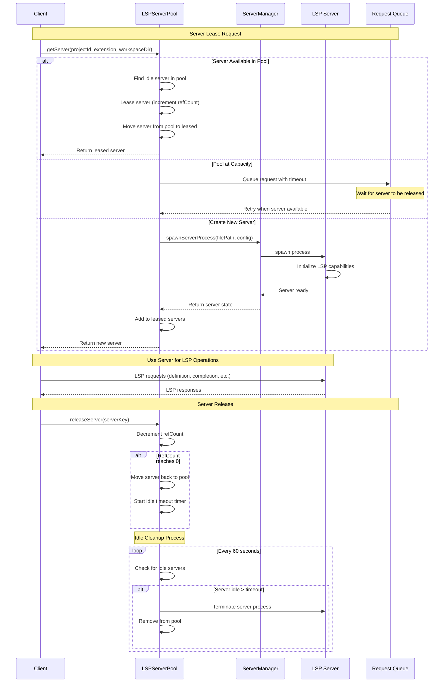

# LSP Server Pooling Architecture

## Purpose

The LSP Server Pooling system exists to optimize resource usage and improve performance by maintaining a pool of reusable Language Server Protocol (LSP) server processes. Instead of spawning a new LSP server for every client request, the system maintains a pool of pre-initialized servers that can be leased and released, significantly reducing startup latency and conserving system resources.

## Core Components

### LSPServerPool

The central coordinator that manages the lifecycle of LSP servers across different languages and projects. It implements a true pooling mechanism where servers can be leased, used, and returned to the pool for reuse.

**Key Features:**
- **Multi-language Support**: Maintains separate pools for different languages (TypeScript, Python, Go, etc.)
- **Project Isolation**: Servers are keyed by project and workspace to prevent cross-project interference
- **Automatic Scaling**: Dynamically creates new servers up to the configured limit per language
- **Idle Cleanup**: Automatically terminates unused servers after a timeout period
- **Crash Recovery**: Handles server crashes gracefully with automatic restart and request queuing

### PooledLSPServer

An extended server state that includes pooling-specific metadata:

```typescript
interface PooledLSPServer extends ServerState {
  projectId: string;      // Project identifier for isolation
  language: string;       // Programming language (ts, py, go, etc.)
  lastUsed: Date;        // Last usage timestamp for idle cleanup
  refCount: number;      // Number of active references/leases
  isRestarting?: boolean; // Flag indicating server is being restarted
  crashCount: number;    // Track crashes for stability monitoring
}
```

### ServerManager

The underlying component responsible for spawning and managing LSP server processes. The pool system leverages this to create new server instances when needed.

## Workflow Logic

The following sequence diagram illustrates the complete lifecycle of a pooled server request:



## Configuration

### Pool Configuration

The LSP Server Pool can be configured through the following parameters:

| Parameter | Default | Description |
|-----------|---------|-------------|
| `maxServersPerLanguage` | 2 | Maximum number of concurrent servers per programming language |
| `idleTimeoutMs` | 60000 | Time in milliseconds before idle servers are terminated |
| `crashRestartDelayMs` | 2000 | Delay before restarting a crashed server |
| `maxRetries` | 3 | Maximum retry attempts for failed requests |

### Server Manager Configuration

The underlying ServerManager provides additional resource limits:

| Parameter | Default | Description |
|-----------|---------|-------------|
| `maxConcurrentServers` | CPU cores × 2 (min 2, max 8) | Total concurrent server processes across all languages |
| `serverQueueTimeoutMs` | 30000 | Maximum wait time for server availability |
| `serverStartupDelayMs` | 100 | Delay to check for startup failures |
| `serverInitializeTimeoutMs` | 10000 | Timeout for LSP server initialization |

### Configuration Example

```typescript
const poolConfig = {
  maxServersPerLanguage: 3,        // Allow up to 3 TypeScript servers
  idleTimeoutMs: 120000,           // Keep servers alive for 2 minutes
  crashRestartDelayMs: 3000,       // 3 second delay before restart
};
```

## Resource Management

### Memory Optimization

The pool system implements several memory optimization strategies:

1. **Idle Cleanup**: Automatically terminates servers that haven't been used within the configured timeout
2. **LRU Eviction**: When pool capacity is reached, least recently used servers are terminated first
3. **Reference Counting**: Tracks active usage to prevent premature termination of busy servers

### CPU Optimization

1. **Process Reuse**: Eliminates the overhead of repeatedly spawning new LSP server processes
2. **Startup Amortization**: Initial server startup costs are amortized across multiple requests
3. **Dynamic Scaling**: Creates servers on-demand up to configured limits

### Fault Tolerance

1. **Crash Detection**: Monitors server health and detects process crashes
2. **Automatic Restart**: Crashed servers are automatically restarted with exponential backoff
3. **Request Queuing**: Failed requests are queued and retried when servers recover
4. **Circuit Breaker**: Repeatedly crashing servers are temporarily removed from the pool

## Performance Benefits

The LSP Server Pooling system provides significant performance improvements:

- **Reduced Latency**: Eliminates LSP server startup time for subsequent requests (typical savings: 200-1000ms per request)
- **Resource Efficiency**: Shared server processes reduce memory and CPU overhead
- **Improved Throughput**: Multiple concurrent requests can be handled by the same server instance
- **Better Scalability**: Pool size automatically adjusts based on demand up to configured limits

## Integration Points

The LSP Server Pool integrates with several other system components:

- **LSPClient**: The pool is initialized and managed through the LSPClient interface
- **ServiceContext**: Services receive pooled servers through the context's `getServer` method
- **MCP Handlers**: All MCP tool handlers benefit from pooled servers transparently
- **Performance Monitoring**: Pool statistics are tracked and reported for optimization

## Monitoring and Observability

The pool system provides comprehensive monitoring capabilities:

- **Active Server Count**: Number of servers currently leased and in use
- **Pool Utilization**: Percentage of pool capacity being used per language
- **Crash Statistics**: Frequency and patterns of server crashes
- **Response Times**: Average time to lease and release servers
- **Queue Metrics**: Number of requests waiting for available servers

This monitoring data helps optimize pool configuration and identify performance bottlenecks in production environments.