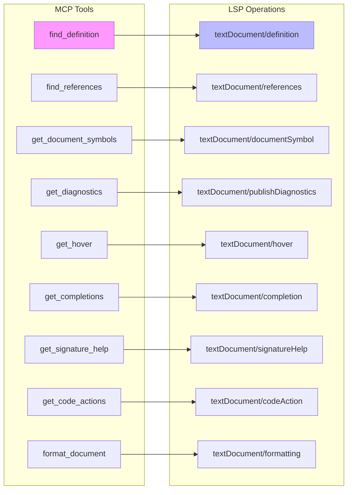
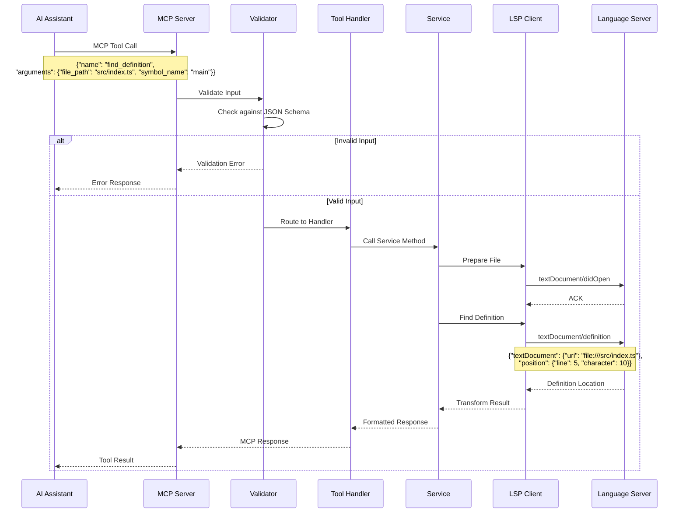
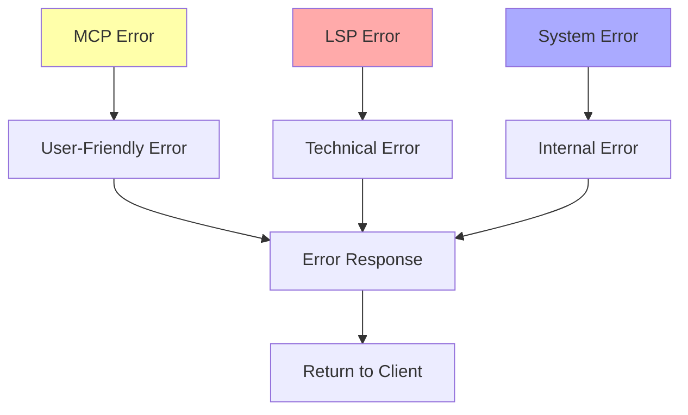

# MCP-LSP Bridge Architecture

## Overview

The MCP-LSP bridge is the core innovation of Codeflow Buddy, translating Model Context Protocol (MCP) tool calls from AI assistants into Language Server Protocol (LSP) operations. This document details how this translation works and the architectural decisions behind it.

## Protocol Mapping

### MCP Tool → LSP Operation Mapping



### MCP Tool Definitions

Each MCP tool is defined with JSON Schema for validation:

```typescript
// Example: find_definition tool
{
  name: 'find_definition',
  description: 'Find the definition of a symbol',
  inputSchema: {
    type: 'object',
    properties: {
      file_path: {
        type: 'string',
        description: 'Path to the file containing the symbol'
      },
      symbol_name: {
        type: 'string', 
        description: 'Name of the symbol to find'
      },
      line: {
        type: 'number',
        description: 'Line number (1-indexed, optional)'
      },
      character: {
        type: 'number',
        description: 'Character position (0-indexed, optional)'
      }
    },
    required: ['file_path', 'symbol_name']
  }
}
```

## Request Flow Architecture



## Tool Handler Architecture

### Handler Registration Pattern

```typescript
// Tool registry pattern
const toolHandlers = new Map<string, ToolHandler>();

// Register handlers
toolHandlers.set('find_definition', handleFindDefinition);
toolHandlers.set('find_references', handleFindReferences);

// Handler function signature
type ToolHandler = (
  service: Service,
  args: unknown
) => Promise<unknown>;
```

### Example Handler Implementation

```typescript
export async function handleFindDefinition(
  symbolService: SymbolService,
  args: unknown
): Promise<MCPResponse> {
  // 1. Validate input (done by MCP layer)
  const { file_path, symbol_name, line, character } = args as FindDefinitionArgs;
  
  // 2. Call service method
  const result = await symbolService.findDefinition(
    file_path,
    symbol_name,
    line,
    character
  );
  
  // 3. Transform LSP result to MCP format
  return {
    content: [{
      type: 'text',
      text: JSON.stringify(result, null, 2)
    }]
  };
}
```

## Protocol Translation Details

### Position Handling

**MCP (Human-Friendly)**:
- Lines: 1-indexed
- Characters: 0-indexed (when specified)
- Often symbol-name based

**LSP (Protocol Standard)**:
- Lines: 0-indexed
- Characters: 0-indexed
- Always position-based

```typescript
// Translation logic
function mcpToLspPosition(mcpLine?: number, mcpChar?: number): LSPPosition {
  return {
    line: (mcpLine || 1) - 1,  // Convert to 0-indexed
    character: mcpChar || 0
  };
}
```

### URI Handling

**MCP**: File paths (`src/index.ts`)
**LSP**: File URIs (`file:///workspace/src/index.ts`)

```typescript
function pathToUri(filePath: string): string {
  const absolutePath = path.resolve(filePath);
  return `file://${absolutePath}`;
}
```

### Response Transformation

```mermaid
graph TD
    LSPResp[LSP Response<br/>{location, range, uri}]
    Transform[Transform]
    MCPResp[MCP Response<br/>{content: text/json}]
    
    LSPResp --> Transform
    Transform --> MCPResp
    
    subgraph "Transformations"
        T1[URI → File Path]
        T2[0-indexed → 1-indexed lines]
        T3[LSP types → JSON]
        T4[Add context/metadata]
    end
    
    Transform --> T1
    Transform --> T2
    Transform --> T3
    Transform --> T4
```

## Advanced Features

### Batch Operations

```typescript
// Batch executor for multiple operations
export async function handleBatchExecute(
  operations: BatchOperation[]
): Promise<BatchResult[]> {
  const results = await Promise.all(
    operations.map(async (op) => {
      try {
        const handler = getHandler(op.tool);
        const service = getService(op.tool);
        const result = await handler(service, op.args);
        return { success: true, result };
      } catch (error) {
        return { success: false, error: error.message };
      }
    })
  );
  
  return results;
}
```

### Workspace Edit Operations

```typescript
// Complex multi-file operations
export async function handleApplyWorkspaceEdit(
  edit: WorkspaceEdit
): Promise<ApplyWorkspaceEditResponse> {
  const changes = [];
  
  // Process document changes
  if (edit.documentChanges) {
    for (const change of edit.documentChanges) {
      const result = await applyDocumentEdit(change);
      changes.push(result);
    }
  }
  
  // Process resource changes (rename, create, delete)
  if (edit.changes) {
    for (const [uri, edits] of Object.entries(edit.changes)) {
      const result = await applyTextEdits(uri, edits);
      changes.push(result);
    }
  }
  
  return {
    applied: changes.every(c => c.success),
    failureReason: changes.find(c => !c.success)?.error
  };
}
```

## Error Handling Strategy

### Error Types and Mapping



### Error Response Format

```typescript
interface ErrorResponse {
  content: [{
    type: 'text';
    text: string;
  }];
  isError?: boolean;
}

// Example error transformation
function transformLSPError(lspError: LSPResponseError): ErrorResponse {
  return {
    content: [{
      type: 'text',
      text: `LSP Error (${lspError.code}): ${lspError.message}`
    }],
    isError: true
  };
}
```

## Tool Categories

### 1. Navigation Tools
- `find_definition` - Go to definition
- `find_references` - Find all references  
- `find_implementations` - Find implementations
- `prepare_call_hierarchy` - Call hierarchy preparation

### 2. Symbol Tools
- `get_document_symbols` - Document outline
- `search_workspace_symbols` - Workspace search
- `rename_symbol` - Rename refactoring
- `rename_symbol_strict` - Position-based rename

### 3. Intelligence Tools
- `get_hover` - Hover information
- `get_completions` - Code completion
- `get_signature_help` - Parameter hints
- `get_inlay_hints` - Inline annotations

### 4. Code Quality Tools
- `get_diagnostics` - Errors and warnings
- `get_code_actions` - Quick fixes
- `format_document` - Code formatting

### 5. File Operations
- `create_file` - File creation
- `delete_file` - File deletion
- `rename_file` - File renaming
- `apply_workspace_edit` - Multi-file edits

## Performance Optimizations

### 1. Request Coalescing

```typescript
// Batch similar requests
class RequestCoalescer {
  private pendingRequests = new Map<string, Promise<any>>();
  
  async coalesce<T>(key: string, factory: () => Promise<T>): Promise<T> {
    if (this.pendingRequests.has(key)) {
      return this.pendingRequests.get(key);
    }
    
    const promise = factory();
    this.pendingRequests.set(key, promise);
    
    try {
      const result = await promise;
      return result;
    } finally {
      this.pendingRequests.delete(key);
    }
  }
}
```

### 2. Response Caching

```typescript
// Cache expensive operations
class ResponseCache {
  private cache = new Map<string, CacheEntry>();
  
  get(key: string): unknown | undefined {
    const entry = this.cache.get(key);
    if (entry && Date.now() - entry.timestamp < entry.ttl) {
      return entry.value;
    }
    return undefined;
  }
  
  set(key: string, value: unknown, ttl = 5000): void {
    this.cache.set(key, {
      value,
      timestamp: Date.now(),
      ttl
    });
  }
}
```

### 3. Parallel Processing

```typescript
// Process independent operations in parallel
async function handleBatchOperations(ops: Operation[]): Promise<Result[]> {
  // Group operations by dependency
  const groups = groupByDependency(ops);
  
  // Process each group in parallel
  const results = [];
  for (const group of groups) {
    const groupResults = await Promise.all(
      group.map(op => processOperation(op))
    );
    results.push(...groupResults);
  }
  
  return results;
}
```

## Extension Points

### Adding New MCP Tools

1. **Define Tool Schema**:
```typescript
export const myNewTool: ToolDefinition = {
  name: 'my_new_tool',
  description: 'Description of the new tool',
  inputSchema: {
    type: 'object',
    properties: {
      // Define parameters
    },
    required: ['required_params']
  }
};
```

2. **Implement Handler**:
```typescript
export async function handleMyNewTool(
  service: AppropriateService,
  args: unknown
): Promise<MCPResponse> {
  // Implementation
}
```

3. **Register Tool**:
```typescript
// Add to tool definitions
allToolDefinitions.push(myNewTool);

// Add to request handler
case 'my_new_tool':
  return await handleMyNewTool(appropriateService, args);
```

## Next Steps

- Continue to [Service Architecture](./03-service-architecture.md) for service layer details
- Review [Predictive Loading System](./04-predictive-loading.md) for optimization insights
- Explore [Adding New MCP Tools](./09-adding-mcp-tools.md) for extension guidance