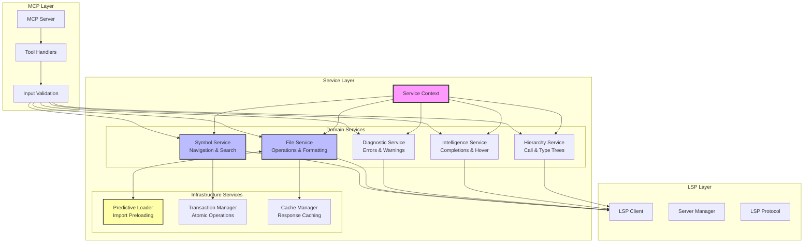

# Service Architecture & Design Patterns

## Overview

The service layer is the heart of Codeflow Buddy's architecture, providing a clean separation between the MCP protocol layer and the LSP communication layer. This document details the service architecture, design patterns, and implementation strategies.

## Service Layer Overview



## Service Context Pattern

### Context Interface

The ServiceContext provides shared infrastructure and utilities for all services:

```typescript
export interface ServiceContext {
  // Core LSP operations
  getServer: (filePath: string, workspaceDir?: string) => Promise<ServerState>;
  protocol: LSPProtocol;
  ensureFileOpen: (serverState: ServerState, filePath: string) => Promise<void>;
  prepareFile: (filePath: string, workspaceDir?: string) => Promise<ServerState>;
  
  // Utilities
  getLanguageId: (filePath: string) => string;
  logger: StructuredLogger;
  
  // Infrastructure
  transactionManager: TransactionManager;
  predictiveLoader?: PredictiveLoaderService;
  fileService?: FileService;
  
  // Configuration
  config?: Config;
}
```

### Context Factory

```typescript
export const ServiceContextUtils = {
  createServiceContext(
    getServer: (filePath: string, workspaceDir?: string) => Promise<ServerState>,
    protocol: LSPProtocol,
    transactionManager: TransactionManager,
    logger: StructuredLogger,
    config?: Config
  ): ServiceContext {
    return {
      getServer,
      protocol,
      transactionManager,
      logger,
      config,
      
      // Shared utilities
      ensureFileOpen: (serverState, filePath) =>
        ServiceContextUtils.ensureFileOpen(serverState, filePath, protocol),
      getLanguageId: ServiceContextUtils.getLanguageId,
      prepareFile: (filePath, workspaceDir) =>
        ServiceContextUtils.prepareFile(filePath, getServer, ensureFileOpen, workspaceDir)
    };
  },
  
  // Centralized file opening logic
  async ensureFileOpen(
    serverState: ServerState,
    filePath: string,
    protocol: LSPProtocol
  ): Promise<void> {
    if (serverState.openFiles.has(filePath)) {
      return;
    }

    const fileContent = readFileSync(filePath, 'utf-8');
    protocol.sendNotification(serverState.process, 'textDocument/didOpen', {
      textDocument: {
        uri: `file://${filePath}`,
        languageId: ServiceContextUtils.getLanguageId(filePath),
        version: 1,
        text: fileContent,
      },
    });

    serverState.openFiles.add(filePath);
  },
  
  // File preparation workflow
  async prepareFile(
    filePath: string,
    getServer: (filePath: string, workspaceDir?: string) => Promise<ServerState>,
    ensureFileOpen: (serverState: ServerState, filePath: string) => Promise<void>,
    workspaceDir?: string
  ): Promise<ServerState> {
    const serverState = await getServer(filePath, workspaceDir);
    await serverState.initializationPromise;
    await ensureFileOpen(serverState, filePath);
    return serverState;
  }
};
```

## Domain Services Architecture

### 1. Symbol Service

**Responsibilities:**
- Symbol navigation (find definition, references, implementations)
- Symbol search (document symbols, workspace symbols)
- Symbol renaming and refactoring

```typescript
export class SymbolService {
  constructor(private context: ServiceContext) {}

  async findDefinition(
    filePath: string,
    symbolName: string,
    line?: number,
    character?: number
  ): Promise<Location[]> {
    // 1. Prepare file for LSP operations
    const serverState = await this.context.prepareFile(filePath);
    
    // 2. Resolve position (symbol-based or position-based)
    const position = line !== undefined && character !== undefined
      ? { line: line - 1, character } // Convert to 0-indexed
      : await this.findSymbolPosition(serverState, filePath, symbolName);
    
    // 3. Send LSP request
    const result = await this.context.protocol.sendRequest(
      serverState.process,
      'textDocument/definition',
      {
        textDocument: { uri: `file://${filePath}` },
        position
      }
    );
    
    // 4. Transform and return result
    return this.transformLocations(result);
  }
  
  private async findSymbolPosition(
    serverState: ServerState,
    filePath: string,
    symbolName: string
  ): Promise<Position> {
    // Get document symbols to find the symbol
    const symbols = await this.context.protocol.sendRequest(
      serverState.process,
      'textDocument/documentSymbol',
      { textDocument: { uri: `file://${filePath}` } }
    );
    
    // Search for symbol by name
    const symbol = this.findSymbolByName(symbols, symbolName);
    if (!symbol) {
      throw new Error(`Symbol '${symbolName}' not found in ${filePath}`);
    }
    
    return symbol.selectionRange.start;
  }
}
```

### 2. File Service

**Responsibilities:**
- File operations (create, delete, rename)
- Document formatting
- Code actions and quick fixes
- Predictive loading integration

```typescript
export class FileService {
  constructor(private context: ServiceContext) {}

  async openFile(filePath: string, skipPredictiveLoading = false): Promise<void> {
    // 1. Core file opening
    const serverState = await this.context.prepareFile(filePath);
    
    // 2. Trigger predictive loading (if enabled)
    if (!skipPredictiveLoading &&
        this.context.config?.serverOptions?.enablePredictiveLoading !== false &&
        this.context.predictiveLoader) {
      
      this.context.predictiveLoader.preloadImports(filePath).catch(err => {
        this.context.logger?.warn('Predictive loading failed', {
          file: filePath,
          error: err.message
        });
      });
    }
  }
  
  async formatDocument(
    filePath: string,
    options?: FormattingOptions
  ): Promise<TextEdit[]> {
    const serverState = await this.context.prepareFile(filePath);
    
    const result = await this.context.protocol.sendRequest(
      serverState.process,
      'textDocument/formatting',
      {
        textDocument: { uri: `file://${filePath}` },
        options: {
          tabSize: options?.tabSize || 2,
          insertSpaces: options?.insertSpaces !== false,
          ...options
        }
      }
    );
    
    return Array.isArray(result) ? result : [];
  }
}
```

### 3. Intelligence Service

**Responsibilities:**
- Code completion
- Hover information
- Signature help
- Semantic tokens and inlay hints

```typescript
export class IntelligenceService {
  constructor(private context: ServiceContext) {}
  
  async getCompletions(
    filePath: string,
    line: number,
    character: number,
    triggerCharacter?: string
  ): Promise<CompletionItem[]> {
    const serverState = await this.context.prepareFile(filePath);
    
    const result = await this.context.protocol.sendRequest(
      serverState.process,
      'textDocument/completion',
      {
        textDocument: { uri: `file://${filePath}` },
        position: { line: line - 1, character }, // Convert to 0-indexed
        context: triggerCharacter ? {
          triggerKind: CompletionTriggerKind.TriggerCharacter,
          triggerCharacter
        } : undefined
      }
    );
    
    return this.transformCompletions(result);
  }
}
```

## Design Patterns

### 1. Template Method Pattern

**Common Service Operation Pattern:**

```typescript
abstract class BaseService {
  constructor(protected context: ServiceContext) {}
  
  // Template method defining the workflow
  protected async executeOperation<T>(
    filePath: string,
    operation: (serverState: ServerState) => Promise<T>,
    options?: OperationOptions
  ): Promise<T> {
    // Step 1: Prepare file
    const serverState = await this.prepareFile(filePath, options);
    
    // Step 2: Execute operation
    const result = await operation(serverState);
    
    // Step 3: Post-process result
    return this.postProcess(result, options);
  }
  
  protected async prepareFile(
    filePath: string, 
    options?: OperationOptions
  ): Promise<ServerState> {
    return this.context.prepareFile(filePath, options?.workspaceDir);
  }
  
  protected postProcess<T>(result: T, options?: OperationOptions): T {
    // Default implementation - can be overridden
    return result;
  }
}

// Concrete implementation
class SymbolService extends BaseService {
  async findDefinition(filePath: string, symbolName: string): Promise<Location[]> {
    return this.executeOperation(filePath, async (serverState) => {
      const position = await this.resolveSymbolPosition(serverState, filePath, symbolName);
      
      return this.context.protocol.sendRequest(
        serverState.process,
        'textDocument/definition',
        {
          textDocument: { uri: `file://${filePath}` },
          position
        }
      );
    });
  }
}
```

### 2. Strategy Pattern

**Language-Specific Handling:**

```typescript
interface LanguageStrategy {
  getLanguageId(): string;
  transformSymbols(symbols: any[]): DocumentSymbol[];
  getCompletionTriggers(): string[];
}

class TypeScriptStrategy implements LanguageStrategy {
  getLanguageId(): string { return 'typescript'; }
  
  transformSymbols(symbols: any[]): DocumentSymbol[] {
    // TypeScript-specific symbol transformation
    return symbols.map(symbol => ({
      ...symbol,
      detail: this.enhanceTypeScriptDetail(symbol)
    }));
  }
  
  getCompletionTriggers(): string[] {
    return ['.', ':', '<', '"', "'", '/', '@'];
  }
}

class LanguageServiceFactory {
  private strategies = new Map<string, LanguageStrategy>();
  
  getStrategy(filePath: string): LanguageStrategy {
    const extension = path.extname(filePath);
    return this.strategies.get(extension) || new DefaultStrategy();
  }
}
```

### 3. Decorator Pattern

**Service Enhancement:**

```typescript
// Base service interface
interface ISymbolService {
  findDefinition(filePath: string, symbolName: string): Promise<Location[]>;
}

// Core implementation
class CoreSymbolService implements ISymbolService {
  async findDefinition(filePath: string, symbolName: string): Promise<Location[]> {
    // Core implementation
  }
}

// Caching decorator
class CachedSymbolService implements ISymbolService {
  private cache = new Map<string, Location[]>();
  
  constructor(private service: ISymbolService) {}
  
  async findDefinition(filePath: string, symbolName: string): Promise<Location[]> {
    const key = `${filePath}:${symbolName}`;
    
    if (this.cache.has(key)) {
      return this.cache.get(key)!;
    }
    
    const result = await this.service.findDefinition(filePath, symbolName);
    this.cache.set(key, result);
    
    return result;
  }
}

// Logging decorator
class LoggingSymbolService implements ISymbolService {
  constructor(
    private service: ISymbolService,
    private logger: StructuredLogger
  ) {}
  
  async findDefinition(filePath: string, symbolName: string): Promise<Location[]> {
    const start = performance.now();
    
    this.logger.debug('Finding definition', { filePath, symbolName });
    
    try {
      const result = await this.service.findDefinition(filePath, symbolName);
      
      this.logger.info('Definition found', {
        filePath,
        symbolName,
        resultCount: result.length,
        duration: performance.now() - start
      });
      
      return result;
    } catch (error) {
      this.logger.error('Definition lookup failed', {
        filePath,
        symbolName,
        error: error.message,
        duration: performance.now() - start
      });
      
      throw error;
    }
  }
}

// Service composition
const symbolService = new LoggingSymbolService(
  new CachedSymbolService(
    new CoreSymbolService(context)
  ),
  logger
);
```

### 4. Observer Pattern

**Event-Driven Architecture:**

```typescript
interface ServiceEventEmitter {
  on(event: string, handler: (...args: any[]) => void): void;
  off(event: string, handler: (...args: any[]) => void): void;
  emit(event: string, ...args: any[]): void;
}

class EventDrivenService extends EventEmitter implements ServiceEventEmitter {
  async performOperation(data: any): Promise<any> {
    // Emit start event
    this.emit('operation:start', { operation: 'performOperation', data });
    
    try {
      const result = await this.doWork(data);
      
      // Emit success event
      this.emit('operation:success', { operation: 'performOperation', result });
      
      return result;
    } catch (error) {
      // Emit error event
      this.emit('operation:error', { operation: 'performOperation', error });
      
      throw error;
    }
  }
}

// Event listeners
symbolService.on('operation:start', (event) => {
  logger.debug('Operation started', event);
});

symbolService.on('operation:success', (event) => {
  metrics.recordSuccess(event.operation);
});

symbolService.on('operation:error', (event) => {
  metrics.recordError(event.operation);
  alerting.sendAlert(event.error);
});
```

## Error Handling Architecture

### Error Hierarchy

```typescript
// Base error classes
export class CodeflowError extends Error {
  constructor(
    message: string,
    public code: string,
    public context?: Record<string, unknown>
  ) {
    super(message);
    this.name = this.constructor.name;
  }
}

export class LSPError extends CodeflowError {
  constructor(message: string, public lspCode: number, context?: Record<string, unknown>) {
    super(message, 'LSP_ERROR', { ...context, lspCode });
  }
}

export class FileNotFoundError extends CodeflowError {
  constructor(filePath: string) {
    super(`File not found: ${filePath}`, 'FILE_NOT_FOUND', { filePath });
  }
}

export class SymbolNotFoundError extends CodeflowError {
  constructor(symbolName: string, filePath: string) {
    super(
      `Symbol '${symbolName}' not found in ${filePath}`,
      'SYMBOL_NOT_FOUND',
      { symbolName, filePath }
    );
  }
}
```

### Error Handler Middleware

```typescript
class ErrorHandler {
  static async withErrorHandling<T>(
    operation: () => Promise<T>,
    context: {
      service: string;
      operation: string;
      filePath?: string;
      logger: StructuredLogger;
    }
  ): Promise<T> {
    try {
      return await operation();
    } catch (error) {
      const enhancedError = this.enhanceError(error, context);
      
      // Log structured error
      context.logger.error('Service operation failed', {
        service: context.service,
        operation: context.operation,
        filePath: context.filePath,
        errorType: enhancedError.constructor.name,
        errorCode: enhancedError.code,
        errorMessage: enhancedError.message,
        errorContext: enhancedError.context
      });
      
      throw enhancedError;
    }
  }
  
  private static enhanceError(
    error: any,
    context: { service: string; operation: string; filePath?: string }
  ): CodeflowError {
    if (error instanceof CodeflowError) {
      return error;
    }
    
    // Transform common error types
    if (error.code === 'ENOENT') {
      return new FileNotFoundError(context.filePath || 'unknown');
    }
    
    if (error.code && error.message && typeof error.code === 'number') {
      return new LSPError(error.message, error.code, context);
    }
    
    // Default to generic error
    return new CodeflowError(
      error.message || 'Unknown error',
      'UNKNOWN_ERROR',
      { ...context, originalError: error }
    );
  }
}

// Usage in service methods
class SymbolService {
  async findDefinition(filePath: string, symbolName: string): Promise<Location[]> {
    return ErrorHandler.withErrorHandling(
      async () => {
        // Core implementation
        const serverState = await this.context.prepareFile(filePath);
        // ... rest of implementation
      },
      {
        service: 'SymbolService',
        operation: 'findDefinition',
        filePath,
        logger: this.context.logger
      }
    );
  }
}
```

## Dependency Injection

### Service Container

```typescript
class ServiceContainer {
  private services = new Map<string, any>();
  private factories = new Map<string, () => any>();
  
  // Register service instance
  register<T>(name: string, instance: T): void {
    this.services.set(name, instance);
  }
  
  // Register service factory
  registerFactory<T>(name: string, factory: () => T): void {
    this.factories.set(name, factory);
  }
  
  // Get service (with lazy instantiation)
  get<T>(name: string): T {
    if (this.services.has(name)) {
      return this.services.get(name);
    }
    
    if (this.factories.has(name)) {
      const instance = this.factories.get(name)!();
      this.services.set(name, instance);
      return instance;
    }
    
    throw new Error(`Service '${name}' not found`);
  }
}

// Service registration
function registerServices(container: ServiceContainer, context: ServiceContext): void {
  container.registerFactory('symbolService', () => new SymbolService(context));
  container.registerFactory('fileService', () => new FileService(context));
  container.registerFactory('diagnosticService', () => new DiagnosticService(context));
  container.registerFactory('intelligenceService', () => new IntelligenceService(context));
  container.registerFactory('hierarchyService', () => new HierarchyService(context));
}
```

## Testing Strategies

### Service Testing with Mocks

```typescript
// Mock service context for testing
class MockServiceContext implements ServiceContext {
  private mockServers = new Map<string, MockServerState>();
  
  async getServer(filePath: string): Promise<ServerState> {
    const ext = path.extname(filePath);
    if (!this.mockServers.has(ext)) {
      this.mockServers.set(ext, new MockServerState());
    }
    return this.mockServers.get(ext)!;
  }
  
  async prepareFile(filePath: string): Promise<ServerState> {
    const server = await this.getServer(filePath);
    // Mock file preparation
    return server;
  }
  
  protocol = new MockLSPProtocol();
  logger = new MockLogger();
  // ... other mock implementations
}

// Service tests
describe('SymbolService', () => {
  let service: SymbolService;
  let mockContext: MockServiceContext;
  
  beforeEach(() => {
    mockContext = new MockServiceContext();
    service = new SymbolService(mockContext);
  });
  
  it('should find symbol definition', async () => {
    // Setup mock response
    mockContext.protocol.mockResponse('textDocument/definition', {
      uri: 'file:///test.ts',
      range: { start: { line: 5, character: 0 }, end: { line: 5, character: 10 } }
    });
    
    const result = await service.findDefinition('/test.ts', 'testFunction');
    
    expect(result).toHaveLength(1);
    expect(result[0].uri).toBe('file:///test.ts');
  });
});
```

### Integration Testing

```typescript
// Integration tests with real LSP servers
describe('Service Integration', () => {
  let services: ServiceContainer;
  let realContext: ServiceContext;
  
  beforeAll(async () => {
    // Setup real LSP client for integration tests
    const lspClient = new LSPClient();
    await lspClient.initialize();
    
    realContext = createServiceContext(lspClient, config);
    services = new ServiceContainer();
    registerServices(services, realContext);
  });
  
  it('should perform end-to-end symbol lookup', async () => {
    const symbolService = services.get<SymbolService>('symbolService');
    
    // Create test file
    await fs.writeFile('/tmp/test.ts', 'function main() { return 42; }');
    
    const result = await symbolService.findDefinition('/tmp/test.ts', 'main');
    
    expect(result).toHaveLength(1);
    expect(result[0].range.start.line).toBe(0);
  });
});
```

## Performance Monitoring

### Service Metrics

```typescript
class ServiceMetrics {
  private static metrics = new Map<string, ServiceMetric>();
  
  static async measureOperation<T>(
    serviceName: string,
    operationName: string,
    operation: () => Promise<T>
  ): Promise<T> {
    const key = `${serviceName}.${operationName}`;
    const start = performance.now();
    
    try {
      const result = await operation();
      
      this.recordSuccess(key, performance.now() - start);
      return result;
    } catch (error) {
      this.recordError(key, performance.now() - start);
      throw error;
    }
  }
  
  private static recordSuccess(key: string, duration: number): void {
    const metric = this.getOrCreateMetric(key);
    metric.successCount++;
    metric.totalDuration += duration;
    metric.lastSuccess = Date.now();
  }
  
  private static recordError(key: string, duration: number): void {
    const metric = this.getOrCreateMetric(key);
    metric.errorCount++;
    metric.lastError = Date.now();
  }
  
  static getStats(): Record<string, ServiceStats> {
    const stats: Record<string, ServiceStats> = {};
    
    for (const [key, metric] of this.metrics) {
      const total = metric.successCount + metric.errorCount;
      stats[key] = {
        totalRequests: total,
        successCount: metric.successCount,
        errorCount: metric.errorCount,
        errorRate: total > 0 ? metric.errorCount / total : 0,
        averageDuration: metric.successCount > 0 ? metric.totalDuration / metric.successCount : 0,
        lastSuccess: metric.lastSuccess,
        lastError: metric.lastError
      };
    }
    
    return stats;
  }
}

// Usage in services
class SymbolService {
  async findDefinition(filePath: string, symbolName: string): Promise<Location[]> {
    return ServiceMetrics.measureOperation(
      'SymbolService',
      'findDefinition',
      async () => {
        // Implementation
      }
    );
  }
}
```

## Next Steps

- Continue to [Transaction Management](./06-transaction-management.md) for atomic operations
- Review [Performance Optimizations](./07-performance-optimizations.md) for scaling strategies
- Explore [Adding New MCP Tools](./09-adding-mcp-tools.md) for extension patterns