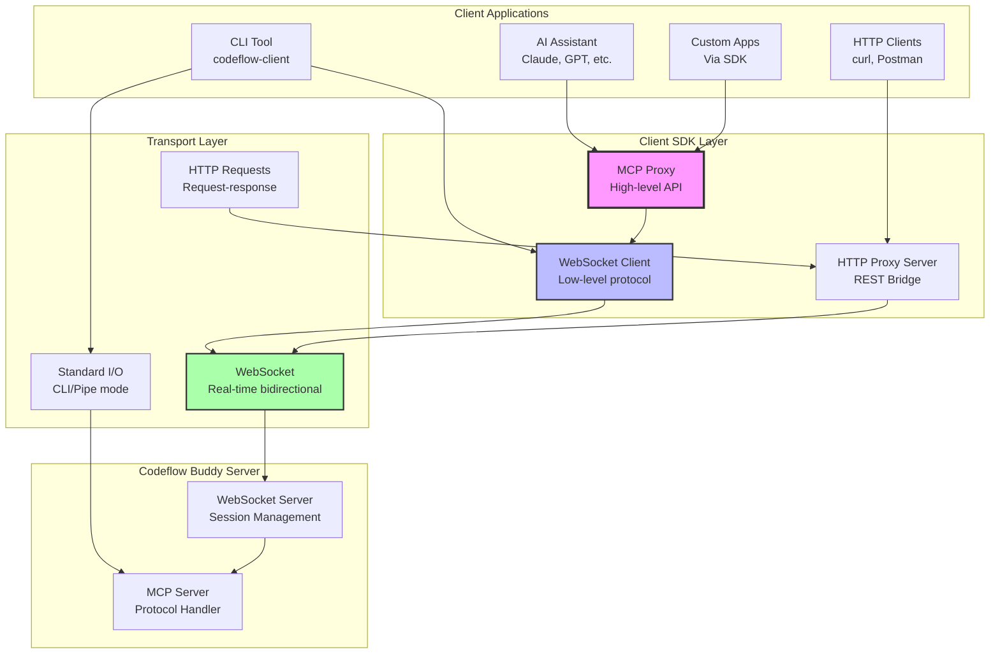
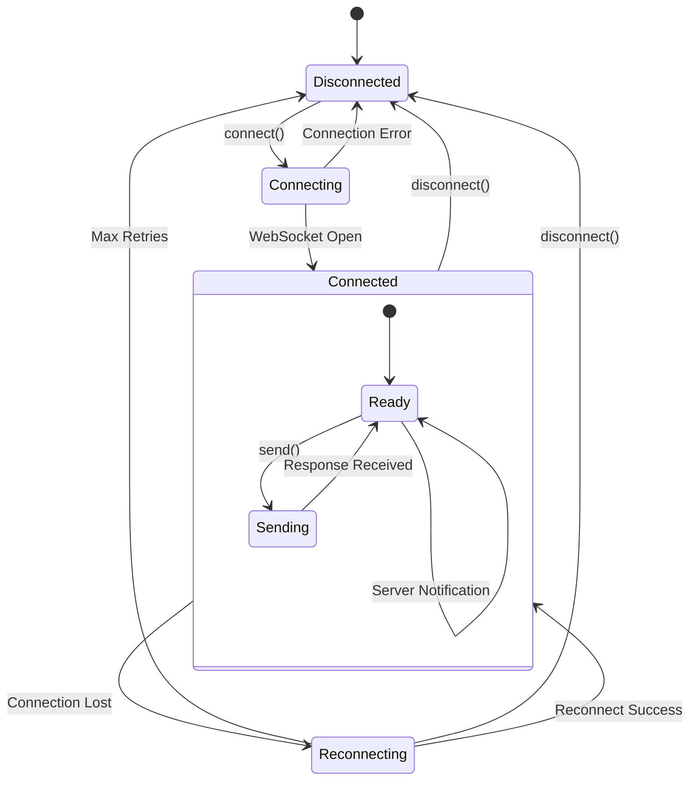
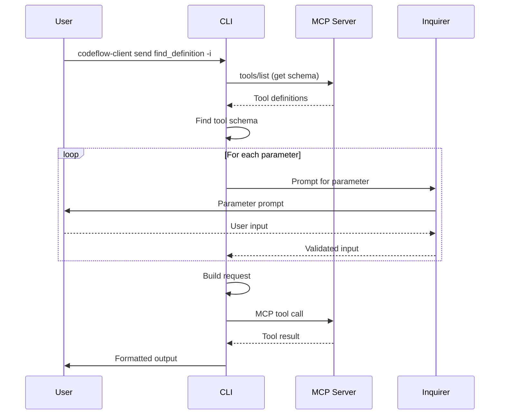
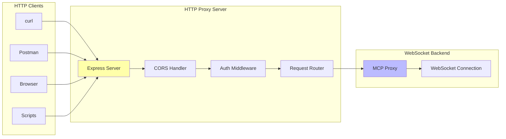
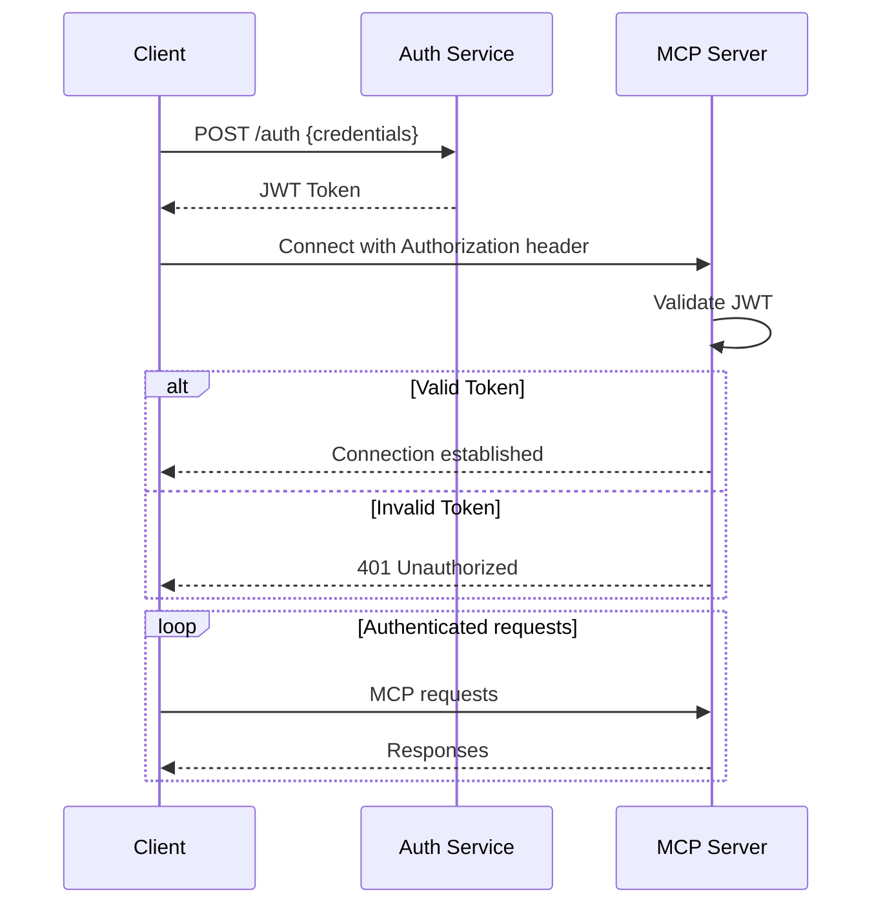
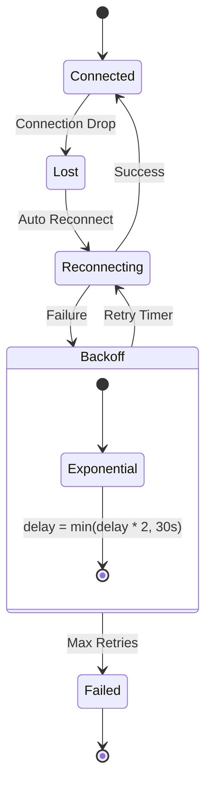

# Client-Server Communication Architecture

## Overview

Codeflow Buddy provides multiple client interfaces for interacting with the MCP server, including a comprehensive WebSocket client SDK, CLI tools, and HTTP proxy server. This document details the communication protocols, client architecture, and integration patterns.

## Communication Stack



## WebSocket Client Architecture

### Connection Management



### WebSocketClient Implementation

```typescript
export class WebSocketClient extends EventEmitter {
  private ws?: WebSocket;
  private url: string;
  private options: WebSocketClientInternalOptions;
  private pendingRequests = new Map<string, PendingRequest>();
  private _status: ConnectionStatus = 'disconnected';
  private reconnectAttempts = 0;
  private isManualDisconnect = false;

  // Connection lifecycle
  async connect(): Promise<void> {
    if (this._status === 'connected') return;
    
    this.setStatus('connecting');
    
    return new Promise((resolve, reject) => {
      const headers = { ...this.options.headers };
      if (this.options.token) {
        headers['Authorization'] = `Bearer ${this.options.token}`;
      }
      
      this.ws = new WebSocket(this.url, { headers });
      
      this.ws.once('open', () => {
        this.setStatus('connected');
        this.setupWebSocketHandlers();
        resolve();
      });
      
      this.ws.once('error', (error) => {
        this.setStatus('disconnected');
        reject(error);
      });
    });
  }
  
  // Request-response correlation
  async send<T = unknown>(method: string, params?: unknown): Promise<T> {
    const id = randomUUID();
    
    return new Promise<T>((resolve, reject) => {
      const timeout = setTimeout(() => {
        this.pendingRequests.delete(id);
        reject(new Error(`Request timeout for method: ${method}`));
      }, this.options.requestTimeout);
      
      this.pendingRequests.set(id, { resolve, reject, timeout });
      
      const request: MCPRequest = {
        jsonrpc: '2.0',
        method,
        params,
        id,
      };
      
      this.ws?.send(JSON.stringify(request));
    });
  }
}
```

### MCPProxy High-Level API

```typescript
export class MCPProxy {
  private client: WebSocketClient;
  
  constructor(url: string, options: ProxyOptions = {}) {
    this.client = new WebSocketClient(url, {
      ...options,
      reconnect: true,
    });
  }
  
  // Simple tool calls
  async send<T = unknown>(call: MCPToolCall): Promise<T> {
    await this.ensureConnected();
    return this.client.send<T>(call.method, call.params);
  }
  
  // Batch operations
  async sendBatch<T = unknown>(calls: MCPToolCall[]): Promise<MCPToolResponse<T>[]> {
    const promises = calls.map(call => 
      this.client.send(call.method, call.params)
        .then(result => ({ result }))
        .catch(error => ({ error }))
    );
    
    return Promise.all(promises);
  }
  
  // Convenience methods
  async listTools(): Promise<any> {
    return this.send({ method: 'tools/list' });
  }
}
```

## CLI Architecture

### Command Structure

```mermaid
graph TD
    CLI[codeflow-client]
    
    subgraph "Configuration Commands"
        Config[configure]
        ProfileList[profile list]
        ProfileUse[profile use]
        ProfileDel[profile delete]
    end
    
    subgraph "Operation Commands"
        Send[send <tool> [params]]
        Proxy[proxy --port 3001]
        Test[test]
    end
    
    subgraph "Modes"
        Interactive[Interactive Mode<br/>-i, --interactive]
        NonInteractive[Non-interactive Mode<br/>JSON params]
        JSON[JSON Output<br/>--format json]
        Pretty[Pretty Output<br/>--format pretty]
    end
    
    CLI --> Config
    CLI --> ProfileList
    CLI --> ProfileUse
    CLI --> ProfileDel
    CLI --> Send
    CLI --> Proxy
    CLI --> Test
    
    Send --> Interactive
    Send --> NonInteractive
    Send --> JSON
    Send --> Pretty
    
    style CLI fill:#f9f
    style Interactive fill:#bbf
    style NonInteractive fill:#afa
```

### Configuration Management

**Configuration File Structure:**
```json
{
  "url": "ws://localhost:3000",
  "token": "default-token",
  "profiles": {
    "local": {
      "url": "ws://localhost:3000",
      "description": "Local development server"
    },
    "production": {
      "url": "wss://api.example.com",
      "token": "prod-token",
      "description": "Production server"
    }
  },
  "currentProfile": "local"
}
```

**Configuration Loading Priority:**
1. Command-line flags (`--url`, `--token`, `--profile`)
2. Environment variables (`CODEFLOW_URL`, `CODEFLOW_TOKEN`)
3. Active profile settings
4. Global config defaults

### Interactive Parameter Prompts



## HTTP Proxy Server

### REST API Bridge



### HTTP Endpoints

**Health Check:**
```http
GET /health

Response:
{
  "status": "ok",
  "connection": "connected",
  "timestamp": "2024-01-15T10:30:00.000Z"
}
```

**Single RPC Call:**
```http
POST /rpc
Content-Type: application/json

{
  "method": "find_definition",
  "params": {
    "file_path": "src/index.ts",
    "symbol_name": "main"
  }
}

Response:
{
  "result": {
    "location": {
      "uri": "file:///src/index.ts",
      "range": {
        "start": { "line": 10, "character": 0 },
        "end": { "line": 15, "character": 1 }
      }
    }
  }
}
```

**Batch RPC Calls:**
```http
POST /rpc/batch
Content-Type: application/json

[
  {
    "method": "find_definition",
    "params": { "file_path": "src/index.ts", "symbol_name": "main" }
  },
  {
    "method": "get_diagnostics",
    "params": { "file_path": "src/index.ts" }
  }
]

Response:
[
  { "result": { "location": ... } },
  { "result": { "diagnostics": [...] } }
]
```

**Tool Discovery:**
```http
GET /tools

Response:
{
  "tools": [
    {
      "name": "find_definition",
      "description": "Find the definition of a symbol",
      "inputSchema": { ... }
    },
    ...
  ]
}
```

## Authentication & Security

### JWT Authentication Flow



### Security Headers

```typescript
// WebSocket connection with auth
const client = new WebSocketClient('wss://api.example.com', {
  token: 'eyJhbGciOiJIUzI1NiIsInR5cCI6IkpXVCJ9...',
  headers: {
    'User-Agent': 'codeflow-client/1.0',
    'X-Client-Version': '1.0.0'
  }
});

// HTTP proxy with CORS
app.use((req, res, next) => {
  res.header('Access-Control-Allow-Origin', '*');
  res.header('Access-Control-Allow-Methods', 'GET, POST, OPTIONS');
  res.header('Access-Control-Allow-Headers', 'Content-Type, Authorization');
  next();
});
```

## Error Handling & Resilience

### Connection Recovery



### Error Response Format

```typescript
// Standardized error responses
interface ErrorResponse {
  error: {
    code: number;
    message: string;
    data?: unknown;
  };
}

// Error categories
const ErrorCodes = {
  // Transport errors
  CONNECTION_FAILED: -32000,
  CONNECTION_TIMEOUT: -32001,
  CONNECTION_LOST: -32002,
  
  // Protocol errors
  PARSE_ERROR: -32700,
  INVALID_REQUEST: -32600,
  METHOD_NOT_FOUND: -32601,
  INVALID_PARAMS: -32602,
  INTERNAL_ERROR: -32603,
  
  // Application errors
  TOOL_ERROR: -32100,
  LSP_ERROR: -32101,
  FILE_NOT_FOUND: -32102
};
```

## Performance Optimizations

### Connection Pooling

```typescript
class ConnectionPool {
  private connections = new Map<string, WebSocketClient>();
  private maxConnections = 10;
  
  async getConnection(url: string, options: ClientOptions): Promise<WebSocketClient> {
    const key = `${url}:${JSON.stringify(options)}`;
    
    if (this.connections.has(key)) {
      const conn = this.connections.get(key)!;
      if (conn.isConnected()) {
        return conn;
      }
    }
    
    const client = new WebSocketClient(url, options);
    await client.connect();
    
    this.connections.set(key, client);
    return client;
  }
}
```

### Request Batching

```typescript
class RequestBatcher {
  private batchQueue: MCPToolCall[] = [];
  private batchTimer?: NodeJS.Timeout;
  private batchSize = 10;
  private batchDelay = 50; // ms
  
  async addRequest(call: MCPToolCall): Promise<any> {
    return new Promise((resolve, reject) => {
      this.batchQueue.push({ ...call, resolve, reject });
      
      if (this.batchQueue.length >= this.batchSize) {
        this.flushBatch();
      } else if (!this.batchTimer) {
        this.batchTimer = setTimeout(() => this.flushBatch(), this.batchDelay);
      }
    });
  }
  
  private async flushBatch(): void {
    if (this.batchTimer) {
      clearTimeout(this.batchTimer);
      this.batchTimer = undefined;
    }
    
    const batch = this.batchQueue.splice(0);
    if (batch.length === 0) return;
    
    const results = await this.proxy.sendBatch(batch);
    
    batch.forEach((call, index) => {
      const result = results[index];
      if (result.error) {
        call.reject(new Error(result.error.message));
      } else {
        call.resolve(result.result);
      }
    });
  }
}
```

### Response Caching

```typescript
class ResponseCache {
  private cache = new Map<string, CacheEntry>();
  
  private generateKey(method: string, params: unknown): string {
    return `${method}:${JSON.stringify(params)}`;
  }
  
  get(method: string, params: unknown): unknown | undefined {
    const key = this.generateKey(method, params);
    const entry = this.cache.get(key);
    
    if (entry && Date.now() - entry.timestamp < entry.ttl) {
      return entry.value;
    }
    
    return undefined;
  }
  
  set(method: string, params: unknown, value: unknown, ttl = 5000): void {
    const key = this.generateKey(method, params);
    this.cache.set(key, {
      value,
      timestamp: Date.now(),
      ttl
    });
  }
}
```

## Usage Examples

### Library Integration

```typescript
// Simple usage
import { MCPProxy } from '@goobits/codeflow-buddy-client';

const proxy = new MCPProxy('ws://localhost:3000');

// Single operation
const definition = await proxy.send({
  method: 'find_definition',
  params: {
    file_path: 'src/index.ts',
    symbol_name: 'main'
  }
});

// Batch operations
const results = await proxy.sendBatch([
  { method: 'find_definition', params: { file_path: 'src/index.ts', symbol_name: 'main' } },
  { method: 'get_diagnostics', params: { file_path: 'src/index.ts' } }
]);
```

### CLI Usage

```bash
# Configure connection
codeflow-client configure

# Non-interactive mode
codeflow-client send find_definition '{"file_path": "src/index.ts", "symbol_name": "main"}'

# Interactive mode
codeflow-client send find_definition -i

# Different profiles
codeflow-client --profile production send get_diagnostics '{"file_path": "app.py"}'

# Start HTTP proxy
codeflow-client proxy --port 3001
```

### HTTP API Usage

```bash
# Single request
curl -X POST http://localhost:3001/rpc \
  -H "Content-Type: application/json" \
  -d '{"method": "find_definition", "params": {"file_path": "src/index.ts", "symbol_name": "main"}}'

# Batch request
curl -X POST http://localhost:3001/rpc/batch \
  -H "Content-Type: application/json" \
  -d '[{"method": "find_definition", "params": {...}}, {"method": "get_diagnostics", "params": {...}}]'

# List available tools
curl http://localhost:3001/tools
```

## Testing & Quality Assurance

### Unit Testing

```typescript
// Mock WebSocket server for testing
class MockWebSocketServer {
  private server: WebSocketServer;
  private responses = new Map<string, any>();
  
  constructor(port: number) {
    this.server = new WebSocketServer({ port });
    this.server.on('connection', this.handleConnection.bind(this));
  }
  
  mockResponse(method: string, response: any): void {
    this.responses.set(method, response);
  }
  
  private handleConnection(ws: WebSocket): void {
    ws.on('message', (data) => {
      const request = JSON.parse(data.toString());
      const response = this.responses.get(request.method) || { result: 'ok' };
      ws.send(JSON.stringify({ ...response, id: request.id }));
    });
  }
}
```

### Integration Testing

```typescript
describe('Client-Server Integration', () => {
  it('should handle request-response cycle', async () => {
    const mockServer = new MockWebSocketServer(9999);
    mockServer.mockResponse('find_definition', {
      result: { location: { uri: 'file:///test.ts' } }
    });
    
    const client = new WebSocketClient('ws://localhost:9999');
    await client.connect();
    
    const result = await client.send('find_definition', { file_path: 'test.ts' });
    expect(result.location.uri).toBe('file:///test.ts');
    
    await client.disconnect();
  });
});
```

## Monitoring & Observability

### Client-Side Metrics

```typescript
class ClientMetrics {
  private requestCount = 0;
  private errorCount = 0;
  private latencySum = 0;
  
  recordRequest(method: string, latency: number, success: boolean): void {
    this.requestCount++;
    this.latencySum += latency;
    
    if (!success) {
      this.errorCount++;
    }
    
    // Send to monitoring system
    this.emit('metric', {
      type: 'request',
      method,
      latency,
      success,
      timestamp: Date.now()
    });
  }
  
  getStats() {
    return {
      requestCount: this.requestCount,
      errorCount: this.errorCount,
      errorRate: this.errorCount / this.requestCount,
      avgLatency: this.latencySum / this.requestCount
    };
  }
}
```

### Health Monitoring

```typescript
// Client health check
const healthCheck = async () => {
  try {
    const start = performance.now();
    await proxy.send({ method: 'health_check' });
    const latency = performance.now() - start;
    
    return {
      status: 'healthy',
      latency,
      timestamp: new Date().toISOString()
    };
  } catch (error) {
    return {
      status: 'unhealthy',
      error: error.message,
      timestamp: new Date().toISOString()
    };
  }
};
```

## Next Steps

- Continue to [Service Architecture](./03-service-architecture.md) for server-side patterns
- Review [Transaction Management](./06-transaction-management.md) for atomic operations
- Explore [Performance Optimizations](./07-performance-optimizations.md) for scaling insights