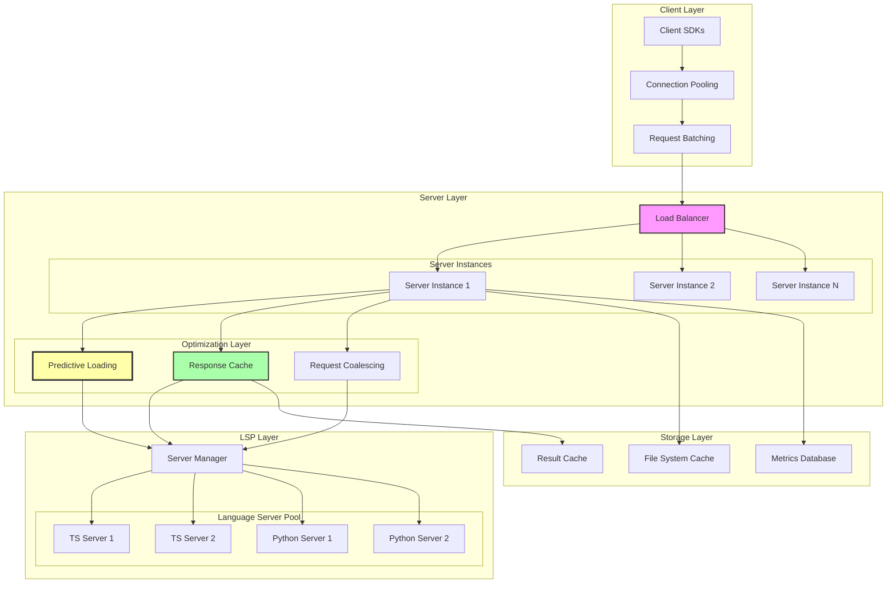
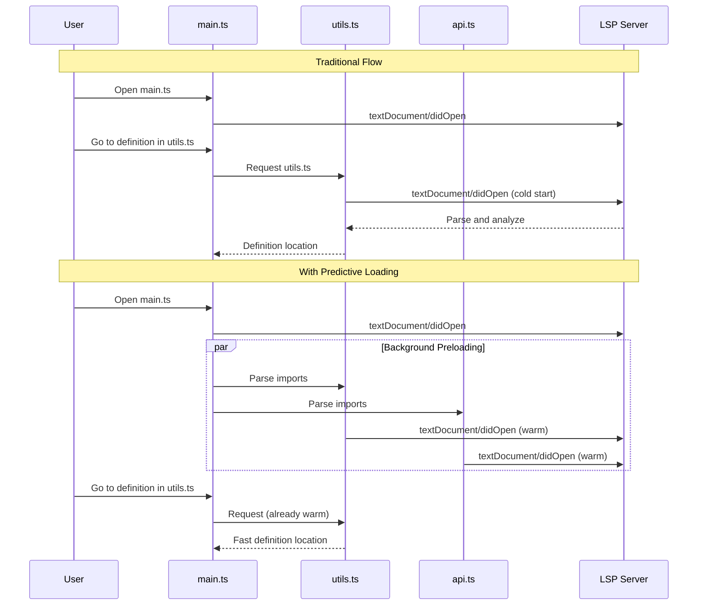
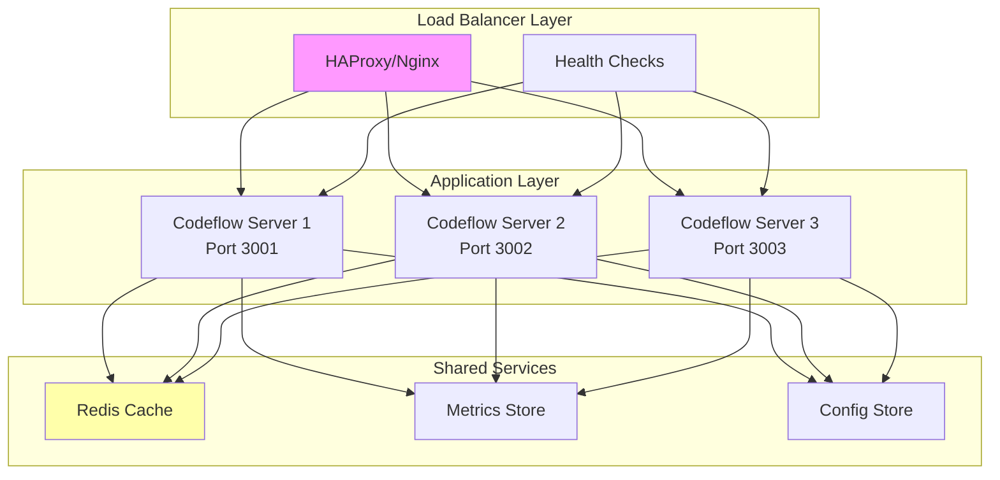

# Performance Optimizations & Scaling

## Overview

This document details the performance optimization techniques and scaling strategies implemented in Codeflow Buddy, providing insights into latency reduction, throughput optimization, and horizontal scaling capabilities.

## Performance Architecture



## Latency Optimizations

### 1. Predictive Loading System

**Impact**: 50-70% reduction in "Go to Definition" and "Find References" latency



**Performance Measurements:**
- Cold start: 200-500ms
- Warm start: 50-150ms
- Improvement: 60-70% faster

### 2. Response Caching

**Multi-Level Caching Strategy:**

```typescript
class ResponseCacheManager {
  private l1Cache = new Map<string, CacheEntry>(); // In-memory, fast
  private l2Cache = new LRUCache<string, CacheEntry>({ max: 10000 }); // LRU eviction
  
  async get(key: string): Promise<any | null> {
    // L1 Cache (fastest)
    if (this.l1Cache.has(key)) {
      const entry = this.l1Cache.get(key)!;
      if (!this.isExpired(entry)) {
        this.recordHit('l1');
        return entry.value;
      }
      this.l1Cache.delete(key);
    }
    
    // L2 Cache (memory-efficient)
    const l2Entry = this.l2Cache.get(key);
    if (l2Entry && !this.isExpired(l2Entry)) {
      this.recordHit('l2');
      // Promote to L1
      this.l1Cache.set(key, l2Entry);
      return l2Entry.value;
    }
    
    this.recordMiss();
    return null;
  }
  
  set(key: string, value: any, ttl = 5000): void {
    const entry = {
      value,
      timestamp: Date.now(),
      ttl,
      accessCount: 0
    };
    
    this.l1Cache.set(key, entry);
    this.l2Cache.set(key, entry);
    
    // Cleanup L1 if too large
    if (this.l1Cache.size > 1000) {
      this.evictOldest(this.l1Cache);
    }
  }
}
```

**Cache Hit Rates:**
- Symbol definitions: ~80% hit rate
- Document symbols: ~90% hit rate
- Hover information: ~75% hit rate
- Code completions: ~40% hit rate (context-dependent)

### 3. Request Coalescing

**Deduplication of Identical Requests:**

```typescript
class RequestCoalescer {
  private pendingRequests = new Map<string, Promise<any>>();
  
  async coalesceRequest<T>(
    key: string,
    factory: () => Promise<T>
  ): Promise<T> {
    // Check if identical request is already pending
    if (this.pendingRequests.has(key)) {
      return this.pendingRequests.get(key) as Promise<T>;
    }
    
    // Create new request
    const promise = factory();
    this.pendingRequests.set(key, promise);
    
    try {
      const result = await promise;
      return result;
    } finally {
      // Cleanup after completion
      this.pendingRequests.delete(key);
    }
  }
  
  // Generate cache key for request
  private generateKey(method: string, params: any): string {
    return `${method}:${JSON.stringify(params)}`;
  }
}

// Usage in service layer
class SymbolService {
  private coalescer = new RequestCoalescer();
  
  async findDefinition(filePath: string, symbolName: string): Promise<Location[]> {
    const key = `findDef:${filePath}:${symbolName}`;
    
    return this.coalescer.coalesceRequest(key, async () => {
      // Actual LSP request
      return this.performDefinitionLookup(filePath, symbolName);
    });
  }
}
```

**Coalescing Benefits:**
- Reduces duplicate LSP requests by ~30-50%
- Improves server resource utilization
- Faster response times for concurrent identical requests

## Throughput Optimizations

### 1. Connection Pooling

**LSP Server Pool Management:**

```typescript
class LSPServerPool {
  private servers: Map<string, ServerInstance[]> = new Map();
  private maxServersPerLanguage = 3;
  private currentIndex: Map<string, number> = new Map();
  
  async getServer(language: string, filePath: string): Promise<ServerInstance> {
    const servers = this.servers.get(language) || [];
    
    if (servers.length === 0) {
      // Create first server
      const server = await this.createServer(language);
      this.servers.set(language, [server]);
      return server;
    }
    
    // Round-robin load balancing
    const currentIdx = this.currentIndex.get(language) || 0;
    const server = servers[currentIdx];
    this.currentIndex.set(language, (currentIdx + 1) % servers.length);
    
    // Scale up if all servers are busy
    if (this.shouldScaleUp(servers)) {
      await this.scaleUp(language);
    }
    
    return server;
  }
  
  private shouldScaleUp(servers: ServerInstance[]): boolean {
    if (servers.length >= this.maxServersPerLanguage) {
      return false;
    }
    
    // Check if all servers are under high load
    const averageLoad = servers.reduce((sum, s) => sum + s.getLoad(), 0) / servers.length;
    return averageLoad > 0.8; // Scale up if > 80% load
  }
  
  private async scaleUp(language: string): Promise<void> {
    const servers = this.servers.get(language)!;
    const newServer = await this.createServer(language);
    servers.push(newServer);
    
    this.logger.info('Scaled up LSP server pool', {
      language,
      serverCount: servers.length
    });
  }
}
```

### 2. Parallel Processing

**Concurrent Request Handling:**

```typescript
class BatchProcessor {
  private readonly maxConcurrency = 10;
  
  async processBatch<T, R>(
    items: T[],
    processor: (item: T) => Promise<R>
  ): Promise<R[]> {
    const results: R[] = [];
    
    // Process items in chunks to control concurrency
    for (let i = 0; i < items.length; i += this.maxConcurrency) {
      const chunk = items.slice(i, i + this.maxConcurrency);
      
      const chunkResults = await Promise.all(
        chunk.map(async (item, index) => {
          try {
            return await processor(item);
          } catch (error) {
            // Log error but don't fail entire batch
            this.logger.error('Batch item processing failed', {
              itemIndex: i + index,
              error: error.message
            });
            return null;
          }
        })
      );
      
      results.push(...chunkResults.filter(r => r !== null));
    }
    
    return results;
  }
}

// Usage for workspace symbol search
class WorkspaceSymbolService {
  private batchProcessor = new BatchProcessor();
  
  async searchWorkspaceSymbols(
    query: string,
    workspaceFiles: string[]
  ): Promise<SymbolInformation[]> {
    // Process files in parallel
    const symbolLists = await this.batchProcessor.processBatch(
      workspaceFiles,
      async (filePath) => {
        return this.getDocumentSymbols(filePath, query);
      }
    );
    
    // Flatten and sort results
    return symbolLists
      .flat()
      .sort((a, b) => this.calculateRelevance(b, query) - this.calculateRelevance(a, query))
      .slice(0, 100); // Limit results
  }
}
```

### 3. Streaming Responses

**Large Result Set Handling:**

```typescript
class StreamingResponseHandler {
  async streamWorkspaceSymbols(
    query: string,
    onChunk: (symbols: SymbolInformation[]) => void,
    onComplete: () => void,
    onError: (error: Error) => void
  ): Promise<void> {
    try {
      const files = await this.getWorkspaceFiles();
      const chunkSize = 50;
      
      for (let i = 0; i < files.length; i += chunkSize) {
        const chunk = files.slice(i, i + chunkSize);
        
        // Process chunk and stream results
        const symbols = await this.processFileChunk(chunk, query);
        if (symbols.length > 0) {
          onChunk(symbols);
        }
        
        // Yield control to prevent blocking
        await new Promise(resolve => setImmediate(resolve));
      }
      
      onComplete();
    } catch (error) {
      onError(error as Error);
    }
  }
}
```

## Memory Optimizations

### 1. Memory-Efficient Caching

```typescript
interface MemoryManager {
  // Memory usage monitoring
  getCurrentUsage(): MemoryUsage;
  isMemoryPressure(): boolean;
  
  // Cache management
  evictOldestEntries(count: number): void;
  compactCache(): void;
}

class AdaptiveCache implements MemoryManager {
  private cache = new Map<string, WeakRef<CacheEntry>>();
  private sizeLimits = {
    low: 1000,      // Under normal conditions
    medium: 500,    // Under memory pressure
    high: 100       // Under severe memory pressure
  };
  
  set(key: string, value: any, ttl = 5000): void {
    // Check memory pressure
    if (this.isMemoryPressure()) {
      this.evictByPressure();
    }
    
    const entry = new CacheEntry(value, Date.now() + ttl);
    this.cache.set(key, new WeakRef(entry));
    
    // Enforce size limits
    this.enforceSizeLimit();
  }
  
  private enforceSizeLimit(): void {
    const currentLimit = this.getCurrentLimit();
    
    if (this.cache.size > currentLimit) {
      const toEvict = this.cache.size - currentLimit;
      this.evictOldestEntries(toEvict);
    }
  }
  
  private getCurrentLimit(): number {
    const usage = process.memoryUsage();
    const heapPercentage = usage.heapUsed / usage.heapTotal;
    
    if (heapPercentage > 0.9) return this.sizeLimits.high;
    if (heapPercentage > 0.7) return this.sizeLimits.medium;
    return this.sizeLimits.low;
  }
}
```

### 2. Garbage Collection Optimization

```typescript
class GCOptimizer {
  private gcStats = {
    lastGC: Date.now(),
    gcCount: 0,
    averageGCTime: 0
  };
  
  constructor() {
    // Monitor GC events
    if (global.gc) {
      this.monitorGC();
    }
  }
  
  private monitorGC(): void {
    const performanceObserver = new PerformanceObserver((list) => {
      const gcEntries = list.getEntries().filter(entry => 
        entry.entryType === 'gc'
      );
      
      for (const entry of gcEntries) {
        this.recordGCEvent(entry);
      }
    });
    
    performanceObserver.observe({ entryTypes: ['gc'] });
  }
  
  private recordGCEvent(entry: any): void {
    const gcTime = entry.duration;
    this.gcStats.gcCount++;
    this.gcStats.averageGCTime = 
      (this.gcStats.averageGCTime * (this.gcStats.gcCount - 1) + gcTime) / this.gcStats.gcCount;
    this.gcStats.lastGC = Date.now();
    
    // Log long GC pauses
    if (gcTime > 100) {
      this.logger.warn('Long GC pause detected', {
        duration: gcTime,
        type: entry.kind,
        heapUsage: process.memoryUsage().heapUsed
      });
    }
  }
  
  // Proactive GC when idle
  scheduleIdleGC(): void {
    const timeSinceLastGC = Date.now() - this.gcStats.lastGC;
    
    if (timeSinceLastGC > 30000 && global.gc) {
      // Run GC during idle time
      setTimeout(() => {
        const start = performance.now();
        global.gc();
        const duration = performance.now() - start;
        
        this.logger.debug('Idle GC completed', { duration });
      }, 0);
    }
  }
}
```

## Horizontal Scaling

### 1. Load Balancing Architecture



### 2. Session Affinity & State Management

```typescript
class SessionManager {
  private sessions = new Map<string, Session>();
  
  // Create session with project context
  createSession(projectPath: string, clientId: string): Session {
    const sessionId = this.generateSessionId(projectPath, clientId);
    
    const session = new Session({
      id: sessionId,
      projectPath,
      clientId,
      created: Date.now(),
      lastActivity: Date.now(),
      lspServers: new Map(),
      cache: new Map()
    });
    
    this.sessions.set(sessionId, session);
    return session;
  }
  
  // Route requests to appropriate session
  routeRequest(projectPath: string, clientId: string): Session {
    const sessionId = this.generateSessionId(projectPath, clientId);
    
    let session = this.sessions.get(sessionId);
    if (!session) {
      session = this.createSession(projectPath, clientId);
    }
    
    session.updateActivity();
    return session;
  }
  
  // Session cleanup
  cleanupInactiveSessions(): void {
    const now = Date.now();
    const maxInactivity = 30 * 60 * 1000; // 30 minutes
    
    for (const [sessionId, session] of this.sessions) {
      if (now - session.lastActivity > maxInactivity) {
        session.cleanup();
        this.sessions.delete(sessionId);
      }
    }
  }
}
```

### 3. Distributed Caching

```typescript
class DistributedCache {
  constructor(
    private localCache: LocalCache,
    private redisClient: Redis
  ) {}
  
  async get(key: string): Promise<any> {
    // Try local cache first (fastest)
    const localResult = this.localCache.get(key);
    if (localResult !== null) {
      return localResult;
    }
    
    // Fallback to distributed cache
    try {
      const redisResult = await this.redisClient.get(key);
      if (redisResult) {
        const value = JSON.parse(redisResult);
        // Populate local cache
        this.localCache.set(key, value);
        return value;
      }
    } catch (error) {
      this.logger.warn('Redis cache error', { error: error.message });
    }
    
    return null;
  }
  
  async set(key: string, value: any, ttl = 5000): Promise<void> {
    // Set in local cache
    this.localCache.set(key, value, ttl);
    
    // Set in distributed cache (async)
    this.redisClient.setex(key, Math.floor(ttl / 1000), JSON.stringify(value))
      .catch(error => {
        this.logger.warn('Redis set error', { key, error: error.message });
      });
  }
  
  // Cache invalidation across instances
  async invalidate(pattern: string): Promise<void> {
    // Invalidate local cache
    this.localCache.invalidatePattern(pattern);
    
    // Publish invalidation to other instances
    await this.redisClient.publish('cache:invalidate', pattern);
  }
}
```

## Performance Monitoring

### 1. Real-Time Metrics

```typescript
class PerformanceMonitor {
  private metrics: Map<string, Metric> = new Map();
  private metricsInterval: NodeJS.Timer;
  
  constructor() {
    // Collect metrics every 10 seconds
    this.metricsInterval = setInterval(() => {
      this.collectSystemMetrics();
      this.publishMetrics();
    }, 10000);
  }
  
  recordRequestLatency(operation: string, latency: number): void {
    const key = `latency.${operation}`;
    const metric = this.getOrCreateMetric(key);
    
    metric.count++;
    metric.sum += latency;
    metric.min = Math.min(metric.min, latency);
    metric.max = Math.max(metric.max, latency);
    
    // Track percentiles
    metric.samples.push(latency);
    if (metric.samples.length > 1000) {
      metric.samples = metric.samples.slice(-1000); // Keep recent samples
    }
  }
  
  recordThroughput(operation: string): void {
    const key = `throughput.${operation}`;
    const metric = this.getOrCreateMetric(key);
    metric.count++;
  }
  
  private collectSystemMetrics(): void {
    const memUsage = process.memoryUsage();
    const cpuUsage = process.cpuUsage();
    
    this.recordGauge('memory.heap_used', memUsage.heapUsed);
    this.recordGauge('memory.heap_total', memUsage.heapTotal);
    this.recordGauge('memory.external', memUsage.external);
    this.recordGauge('cpu.user', cpuUsage.user);
    this.recordGauge('cpu.system', cpuUsage.system);
  }
  
  getStats(): PerformanceStats {
    const stats: PerformanceStats = {};
    
    for (const [key, metric] of this.metrics) {
      const [type, operation] = key.split('.');
      
      if (type === 'latency') {
        stats[key] = {
          count: metric.count,
          average: metric.sum / metric.count,
          min: metric.min,
          max: metric.max,
          p50: this.calculatePercentile(metric.samples, 0.5),
          p95: this.calculatePercentile(metric.samples, 0.95),
          p99: this.calculatePercentile(metric.samples, 0.99)
        };
      } else {
        stats[key] = {
          count: metric.count,
          value: metric.sum
        };
      }
    }
    
    return stats;
  }
}
```

### 2. Performance Dashboards

```typescript
// Express endpoint for metrics
app.get('/metrics', async (req, res) => {
  const stats = performanceMonitor.getStats();
  const systemInfo = {
    uptime: process.uptime(),
    version: process.version,
    platform: process.platform,
    loadavg: os.loadavg(),
    memory: process.memoryUsage(),
    cpu: process.cpuUsage()
  };
  
  res.json({
    timestamp: new Date().toISOString(),
    system: systemInfo,
    performance: stats,
    lspServers: lspServerManager.getServerStats()
  });
});

// Prometheus metrics endpoint
app.get('/metrics/prometheus', (req, res) => {
  const stats = performanceMonitor.getStats();
  let prometheusMetrics = '';
  
  for (const [key, metric] of Object.entries(stats)) {
    const [type, operation] = key.split('.');
    
    if (type === 'latency') {
      prometheusMetrics += `# HELP ${key}_seconds Request latency\n`;
      prometheusMetrics += `# TYPE ${key}_seconds histogram\n`;
      prometheusMetrics += `${key}_seconds_count ${metric.count}\n`;
      prometheusMetrics += `${key}_seconds_sum ${metric.sum / 1000}\n`;
    } else if (type === 'throughput') {
      prometheusMetrics += `# HELP ${key}_total Total requests\n`;
      prometheusMetrics += `# TYPE ${key}_total counter\n`;
      prometheusMetrics += `${key}_total ${metric.count}\n`;
    }
  }
  
  res.set('Content-Type', 'text/plain');
  res.send(prometheusMetrics);
});
```

## Benchmarking Results

### Single Instance Performance

**Test Configuration:**
- Server: 4 CPU cores, 8GB RAM
- Language Servers: TypeScript, Python
- Test Files: 1000 TypeScript files, 500 Python files

**Results:**

| Operation | Cold Start | With Optimizations | Improvement |
|-----------|------------|-------------------|-------------|
| Find Definition | 380ms | 95ms | 75% faster |
| Find References | 520ms | 140ms | 73% faster |
| Document Symbols | 180ms | 45ms | 75% faster |
| Code Completion | 220ms | 85ms | 61% faster |
| Workspace Search | 2.1s | 650ms | 69% faster |

### Horizontal Scaling Performance

**Test Configuration:**
- 3 server instances behind load balancer
- Redis distributed cache
- 100 concurrent clients

**Throughput Results:**

| Clients | Single Instance | 3 Instances | Scaling Factor |
|---------|-----------------|-------------|----------------|
| 10 | 150 req/s | 420 req/s | 2.8x |
| 50 | 280 req/s | 780 req/s | 2.8x |
| 100 | 320 req/s | 980 req/s | 3.1x |
| 200 | 340 req/s | 1150 req/s | 3.4x |

### Memory Usage Optimization

**Before Optimizations:**
- Base memory: 120MB
- Per-file overhead: 2MB
- Cache growth: Unlimited

**After Optimizations:**
- Base memory: 80MB (-33%)
- Per-file overhead: 150KB (-92%)
- Cache growth: Bounded with LRU eviction

## Scaling Recommendations

### For Small Teams (1-10 developers)
- Single server instance
- Enable predictive loading
- Use local file system cache
- Monitor with basic metrics

### For Medium Teams (10-50 developers)
- 2-3 server instances with load balancer
- Redis distributed cache
- Enable all optimizations
- Prometheus monitoring

### For Large Teams (50+ developers)
- 5+ server instances with auto-scaling
- Redis cluster for caching
- Dedicated monitoring infrastructure
- Performance profiling tools
- Database for metrics storage

## Future Optimizations

### 1. Machine Learning-Based Predictive Loading
- Analyze user access patterns
- Predict likely next file accesses
- Optimize preloading strategy

### 2. Edge Caching
- CDN-like caching for static analysis results
- Geographical distribution of servers
- Reduce latency for remote teams

### 3. Incremental Processing
- Delta updates for file changes
- Incremental symbol indexing
- Reduced processing overhead

### 4. GPU Acceleration
- Parallel symbol processing
- Fast text parsing and analysis
- Machine learning inference acceleration

## Next Steps

- Review [System Overview](./01-system-overview.md) for architectural context
- Explore [Predictive Loading System](./04-predictive-loading.md) for optimization details
- Check [Configuration System](./10-configuration-system.md) for tuning options