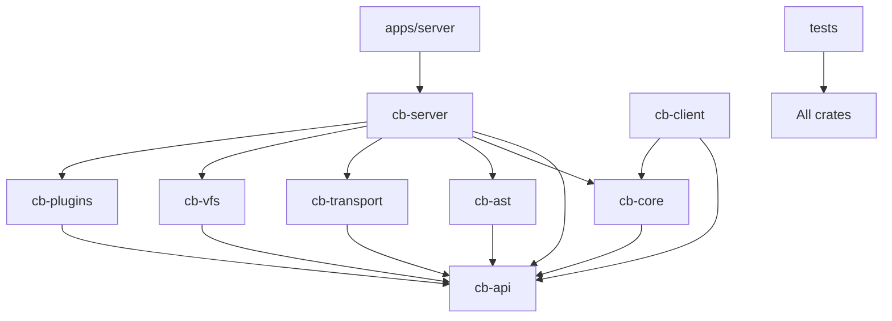

# Architecture Documentation

## Overview

Codebuddy is a pure Rust MCP server that bridges Model Context Protocol (MCP) with Language Server Protocol (LSP) functionality. The architecture follows a service-oriented design with clear crate separation, AI-friendly boundaries, and comprehensive code intelligence tools.

## High-Level Architecture

The system is built on a multi-crate architecture with focused responsibilities and clear dependency hierarchies:



## Crate Responsibilities

### Foundation Layer

**`cb-api`** - The contract crate
- Defines shared traits: `AstService`, `LspService`
- Data structures: `EditPlan`, `ImportGraph`, error types
- No dependencies on other cb-* crates
- Ensures clear interfaces between components

**`cb-core`** - Configuration and core types
- Application configuration (`AppConfig`, `LspConfig`)
- Core data models and utilities
- Depends only on `cb-api`

### Service Layer

**`cb-ast`** - Language intelligence
- Code parsing, analysis, and transformation
- Import graph management and refactoring
- Implements `AstService` trait from `cb-api`

**`cb-transport`** - Communication protocols
- WebSocket and stdio transport layers
- MCP protocol implementation
- Session management and message routing

**`cb-vfs`** - Virtual filesystem
- FUSE filesystem implementation
- File system abstraction and caching
- Read-only workspace mounting

**`cb-plugins`** - Extensibility system
- Plugin management and registry
- Language-specific adapters
- Tool registration and dispatch

### Orchestration Layer

**`cb-server`** - Central orchestration
- Implements all service traits
- Wires services together in `AppState`
- Message dispatching and request routing
- LSP client management

### Application Layer

**`apps/server`** - Executable entry point
- CLI argument parsing
- Server bootstrap and initialization
- Process management (stdio/WebSocket modes)

## Request Lifecycle

### Modern Request Flow

The current architecture uses a plugin-based dispatch system:

1. **Request Reception**
   ```
   Transport Layer (stdio/WebSocket) → JSON parsing → McpMessage
   ```

2. **Plugin Dispatch**
   ```
   PluginDispatcher::dispatch() → MessageDispatcher → Tool lookup
   ```

3. **Service Execution**
   ```
   Plugin handler → AppState services → Service implementations
   ```

4. **Response Generation**
   ```
   Service result → MCP response → JSON serialization → Transport
   ```

### Key Components

**`PluginDispatcher`**
- Central request orchestrator
- Manages plugin lifecycle and routing
- Provides unified error handling

**`MessageDispatcher`**
- Routes messages to appropriate plugins
- Handles tool registration and discovery
- Manages concurrent request processing

**`AppState`**
- Shared service container
- Provides dependency injection for services
- Maintains application-wide state

## Component Interactions

### Service Architecture

The architecture is built around service traits defined in `cb-api`:

```rust
// Core service traits
pub trait AstService: Send + Sync {
    async fn analyze_imports(&self, file_path: &Path) -> ApiResult<ImportGraph>;
    async fn generate_edit_plan(&self, request: RefactorRequest) -> ApiResult<EditPlan>;
}

pub trait LspService: Send + Sync {
    async fn request(&self, message: Message) -> ApiResult<Message>;
    async fn notify_file_opened(&self, file_path: &Path) -> ApiResult<()>;
}
```

### AppState Service Container

The `AppState` acts as a dependency injection container:

```rust
pub struct AppState {
    pub ast_service: Arc<dyn AstService>,
    pub file_service: Arc<FileService>,
    pub project_root: PathBuf,
    pub lock_manager: Arc<LockManager>,
    pub operation_queue: Arc<OperationQueue>,
}
```

### Plugin System

Language-specific functionality is handled through plugins:

```rust
pub trait LanguagePlugin: Send + Sync {
    fn name(&self) -> &str;
    fn supported_extensions(&self) -> &[&str];
    async fn handle_request(&self, request: &ToolRequest, app_state: &AppState) -> PluginResult<ToolResponse>;
}
```

### LSP Integration

The LSP system provides direct language server communication:

- **`LspManager`**: Orchestrates multiple LSP clients by file extension
- **`LspClient`**: Manages individual LSP server processes
- **Direct Communication**: Bypasses legacy request mapping through plugin adapters

### Modern Tool Registration

Tools are registered through the plugin system rather than hardcoded mappings:

```rust
// Plugin-based tool registration
impl LanguagePlugin for SystemToolsPlugin {
    async fn handle_request(&self, request: &ToolRequest, app_state: &AppState) -> PluginResult<ToolResponse> {
        match request.tool.as_str() {
            "find_definition" => self.find_definition(request, app_state).await,
            "get_diagnostics" => self.get_diagnostics(request, app_state).await,
            _ => Err(PluginError::UnsupportedTool(request.tool.clone()))
        }
    }
}
```

## Tool Categories

The system provides comprehensive code intelligence through various tool categories:

### 1. Navigation Tools
- **Symbol Definition**: Find where symbols are defined
- **Symbol References**: Find all references to symbols
- **Workspace Symbols**: Search for symbols across the project
- **Document Symbols**: Get all symbols in a file

### 2. Intelligence Tools
- **Hover Information**: Rich documentation and type information
- **Code Completions**: Context-aware code suggestions
- **Signature Help**: Function parameter assistance
- **Diagnostics**: Real-time error and warning detection

### 3. Editing Tools
- **Symbol Renaming**: Project-wide symbol renaming
- **Code Formatting**: Language-specific formatting
- **Code Actions**: Quick fixes and refactoring suggestions
- **Workspace Edits**: Multi-file atomic editing operations

### 4. Analysis Tools
- **Import Analysis**: Dependency graph analysis via `cb-ast`
- **Dead Code Detection**: Unused code identification
- **Call Hierarchy**: Function call relationships
- **Type Hierarchy**: Type inheritance relationships

### 5. Filesystem Tools
- **File Operations**: Cross-platform file manipulation
- **Directory Operations**: Workspace management
- **Path Resolution**: Canonical path handling
- **File Watching**: Real-time file system monitoring

### 6. Refactoring Tools
- **Extract Function**: Code extraction into new functions
- **Extract Variable**: Expression extraction into variables
- **Inline Operations**: Variable and function inlining
- **Import Organization**: Automatic import cleanup

## Configuration Management

### Hierarchical Configuration

Configuration is managed through the `cb-core` crate with support for multiple sources:

1. **Default Configuration**: Built-in sensible defaults
2. **Configuration Files**: JSON/TOML support (`.codebuddy/config.json`)
3. **Environment Variables**: Runtime overrides
4. **Command Line**: Highest precedence overrides

### Configuration Structure

```rust
#[derive(Debug, Clone, Default, Serialize, Deserialize)]
pub struct AppConfig {
    pub server: ServerConfig,    // WebSocket/stdio server settings
    pub lsp: LspConfig,         // Language server configurations
    pub fuse: Option<FuseConfig>, // Optional FUSE filesystem
    pub logging: LoggingConfig,  // Logging configuration
    pub cache: CacheConfig,     // Caching settings
}
```

### LSP Server Configuration

Each language server is configured with:

```rust
#[derive(Debug, Clone, Serialize, Deserialize)]
pub struct LspServerConfig {
    pub extensions: Vec<String>,        // File extensions handled
    pub command: Vec<String>,           // Command to start LSP server
    pub root_dir: Option<PathBuf>,      // Working directory
    pub restart_interval: Option<u64>,  // Auto-restart interval
}
```

## Error Handling Strategy

### Error Types Hierarchy

The system uses a layered error handling approach:

```rust
ApiError ← CoreError ← ServerError ← Transport-specific errors
```

### Error Propagation

- **Service Errors**: Propagated through `ApiResult<T>` from service traits
- **LSP Errors**: Wrapped as `ApiError` with contextual information
- **File System Errors**: Converted to appropriate error responses
- **Configuration Errors**: Fail fast during application startup

### Error Recovery

- **LSP Server Failures**: Graceful degradation with optional restart
- **Network Errors**: Connection-level retry logic
- **Parse Errors**: Detailed error messages with context
- **Resource Exhaustion**: Configurable limits and throttling

## Performance Architecture

### Async Runtime

- **Tokio-based**: Efficient async I/O with minimal thread overhead
- **Concurrent Processing**: Multiple MCP requests handled simultaneously
- **Resource Pooling**: Shared LSP clients and service instances

### Memory Management

- **Arc-based Sharing**: Efficient shared ownership of services
- **Lazy Initialization**: Services created on-demand
- **Bounded Caching**: TTL-based caching with size limits

### Optimization Features

- **Native Performance**: Zero-cost Rust abstractions
- **Memory Safety**: Compile-time guarantees prevent common vulnerabilities
- **Minimal Allocations**: Efficient data structures and borrowing

## Security Model

### Process Isolation

- **LSP Servers**: Run as separate child processes
- **Workspace Boundaries**: File operations restricted to project scope
- **Command Validation**: LSP commands validated against configuration

### Input Validation

- **JSON Schema**: All MCP requests validated against schemas
- **Path Sanitization**: Prevents directory traversal attacks
- **Type Safety**: Rust's type system prevents many common vulnerabilities

## Development Workflow

### Adding New Tools

1. **Define Tool Schema**: Add to appropriate plugin
2. **Implement Handler**: Create async handler function
3. **Register Tool**: Add to plugin's tool registry
4. **Add Tests**: Unit and integration tests
5. **Update Documentation**: Tool-specific documentation

### Plugin Development

1. **Create Plugin Crate**: New crate under `cb-plugins`
2. **Implement Trait**: Implement `LanguagePlugin` trait
3. **Register Plugin**: Add to plugin manager
4. **Test Integration**: End-to-end testing

This architecture provides a robust, scalable foundation for bridging MCP and LSP protocols while maintaining excellent performance and reliability characteristics through Rust's safety guarantees and zero-cost abstractions.
